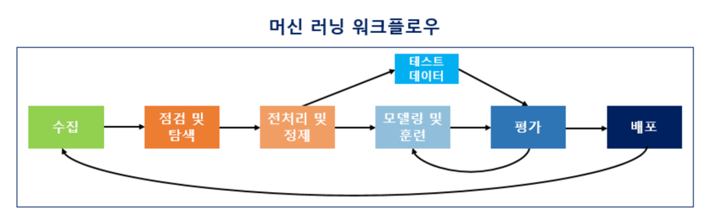
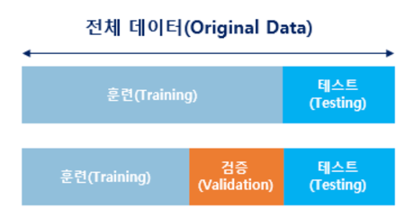

# 1. 머신 러닝 워크플로우(Machine Learning Workflow)

## 1) 수집(Acquisition)
- 머신 러닝을 하기 위해서는 기계에 학습시켜야 할 데이터가 필요
- 자연어 처리의 경우, 자연어 데이터를 말뭉치 또는 코퍼스(corpus)라고 부름
- 코퍼스의 의미를 풀이하면, 조사나 연구 목적에 의해서 특정 도메인으로부터 수집된 텍스트 집합
## 2) 점검 및 탐색(Inspection and exploration)
- 데이터를 점검하고 탐색하는 단계
- 데이터의 구조, 노이즈 데이터, 머신 러닝 적용을 위해서 데이터를 어떻게 정제해야하는지 등을 파악
- 탐색적 데이터 분석(Exploratory Data Analysis, EDA) 단계라고도 함
## 3) 전처리 및 정제
- 자연어 처리라면 토큰화, 정제, 정규화, 불용어 제거 등의 단계를 포함
- 빠르고 정확한 데이터 전처리를 하기 위해서는 사용하고 있는 툴(이 책에서는 파이썬)에 대한 다양한 라이브러리에 대한 지식이 필요
## 4) 모델링 및 훈련
- 머신 러닝에 대한 코드를 작성하는 단계인 모델링 단계
- 전처리가 완료 된 데이터를 머신 러닝 알고리즘을 통해 기계에게 학습(training)
- 주의해야 할 것은 모든 데이터를 기계에게 학습시켜서는 안 된다는 점
- 데이터 중 일부는 테스트용으로 남겨두고 훈련용 데이터만 훈련에 사용
- 테스트용 데이터를 통해서 현재 성능이 얼마나 되는지를 측정할 수 있으며 과적합(overfitting) 상황 방지 가능

## 5) 평가(Evaluation)
- 기계가 다 학습이 되었다면 테스트용 데이터로 성능을 평가
## 6) 배포(Deployment)
- 기계가 성공적으로 훈련이 된 것으로 판단된다면 완성된 모델이 배포되는 단계