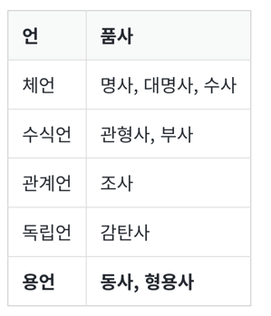

- 두 작업이 갖고 있는 의미는 눈으로 봤을 때는 서로 다른 단어들이지만, 하나의 단어로 일반화시킬 수 있다면 하나의 단어로 일반화시켜서 문서 내의 단어 수를 줄이겠다는 것
# 1. 표제어 추출(Lemmatization)
- 표제어 추출은 단어들로부터 표제어를 찾아가는 과정   
ex) am, are, is는 서로 다른 스펠링이지만 그 뿌리 단어는 be. 이때, 이 단어들의 표제어는 be
- 표제어 추출을 하는 가장 섬세한 방법은 단어의 형태학적 파싱을 먼저 진행하는 것
- 형태학(morphology)이란 형태소로부터 단어들을 만들어가는 학문
- 형태소의 종류로 어간(stem)과 접사(affix)가 존재
1. 어간(stem): 단어의 의미를 담고 있는 단어의 핵심 부분.
2. 접사(affix): 단어에 추가적인 의미를 주는 부분.
```
from nltk.stem import WordNetLemmatizer

lemmatizer = WordNetLemmatizer()

words = ['policy', 'doing', 'organization', 'have', 'going', 'love', 'lives', 'fly', 'dies', 'watched', 'has', 'starting']

print('표제어 추출 전 :',words)
print('표제어 추출 후 :',[lemmatizer.lemmatize(word) for word in words])

[출력]
표제어 추출 전 : ['policy', 'doing', 'organization', 'have', 'going',
 'love', 'lives', 'fly', 'dies', 'watched', 'has', 'starting']
표제어 추출 후 : ['policy', 'doing', 'organization', 'have', 'going',
 'love', 'life', 'fly', 'dy', 'watched', 'ha', 'starting']
```
- WordNetLemmatizer는 입력으로 단어가 동사 품사라는 사실 인지 필요
```
lemmatizer.lemmatize('dies', 'v')
lemmatizer.lemmatize('watched', 'v')
lemmatizer.lemmatize('has', 'v')
```
- 표제어 추출은 문맥을 고려하며 수행했을 때의 결과는 해당 단어의 품사 정보를 보존
# 2. 어간 추출(Stemming)
- 어간 추출은 형태학적 분석을 단순화한 버전이라고 볼 수도 있고, 정해진 규칙만 보고 단어의 어미를 자르는 어림짐작의 작업
- 포터 알고리즘
```
from nltk.stem import PorterStemmer
from nltk.tokenize import word_tokenize

stemmer = PorterStemmer()

sentence = "This was not the map we found in Billy Bones's chest, but an accurate copy, complete in all things--names and heights and soundings--with the single exception of the red crosses and the written notes."
tokenized_sentence = word_tokenize(sentence)

print('어간 추출 전 :', tokenized_sentence)
print('어간 추출 후 :',[stemmer.stem(word) for word in tokenized_sentence])

[출력]
어간 추출 전 : ['This', 'was', 'not', 'the', 'map', 'we', 'found', 'in',
 'Billy', 'Bones', "'s", 'chest', ',', 'but', 'an', 'accurate', 'copy',
  ',', 'complete', 'in', 'all', 'things', '--', 'names', 'and', 'heights',
   'and', 'soundings', '--', 'with', 'the', 'single', 'exception', 'of',
    'the', 'red', 'crosses', 'and', 'the', 'written', 'notes', '.']
어간 추출 후 : ['thi', 'wa', 'not', 'the', 'map', 'we', 'found', 'in',
 'billi', 'bone', "'s", 'chest', ',', 'but', 'an', 'accur', 'copi',
  ',', 'complet', 'in', 'all', 'thing', '--', 'name', 'and', 'height',
   'and', 'sound', '--', 'with', 'the', 'singl', 'except', 'of', 'the',
    'red', 'cross', 'and', 'the', 'written', 'note', '.']
```

# 3. 한국어에서의 어간 추출

## (1) 활용(conjugation)
- 활용이란 용언의 어간(stem)이 어미(ending)를 가지는 일을 말합니다.
1. 어간(stem) : 용언(동사, 형용사)을 활용할 때, 원칙적으로 모양이 변하지 않는 부분. 활용에서 어미에 선행하는 부분. 때론 어간의 모양도 바뀔 수 있음(예: 긋다, 긋고, 그어서, 그어라).
2. 어미(ending): 용언의 어간 뒤에 붙어서 활용하면서 변하는 부분이며, 여러 문법적 기능을 수행
- 활용은 어간이 어미를 취할 때, 어간의 모습이 일정하다면 규칙 활용, 어간이나 어미의 모습이 변하는 불규칙 활용으로 나뉨
## (2) 규칙 활용
- 규칙 활용은 어간이 어미를 취할 때, 어간의 모습이 일정
```
잡/어간 + 다/어미
```
## (3) 불규칙 활용
- 어간이 어미를 취할 때 어간의 모습이 바뀌거나 취하는 어미가 특수한 어미일 경우
- 예를 들어 ‘듣-, 돕-, 곱-, 잇-, 오르-, 노랗-’ 등이 ‘듣/들-, 돕/도우-, 곱/고우-, 잇/이-, 올/올-, 노랗/노라-’와 같이 어간의 형식이 달라지는 일이 있거나 ‘오르+ 아/어→올라, 하+아/어→하여, 이르+아/어→이르러, 푸르+아/어→푸르러’와 같이 일반적인 어미가 아닌 특수한 어미를 취하는 경우 불규칙활용을 하는 예에 속합니다.