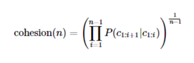
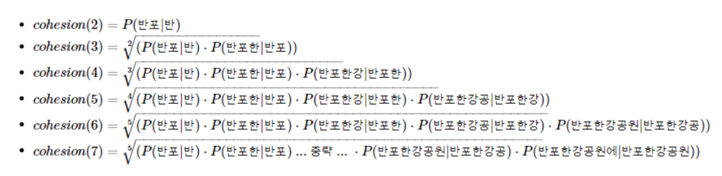

# 1. PyKoSpacing
- PyKoSpacing은 띄어쓰기가 되어있지 않은 문장을 띄어쓰기를 한 문장으로 변환해주는 패키지
```
sent = '김철수는 극중 두 인격의 사나이 이광수 역을 맡았다. 철수는 한국 유일의 태권도 전승자를 가리는 결전의 날을 앞두고 
10년간 함께 훈련한 사형인 유연재(김광수 분)를 찾으러 속세로 내려온 인물이다.'
```
```
new_sent = sent.replace(" ", '') # 띄어쓰기가 없는 문장 임의로 만들기
print(new_sent)

[output]
김철수는극중두인격의사나이이광수역을맡았다.철수는한국유일의태권도전승자를가리는결전의날을앞두고10년간함께훈련한사형인유연재(김광수분)를찾으러속세로내려온인물이다.
```
```
from pykospacing import Spacing
spacing = Spacing()
kospacing_sent = spacing(new_sent) 

print(sent)
print(kospacing_sent)

[output]
김철수는 극중 두 인격의 사나이 이광수 역을 맡았다. 철수는 한국 유일의 태권도 전승자를 가리는 결전의 날을 앞두고 10년간 함께 훈련한 사형인 유연재(김광수 분)를 찾으러 속세로 내려온 인물이다.
김철수는 극중 두 인격의 사나이 이광수 역을 맡았다. 철수는 한국 유일의 태권도 전승자를 가리는 결전의 날을 앞두고 10년간 함께 훈련한 사형인 유연재(김광수 분)를 찾으러 속세로 내려온 인물이다.
```
# 2. Py-Hanspell
- Py-Hanspell은 네이버 한글 맞춤법 검사기를 바탕으로 만들어진 패키지
```
from hanspell import spell_checker

sent = "맞춤법 틀리면 외 않되? 쓰고싶은대로쓰면돼지 "
spelled_sent = spell_checker.check(sent)

hanspell_sent = spelled_sent.checked
print(hanspell_sent)

[output]
맞춤법 틀리면 왜 안돼? 쓰고 싶은 대로 쓰면 되지
```
```
spelled_sent = spell_checker.check(new_sent)

hanspell_sent = spelled_sent.checked
print(hanspell_sent)
print(kospacing_sent) # 앞서 사용한 kospacing 패키지에서 얻은 결과

[output]
김철수는 극 중 두 인격의 사나이 이광수 역을 맡았다. 철수는 한국 유일의 태권도 전승자를 가리는 결전의 날을 앞두고 10년간 함께 훈련한 사형인 유연제(김광수 분)를 찾으러 속세로 내려온 인물이다.
김철수는 극중 두 인격의 사나이 이광수 역을 맡았다. 철수는 한국 유일의 태권도 전승자를 가리는 결전의 날을 앞두고 10년간 함께 훈련한 사형인 유연재(김광수 분)를 찾으러 속세로 내려온 인물이다.
```
# 3. SOYNLP를 이용한 단어 토큰화
- soynlp는 품사 태깅, 단어 토큰화 등을 지원하는 단어 토크나이저
- 비지도 학습으로 단어 토큰화를 한다는 특징을 갖고 있으며, 데이터에 자주 등장하는 단어들을 단어로 분석
- soynlp 단어 토크나이저는 내부적으로 단어 점수 표로 동작
- 이 점수는 응집 확률(cohesion probability)과 브랜칭 엔트로피(branching entropy)를 활용
## 1. 신조어 문제
- 기존의 형태소 분석기는 신조어나 형태소 분석기에 등록되지 않은 단어 같은 경우에는 제대로 구분하지 못하는 단점
```
from konlpy.tag import Okt
tokenizer = Okt()
print(tokenizer.morphs('에이비식스 이대휘 1월 최애돌 기부 요정'))

[output]
['에이', '비식스', '이대', '휘', '1월', '최애', '돌', '기부', '요정']
```
- 텍스트 데이터에서 특정 문자 시퀀스가 함께 자주 등장하는 빈도가 높고, 앞 뒤로 조사 또는 완전히 다른 단어가 등장하는 것을 고려해서 해당 문자 시퀀스를 형태소라고 판단하는 단어 토크나이저   
-> soynlp
## 2. 학습하기
```
import urllib.request
from soynlp import DoublespaceLineCorpus
from soynlp.word import WordExtractor

urllib.request.urlretrieve("https://raw.githubusercontent.com/lovit/soynlp/master/tutorials/2016-10-20.txt", filename="2016-10-20.txt")

# 훈련 데이터를 다수의 문서로 분리
corpus = DoublespaceLineCorpus("2016-10-20.txt")
len(corpus)

[output]
30091
```
- 총 3만 91개의 문서가 존재. 상위 3개의 문서만 출력
```
i = 0
for document in corpus:
  if len(document) > 0:
    print(document)
    i = i+1
  if i == 3:
    break
    
[output]
19  1990  52 1 22
오패산터널 총격전 용의자 검거 서울 연합뉴스 경찰 관계자들이 19일 오후 서울 강북구 오패산 터널 인근에서 사제 총기를 발사해 경찰을 살해한 용의자 성모씨를 검거하고 있다 ... 중략 ... 숲에서 발견됐고 일부는 성씨가 소지한 가방 안에 있었다
테헤란 연합뉴스 강훈상 특파원 이용 승객수 기준 세계 최대 공항인 아랍에미리트 두바이국제공항은 19일 현지시간 이 공항을 이륙하는 모든 항공기의 탑승객은 삼성전자의 갤럭시노트7을 휴대하면 안 된다고 밝혔다 ... 중략 ... 이런 조치는 두바이국제공항 뿐 아니라 신공항인 두바이월드센터에도 적용된다  배터리 폭발문제로 회수된 갤럭시노트7 연합뉴스자료사진
```
- soynlp는 학습 기반의 단어 토크나이저이므로 기존의 KoNLPy에서 제공하는 형태소 분석기들과는 달리 학습 과정 필요
- 전체 코퍼스로부터 응집 확률과 브랜칭 엔트로피 단어 점수표를 만드는 과정
- WordExtractor.extract()를 통해서 전체 코퍼스에 대해 단어 점수표를 계산
```
word_extractor = WordExtractor()
word_extractor.train(corpus)
word_score_table = word_extractor.extract()

[output]
training was done. used memory 5.186 Gb
all cohesion probabilities was computed. # words = 223348
all branching entropies was computed # words = 361598
all accessor variety was computed # words = 361598
```
# 3. SOYNLP의 응집 확률(cohesion probability)
- 응집 확률은 내부 문자열(substring)이 얼마나 응집하여 자주 등장하는지를 판단하는 척도
- 응집 확률은 문자열을 문자 단위로 분리하여 내부 문자열을 만드는 과정에서 왼쪽부터 순서대로 문자를 추가하면서 각 문자열이 주어졌을 때 그 다음 문자가 나올 확률을 계산하여 누적곱을 한 값
- 이 값이 높을수록 전체 코퍼스에서 이 문자열 시퀀스는 하나의 단어로 등장할 가능성이 높음

- '반포한강공원에'라는 7의 길이를 가진 문자 시퀀스에 대해서 각 내부 문자열의 스코어를 구하는 과정

```
word_score_table["반포한"].cohesion_forward

[output]
0.08838002913645132
```
```
word_score_table["반포한강공원"].cohesion_forward

[output]
0.37891487632839754
```
- "반포한강공원"이 응집도가 가장 높음
# 4. SOYNLP의 브랜칭 엔트로피(branching entropy)
- Branching Entropy는 확률 분포의 엔트로피값을 사용
- 브랜칭 엔트로피의 값은 하나의 완성된 단어에 가까워질수록 문맥으로 인해 점점 정확히 예측할 수 있게 되면서 점점 줄어드는 양상
```
word_score_table["디스"].right_branching_entropy

[output]
1.6371694761537934
```
```
word_score_table["디스플"].right_branching_entropy

[output]
-0.0
```
- '디스' 다음에는 다양한 문자가 올 수 있으니까 1.63이라는 값
- '디스플'이라는 문자열 다음에는 다음 문자로 '레'가 오는 것이 너무나 명백하기 때문에 0이란 값
```
word_score_table["디스플레이"].right_branching_entropy

[output]
3.1400392861792916
```
- 문자 시퀀스 '디스플레이'라는 문자 시퀀스 다음에는 조사나 다른 단어와 같은 다양한 경우가 있을 수 있기 때문에 갑자기 값이 증가
# 5. SOYNLP의 L tokenizer
- 띄어쓰기 단위로 나눈 어절 토큰은 주로 L 토큰 + R 토큰의 형식을 가질 때
```
from soynlp.tokenizer import LTokenizer

scores = {word:score.cohesion_forward for word, score in word_score_table.items()}
l_tokenizer = LTokenizer(scores=scores)
l_tokenizer.tokenize("국제사회와 우리의 노력들로 범죄를 척결하자", flatten=False)

[output]
[('국제사회', '와'), ('우리', '의'), ('노력', '들로'), ('범죄', '를'), ('척결', '하자')]
```
# 6. 최대 점수 토크나이저
- 최대 점수 토크나이저는 띄어쓰기가 되지 않는 문장에서 점수가 높은 글자 시퀀스를 순차적으로 찾아내는 토크나이저
- 띄어쓰기가 되어 있지 않은 문장을 넣어서 점수를 통해 토큰화 된 결과
```
from soynlp.tokenizer import MaxScoreTokenizer

maxscore_tokenizer = MaxScoreTokenizer(scores=scores)
maxscore_tokenizer.tokenize("국제사회와우리의노력들로범죄를척결하자")

[output]
['국제사회', '와', '우리', '의', '노력', '들로', '범죄', '를', '척결', '하자']
```
4. SOYNLP를 이용한 반복되는 문자 정제
- ㅋㅋ, ㅋㅋㅋ, ㅋㅋㅋㅋ와 같이 반복되는 것은 하나로 정규화
```
from soynlp.normalizer import *

print(emoticon_normalize('앜ㅋㅋㅋㅋ이영화존잼쓰ㅠㅠㅠㅠㅠ', num_repeats=2))
print(emoticon_normalize('앜ㅋㅋㅋㅋㅋㅋㅋㅋㅋ이영화존잼쓰ㅠㅠㅠㅠ', num_repeats=2))
print(emoticon_normalize('앜ㅋㅋㅋㅋㅋㅋㅋㅋㅋㅋㅋㅋ이영화존잼쓰ㅠㅠㅠㅠㅠㅠ', num_repeats=2))
print(emoticon_normalize('앜ㅋㅋㅋㅋㅋㅋㅋㅋㅋㅋㅋㅋㅋㅋㅋㅋㅋ이영화존잼쓰ㅠㅠㅠㅠㅠㅠㅠㅠ', num_repeats=2))

[output]
아ㅋㅋ영화존잼쓰ㅠㅠ
아ㅋㅋ영화존잼쓰ㅠㅠ
아ㅋㅋ영화존잼쓰ㅠㅠ
아ㅋㅋ영화존잼쓰ㅠㅠ
```
- 의미없게 반복되는 것은 비단 이모티콘에 한정 X
```
print(repeat_normalize('와하하하하하하하하하핫', num_repeats=2))
print(repeat_normalize('와하하하하하하핫', num_repeats=2))
print(repeat_normalize('와하하하하핫', num_repeats=2))

[output]
와하하핫
와하하핫
와하하핫
```
# 5. Customized KoNLPy
- 이런 경우에는 사용자 사전이 필요
```
형태소 분석 입력 : '은경이는 사무실로 갔습니다.'
형태소 분석 결과 : ['은', '경이', '는', '사무실', '로', '갔습니다', '.']
```
- customized_konlpy에서 제공하는 형태소 분석기 Twitter를 사용하여 앞서 소개했던 예문을 단어 토큰화
```
from ckonlpy.tag import Twitter
twitter = Twitter()
twitter.morphs('은경이는 사무실로 갔습니다.')

[output]
['은', '경이', '는', '사무실', '로', '갔습니다', '.']
```
- 형태소 분석기 Twitter에 add_dictionary('단어', '품사')와 같은 형식으로 사전 추가
```
twitter.add_dictionary('은경이', 'Noun')
twitter.morphs('은경이는 사무실로 갔습니다.')

[output]
['은경이', '는', '사무실', '로', '갔습니다', '.']
```