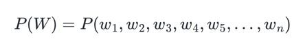
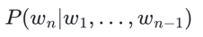
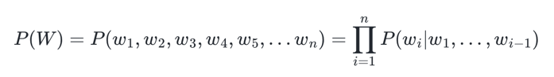

- 언어 모델(Language Model, LM)은 언어라는 현상을 모델링하고자 단어 시퀀스(문장)에 확률을 할당(assign)하는 모델
- 언어 모델을 만드는 방법은 크게는 통계를 이용한 방법과 인공 신경망을 이용한 방법으로 구분
# 1. 언어 모델(Language Model)
- 언어 모델은 단어 시퀀스에 확률을 할당(assign) 하는 일을 하는 모델
- 언어 모델은 가장 자연스러운 단어 시퀀스를 찾아내는 모델
- 가장 보편적으로 사용되는 방법은 언어 모델이 이전 단어들이 주어졌을 때 다음 단어를 예측하도록 하는 것
- 언어 모델에 -ing를 붙인 언어 모델링(Language Modeling)은 주어진 단어들로부터 아직 모르는 단어를 예측하는 작업
- 언어 모델이 이전 단어들로부터 다음 단어를 예측하는 일은 언어 모델링
# 2. 단어 시퀀스의 확률 할당
### a. 기계 번역(Machine Translation):
```
P(나는 버스를 탔다) > P(나는 버스를 태운다)
```
- 언어 모델은 두 문장을 비교하여 좌측의 문장의 확률이 더 높다고 판단
### b. 오타 교정(Spell Correction)
```
선생님이 교실로 부리나케  
P(달려갔다) > P(잘려갔다)  
```
- 언어 모델은 두 문장을 비교하여 좌측의 문장의 확률이 더 높다고 판단
### c. 음성 인식(Speech Recognition)
```
P(나는 메롱을 먹는다) < P(나는 메론을 먹는다)
```
- 언어 모델은 두 문장을 비교하여 우측의 문장의 확률이 더 높다고 판단
# 3. 주어진 이전 단어들로부터 다음 단어 예측하기
- 단어 시퀀스에 확률을 할당하기 위해서 가장 보편적으로 사용하는 방법은 이전 단어들이 주어졌을 때, 다음 단어를 예측하도록 하는 것
- 이를 조건부 확률로 표현
### A. 단어 시퀀스의 확률
- 하나의 단어를 w, 단어 시퀀스를 대문자 W라고 한다면, n개의 단어가 등장하는 단어 시퀀스 W의 확률은 다음과 같다

- |의 기호는 조건부 확률을 의미
### B. 다음 단어 등장 확률
- n-1개의 단어가 나열된 상태에서 n번째 단어의 확률

- 전체 단어 시퀀스 W의 확률은 모든 단어가 예측되고 나서야 알 수 있으므로 단어 시퀀스의 확률은 다음과 같음

# 4. 언어 모델의 간단한 직관
- 비행기를 타려고 공항에 갔는데 지각을 하는 바람에 비행기를 [?]라는 문장이 있으면 여러 단어들을 후보로 생각하고 가장 높은 확률을 꼽는다