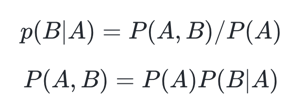
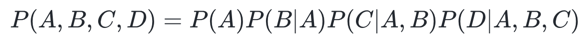
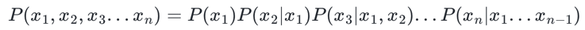
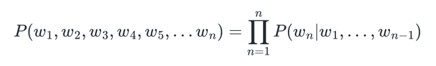
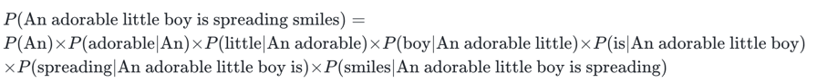
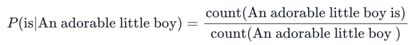
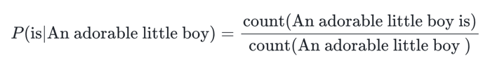

- 통계적 언어 모델(Statistical Language Model)은 줄여서 SLM
# 1. 조건부 확률
- 조건부 확률은 두 확률 P(A), P(B)에 대해서 아래와 같은 관계

-  4개의 확률이 조건부 확률의 관계를 가질 때

- 이를 조건부 확률의 연쇄 법칙(chain rule). 4개가 아닌 n개에 대해서 일반화

# 2. 문장에 대한 확률
- P(An adorable little boy is spreading smiles)을 식으로 표현
- 언급한 조건부 확률의 일반화 식을 문장의 확률 관점에서 다시 적어보면 문장의 확률은 각 단어들이 이전 단어가 주어졌을 때 다음 단어로 등장할 확률의 곱으로 구성

# 3. 카운트 기반의 접근
- An adorable little boy가 나왔을 때, is가 나올 확률, P(is|An adorable little boy)

# 4. 카운트 기반 접근의 한계 - 희소 문제(Sparsity Problem)
- 언어 모델은 실생활에서 사용되는 언어의 확률 분포를 근사 모델링
- 실제로 정확하게 알아볼 방법은 없겠지만 현실에서도 An adorable little boy가 나왔을 때 is가 나올 확률이라는 것이 존재
- 이를 실제 자연어의 확률 분포, 현실에서의 확률 분포
- 기계에게 많은 코퍼스를 훈련시켜서 언어 모델을 통해 현실에서의 확률 분포를 근사하는 것이 언어 모델의 목표
- 하지만, 카운트 기반으로 접근하려고 한다면 갖고있는 코퍼스(corpus). 즉, 다시 말해 기계가 훈련하는 데이터는 정말 방대한 양이 필요

- 기계가 훈련한 코퍼스에 An adorable little boy is라는 단어 시퀀스가 없었다면 이 단어 시퀀스에 대한 확률은 0
- 또는 An adorable little boy라는 단어 시퀀스가 없었다면 분모가 0이 되어 확률은 정의 X
- 현실에선 An adorable little boy is 라는 단어 시퀀스가 존재하고 또 문법에도 적합하므로 정답일 가능성 또한 높다
- 충분한 데이터를 관측하지 못하여 언어를 정확히 모델링하지 못하는 문제를 희소 문제(sparsity problem)
- 이러한 한계로 인해 언어 모델의 트렌드는 통계적 언어 모델에서 인공 신경망 언어 모델로 이동