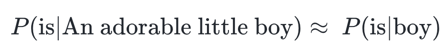
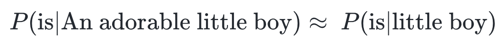
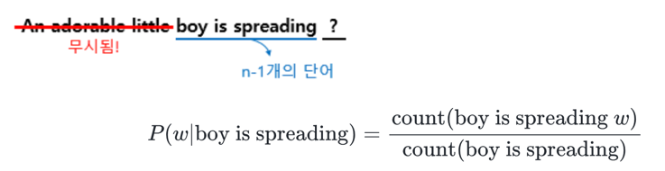
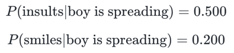
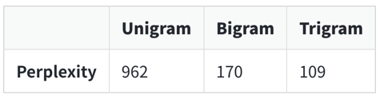

- 이전에 등장한 모든 단어를 고려하는 것이 아니라 일부 단어만 고려하는 접근 방법을 사용
- 이때 일부 단어를 몇개 보느냐를 결정하는데 이것이 n-gram에서의 n이 가지는 의미
# 1. 코퍼스에서 카운트하지 못하는 경우의 감소.
- SLM의 한계는 훈련 코퍼스에 확률을 계산하고 싶은 문장이나 단어가 없을 수 있다는 점
- 다음과 같이 참고하는 단어들을 줄이면 카운트를 할 수 있을 가능성 향상 가능

- 갖고있는 코퍼스에 An adorable little boy is가 있을 가능성 보다는 boy is라는 더 짧은 단어 시퀀스가 존재할 가능성이 더 높다
- 조금 지나친 일반화로 느껴진다면 아래와 같이 little boy가 나왔을 때 is가 나올 확률로 생각하는 것도 대안

- 이제는 단어의 확률을 구하고자 기준 단어의 앞단어를 전부 포함해서 카운트하는 것이 아니라, 앞 단어 중 임의의 개수만 포함해서 카운트하여 근사하자는 것
# 2. N-gram
- n-gram은 n개의 연속적인 단어 나열을 의미
- 갖고 있는 코퍼스에서 n개의 단어 뭉치 단위로 끊어서 이를 하나의 토큰으로 간주
- 문장 An adorable little boy is spreading smiles이 있을 때, 각 n에 대해서 n-gram을 전부 구해보면 다음과 같다
```
unigrams : an, adorable, little, boy, is, spreading, smiles
bigrams : an adorable, adorable little, little boy, boy is, is spreading, spreading smiles
trigrams : an adorable little, adorable little boy, little boy is, boy is spreading, is spreading smiles
4-grams : an adorable little boy, adorable little boy is, little boy is spreading, boy is spreading smiles
```
- n-gram을 통한 언어 모델에서는 다음에 나올 단어의 예측은 오직 n-1개의 단어에만 의존
- 'An adorable little boy is spreading' 다음에 나올 단어를 예측하고 싶다고 해보자
- n=4라고 한 4-gram을 이용한 언어 모델을 사용하는 경우, spreading 다음에 올 단어를 예측하는 것은 n-1에 해당되는 앞의 3개의 단어만을 고려

- boy is spreading가 1,000번 등장했다고 해보자
- boy is spreading insults가 500번 등장했으며, boy is spreading smiles가 200번 등장했다고 하자 
- 그렇게 되면 boy is spreading 다음에 insults가 등장할 확률은 50%이며, smiles가 등장할 확률은 20%. 
- 확률적 선택에 따라 우리는 insults가 더 맞다고 판단

# 3. N-gram Language Model의 한계
- '작고 사랑스러운'을 지우게 되면, '모욕을 퍼트렸다'라는 부정적인 내용이 '웃음 지었다' 대신 선택 될 수도 있다
- n-gram은 앞의 단어 몇 개만 보다 보니 의도하고 싶은 대로 문장을 끝맺음하지 못하는 경우가 생긴다는 점
- 한계점 발생
## (1) 희소 문제(Sparsity Problem)
## (2) n을 선택하는 것은 trade-off 문제.
- 몇 개의 단어를 볼지 n을 정하는 것은 trade-off가 존재
- n을 크게 선택하면 실제 훈련 코퍼스에서 해당 n-gram을 카운트할 수 있는 확률은 적어지므로 희소 문제는 점점 심각
- 또한 n이 커질수록 모델 사이즈가 커진다는 문제점
- n을 작게 선택하면 훈련 코퍼스에서 카운트는 잘 되겠지만 근사의 정확도는 현실의 확률분포와 멀어진다
- 앞서 언급한 trade-off 문제로 인해 정확도를 높이려면 n은 최대 5를 넘게 잡아서는 안 된다고 권장
- 스탠퍼드 대학교 공유 자료. 3800만개의 단어토큰으로 학습하고 1500만개의 테스트 데이터
- n을 높일수록 성능이 올라간다

# 4. 적용 분야(Domain)에 맞는 코퍼스의 수집
- 언어 모델에 사용하는 코퍼스를 해당 도메인의 코퍼스를 사용한다면 당연히 언어 모델이 제대로 된 언어 생성을 할 가능성이 높아진다
# 5. 인공 신경망을 이용한 언어 모델(Neural Network Based Language Model)
- 대안으로 N-gram Language Model보다 대체적으로 성능이 우수한 인공 신경망을 이용한 언어 모델이 많이 사용