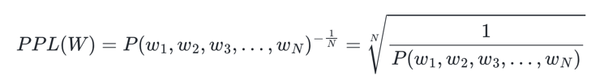
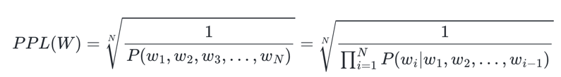
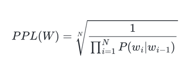
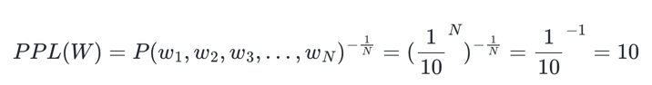
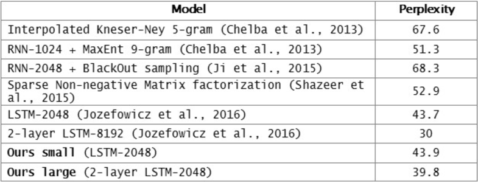

- 두 모델의 성능을 비교하고자, 일일히 모델들에 대해서 실제 작업을 시켜보고 정확도를 비교하는 작업은 공수가 너무 많이 드는 작업
- 조금은 부정확할 수는 있어도 테스트 데이터에 대해서 빠르게 식으로 계산되는 더 간단한 평가 방법
- 자신의 성능을 수치화하여 결과를 내놓는 펄플렉서티(perplexity)
# 1. 언어 모델의 평가 방법(Evaluation metric) : PPL
- 언어 모델을 평가하기 위한 평가 지표
- PPL은 수치가 높으면 좋은 성능을 의미하는 것이 아니라, '낮을수록' 언어 모델의 성능이 좋다는 것을 의미한다는 점
- PPL은 문장의 길이로 정규화된 문장 확률의 역수. 문장 W의 길이가 N이라고 했을 때 PPL

- 문장의 확률에 체인룰(chain rule)을 적용

- bigram 언어 모델의 경우의 식

# 2. 분기 계수(Branching factor)
- PPL은 선택할 수 있는 가능한 경우의 수를 의미하는 분기계수(branching factor)
- PPL은 이 언어 모델이 특정 시점에서 평균적으로 몇 개의 선택지를 가지고 고민하고 있는지를 의미
- 10이라 하면, 해당 언어 모델은 테스트 데이터에 대해서 다음 단어를 예측하는 모든 시점(time step)마다 평균 10개의 단어를 가지고 어떤 것이 정답인지 고민

- PPL의 값이 낮다는 것은 테스트 데이터 상에서 높은 정확도를 보인다는 것이지, 사람이 직접 느끼기에 좋은 언어 모델이라는 것을 반드시 의미하진 않는다는 점
- 언어 모델의 PPL은 테스트 데이터에 의존하므로 두 개 이상의 언어 모델을 비교할 때는 정량적으로 양이 많고, 또한 도메인에 알맞은 동일한 테스트 데이터를 사용해야 신뢰도가 높다는 것
# 3. 기존 언어 모델 Vs. 인공 신경망을 이용한 언어 모델.
- 페이스북 AI 연구팀에서 했는데 인공 신경망 쓰랜다
