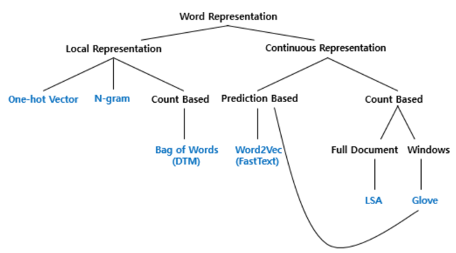

# 1. 단어의 표현 방법
- 단어의 표현 방법은 크게 국소 표현(Local Representation) 방법과 분산 표현(Distributed Representation) 방법으로 나눔
- 국소 표현 방법은 해당 단어 그 자체만 보고, 특정값을 맵핑하여 단어를 표현하는 방법이며, 분산 표현 방법은 그 단어를 표현하고자 주변을 참고하여 단어를 표현하는 방법
```
[국소 표현 방법]
puppy(강아지)-1번, cute(귀여운)-2번, lovely(사랑스러운)-3번으로 숫자를 매핑

[분산 표현 방법]
puppy(강아지)라는 단어 근처에는 주로 cute(귀여운), lovely(사랑스러운)이라느 단어가 자주 등장하므로 puppy -> cute, lovely한 느낌이다
```
- 국소 표현 방법을 이산 표현이라고도 하며, 분산 표현을 연속 표현이라고도 함

# 2. 단어 표현의 카테고리화
- 단어 표현을 카테고리화하여 작성

- Bag of Words는 국소 표현에에 속하며, 단어의 빈도수를 카운트하여 단어를 수치화하는 단어 표현 방법
- BoW와 그의 확장인 DTM(또는 TDM)에 대해서 학습
- 이러한 빈도수 기반 단어 표현에 단어의 중요도에 따른 가중치를 줄 수 있는 TF-IDF에 대해서 학습