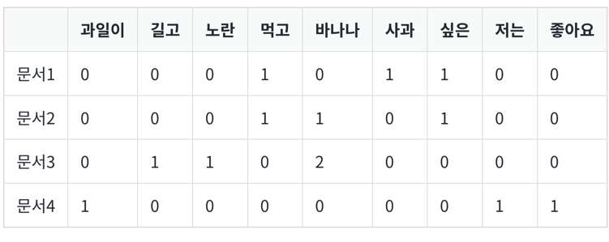

- 서로 다른 문서들의 BoW들을 결합한 표현 방법인 문서 단어 행렬(Document-Term Matrix, DTM) 표현 방법 다뤄보자
- 행과 열을 반대로 선택하면 TDM이라고 부르기도. 이렇게 하면 서로 다른 문서들을 비교 가능
# 1. 문서 단어 행렬(Document-Term Matrix, DTM)의 표기법
- 문서 단어 행렬(Document-Term Matrix, DTM)이란 다수의 문서에서 등장하는 각 단어들의 빈도를 행렬로 표현한 것
- BoW와 다른 표현 방법이 아니라 BoW 표현을 다수의 문서에 대해서 행렬로 표현하고 부르는 용어
```
문서1 : 먹고 싶은 사과
문서2 : 먹고 싶은 바나나
문서3 : 길고 노란 바나나 바나나
문서4 : 저는 과일이 좋아요
```

2. 문서 단어 행렬(Document-Term Matrix)의 한계
## 1) 희소 표현(Sparse representation)
- DTM에서의 각 행을 문서 벡터라고 해봅시다. 각 문서 벡터의 차원은 원-핫 벡터와 마찬가지로 전체 단어 집합의 크기
- 가지고 있는 전체 코퍼스가 방대한 데이터라면 문서 벡터의 차원은 수만 이상의 차원
- 많은 문서 벡터가 대부분의 값이 0을 가질 수도 있음
- 원-핫 벡터나 DTM과 같은 대부분의 값이 0인 표현을 희소 벡터 또는 희소 행렬라고 부르는데, 희소 벡터는 많은 양의 저장 공간과 높은 계산 복잡도를 요구
- 전처리를 통해 단어 집합의 크기를 줄이는 일은 BoW 표현을 사용하는 모델에서 중요할 수 있음
## 2) 단순 빈도 수 기반 접근
- 여러 문서에 등장하는 모든 단어에 대해서 빈도 표기를 하는 이런 방법은 때로는 한계를 지님
- 영어에 대해서 DTM을 만들었을 때, 불용어인 the는 어떤 문서이든 자주 등장할 수 밖에 없음
- 유사한 문서인지 비교하고 싶은 문서1, 문서2, 문서3에서 동일하게 the가 빈도수가 높다고 해서 이 문서들이 유사한 문서라고 판단 X
- DTM에 불용어와 중요한 단어에 대해서 가중치를 줄 수 있는 방법은 없을까?
- 이러한 아이디어를 적용한 TF-IDF를 이어서 학습!
