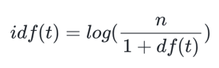
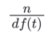

# 1. TF-IDF(단어 빈도-역 문서 빈도, Term Frequency-Inverse Document Frequency)
- 단어의 빈도와 역 문서 빈도(문서의 빈도에 특정 식을 취함)를 사용하여 DTM 내의 각 단어들마다 중요한 정도를 가중치로 주는 방법
- 우선 DTM을 만든 후, TF-IDF 가중치를 부여
- TF-IDF는 주로 문서의 유사도를 구하는 작업, 검색 시스템에서 검색 결과의 중요도를 정하는 작업, 문서 내에서 특정 단어의 중요도를 구하는 작업 등
- TF-IDF는 TF와 IDF를 곱한 값을 의미하는데 이를 식으로 표현. 
- 문서를 d, 단어를 t, 문서의 총 개수를 n이라고 표현할 때 TF, DF, IDF는 각각 다음과 같이 정의
## (1) tf(d,t) : 특정 문서 d에서의 특정 단어 t의 등장 횟수.
- TF는 앞에서 배운 DTM의 예제에서 각 단어들이 가진 값들
- DTM이 각 문서에서의 각 단어의 등장 빈도
## (2) df(t) : 특정 단어 t가 등장한 문서의 수.
- 오직 특정 단어 t가 등장한 문서의 수에만 관심
## (3) idf(t) : df(t)에 반비례하는 수.

- IDF는 DF의 역수를 취하고 싶은 것
- log를 사용하지 않았을 때, IDF를 DF의 역수로 사용한다면 총 문서의 수 n이 커질수록, IDF의 값은 기하급수적으로 커지게 됩니다. 그렇기 때문에 log를 사용   
