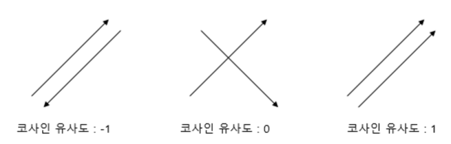
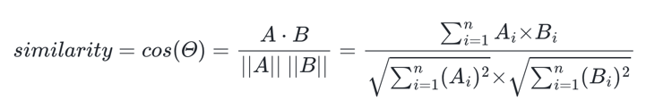
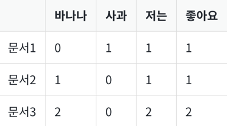

# 1. 코사인 유사도(Cosine Similarity)
- 두 벡터 간의 코사인 각도를 이용하여 구할 수 있는 두 벡터의 유사도를 의미
- -1~1의 값을 갖고 있고, 1에 가까울수록 유사


- 문서 단어 행렬이나 TF-IDF 행렬을 통해서 문서의 유사도를 구하는 경우에는 문서 단어 행렬이나 TF-IDF 행렬이 각각의 특징 벡터 A, B
- 다음 예시를 통해 문서 단어 행렬에 대해서 코사인 유사도
```
문서1 : 저는 사과 좋아요
문서2 : 저는 바나나 좋아요
문서3 : 저는 바나나 좋아요 저는 바나나 좋아요
```
- 문서행렬   

```
import numpy as np
from numpy import dot
from numpy.linalg import norm

def cos_sim(A, B):
  return dot(A, B)/(norm(A)*norm(B))

doc1 = np.array([0,1,1,1])
doc2 = np.array([1,0,1,1])
doc3 = np.array([2,0,2,2])

print('문서 1과 문서2의 유사도 :',cos_sim(doc1, doc2))
print('문서 1과 문서3의 유사도 :',cos_sim(doc1, doc3))
print('문서 2와 문서3의 유사도 :',cos_sim(doc2, doc3))

[output]
문서 1과 문서2의 유사도 : 0.67
문서 1과 문서3의 유사도 : 0.67
문서 2과 문서3의 유사도 : 1.00
```
- 문서3은 문서2에서 단지 모든 단어의 빈도수가 1씩 증가
- 빈도수가 동일하게 증가하는 경우에는 기존의 문서와 코사인 유사도의 값이 1이라는 것
- 코사인 유사도는 유사도를 구할 때 벡터의 방향(패턴)에 초점을 두므로 코사인 유사도는 문서의 길이가 다른 상황에서 비교적 공정한 비교 가능
# 2. 유사도를 이용한 추천 시스템 구현하기
- 예제
