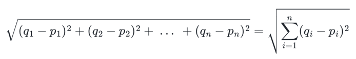
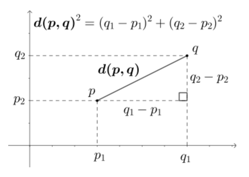
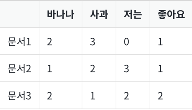
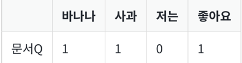
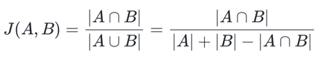

1. 유클리드 거리(Euclidean distance)
- 문서의 유사도를 구할 때 자카드 유사도나 코사인 유사도만큼, 유용한 방법 X
- 하지만 시도해보는 것 자체만으로 다른 개념들을 이해할 때 도움이 되므로 의미
- 두 개의 점 p, q


- 여러 문서에 대해서 유사도를 구하고자 유클리드 거리 공식을 사용한다는 것은, 앞서 본 2차원을 단어의 총 개수만큼의 차원으로 확장한다는 것

- 다음과 같은 문서Q에 대해서 문서1, 문서2, 문서3 중 가장 유사한 문서를 찾아내고자

```
import numpy as np

def dist(x,y):   
    return np.sqrt(np.sum((x-y)**2))

doc1 = np.array((2,3,0,1))
doc2 = np.array((1,2,3,1))
doc3 = np.array((2,1,2,2))
docQ = np.array((1,1,0,1))

print('문서1과 문서Q의 거리 :',dist(doc1,docQ))
print('문서2과 문서Q의 거리 :',dist(doc2,docQ))
print('문서3과 문서Q의 거리 :',dist(doc3,docQ))

[output]
문서1과 문서Q의 거리 : 2.23606797749979
문서2과 문서Q의 거리 : 3.1622776601683795
문서3과 문서Q의 거리 : 2.449489742783178
```
- 유클리드 거리의 값이 가장 작다는 것은 문서 간 거리가 가장 가깝다는 것을 의미
- Q와 1이 가장 유사하다고 볼 수 있다!
# 2. 자카드 유사도(Jaccard similarity)
- 합집합에서 교집합의 비율을 구한다면 두 집합 A와 B의 유사도를 구할 수 있다는 것이 자카드 유사도(jaccard similarity)의 아이디어
- 자카드 유사도는 0과 1사이의 값을 가지며, 만약 두 집합이 동일하다면 1의 값을 가지고, 두 집합의 공통 원소가 없다면 0

- doc1, doc2의 유사도  

```
doc1 = "apple banana everyone like likey watch card holder"
doc2 = "apple banana coupon passport love you"

# 토큰화
tokenized_doc1 = doc1.split()
tokenized_doc2 = doc2.split()

print('문서1 :',tokenized_doc1)
print('문서2 :',tokenized_doc2)

[output]
문서1 : ['apple', 'banana', 'everyone', 'like', 'likey', 'watch', 'card', 'holder']
문서2 : ['apple', 'banana', 'coupon', 'passport', 'love', 'you']
```
- 문서1과 문서2의 합집합
```
union = set(tokenized_doc1).union(set(tokenized_doc2))
print('문서1과 문서2의 합집합 :',union)

[output]
문서1과 문서2의 합집합 : {'you', 'passport', 'watch', 'card', 'love',
 'everyone', 'apple', 'likey', 'like', 'banana', 'holder', 'coupon'}
```
- 문서1과 문서2의 교집합
```
intersection = set(tokenized_doc1).intersection(set(tokenized_doc2))
print('문서1과 문서2의 교집합 :',intersection)

[output]
문서1과 문서2의 교집합 : {'apple', 'banana'}
```
```
print('자카드 유사도 :',len(intersection)/len(union))

[output]
자카드 유사도 : 0.16666666666666666
```