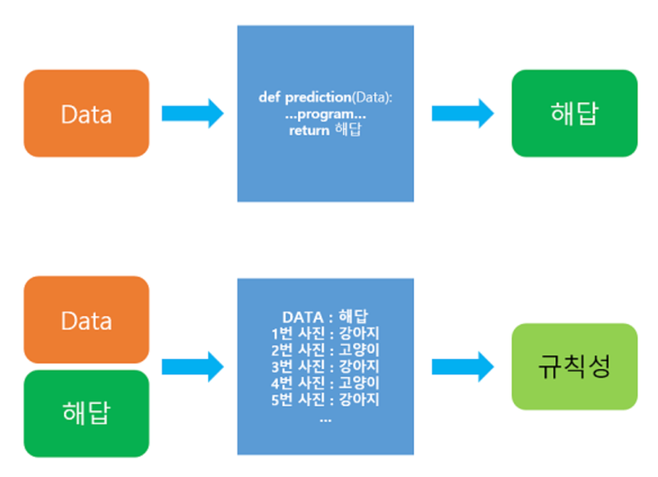

# 1. 머신 러닝(Machine Learning)이 아닌 접근 방법의 한계
- 기존의 프로그래밍 작성 방식을 통해서는 해결하기 어려운 문제 예시
```
예시 : 주어진 사진으로부터 고양이 사진인지 강아지 사진인지 판별하는 일.  
```
- 사진이란 건 사진을 보는 각도, 조명, 타겟의 변형(고양이의 자세)에 따라서 너무나 천차만별이라 사진으로부터 공통된 명확한 특징을 잡아내는 것은 어려움
- 결론을 미리 얘기하면 해당 프로그램은 숫자를 정렬하는 것과 같은 명확한 알고리즘이 애초에 존재 X
# 2. 머신 러닝 방식

- 머신 러닝은 데이터가 주어지면, 기계가 스스로 데이터로부터 규칙성을 찾는 것에 집중
- 