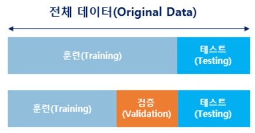
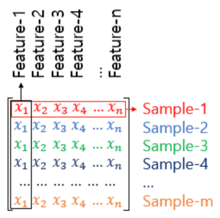
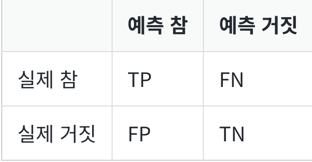
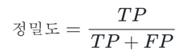
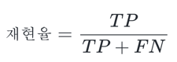
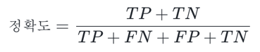
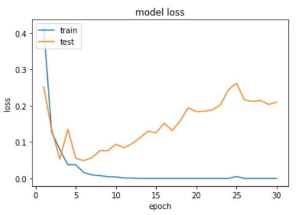

# 1. 머신 러닝 모델의 평가

- 머신 러닝을 위한 데이터를 준비했다면 기계를 학습하기 전 해당 데이터를 훈련용, 검증용, 테스트용 이렇게 세 가지로 분리하는 것이 일반적
- 훈련 데이터는 머신 러닝 모델을 학습하는 용도. 테스트 데이터는 학습한 머신 러닝 모델의 성능을 평가하기 위한 용도
- 검증용 데이터는 모델의 성능을 평가하기 위한 용도가 아니라 모델의 성능을 조정하기 위한 용도
- 모델이 훈련 데이터에 '과적합(overfitting)' 이 되고 있는지 판단하거나 하이퍼파라미터의 조정을 위한 용도
1. 하이퍼파라미터(초매개변수) : 모델의 성능에 영향을 주는 사람이 값을 지정하는 변수.
2. 매개변수 : 가중치와 편향. 학습을 하는 동안 값이 계속해서 변하는 수.
- 뒤의 선형 회귀에서 배우게 되는 경사 하강법에서 학습률(learning rate)이나, 딥 러닝에서 뉴런의 수나 층의 수와 같은 것들이 대표적인 하이퍼파라미터
- 훈련용 데이터로 훈련을 모두 시킨 모델은 검증용 데이터를 사용하여 정확도를 검증하며 하이퍼파라미터를 '튜닝(tuning)'
# 2. 분류(Classification)와 회귀(Regression)
- 머신 러닝의 많은 문제는 분류 또는 회귀 문제
- 머신 러닝 기법 중 선형 회귀와 로지스틱 회귀를 다루는데 선형 회귀는 대표적인 회귀 문제에 속하고, 로지스틱 회귀는 대표적인 분류 문제
## 1) 이진 분류 문제(Binary Classification)
- 이진 분류는 주어진 입력에 대해서 두 개의 선택지 중 하나의 답을 선택해야 하는 경우   
ex) 최종적으로 합격, 불합격인지 판단하는 문제, 메일을 보고나서 정상 메일, 스팸 메일인지
## 2) 다중 클래스 분류(Multi-class Classification)
- 다중 클래스 분류는 주어진 입력에 대해서 세 개 이상의 선택지 중에서 답을 선택해야 하는 경우   
ex) 서점 직원이 일을 하는데 과학, 영어, IT, 학습지, 만화라는 레이블이 붙어있는 5개의 책장 중에 책을 넣는 일
## 3) 회귀 문제(Regression)
- 회귀 문제는 정답이 몇 개의 정해진 선택지 중에서 정해져 있는 경우가 아니라 어떠한 연속적인 값의 범위 내에서 예측값이 나오는 경우   
ex) 부동산 가격을 7억 8,456만 3,450원으로 예측하는 경우도 있을 것이고, 8억 1257만 300원으로 예측하는 경우
# 3. 지도 학습과 비지도 학습
- 머신 러닝은 크게 지도 학습, 비지도 학습, 강화 학습으로 나누어짐
- 딥 러닝 자연어 처리에서 중요한 학습 방법 중 하나인 자기지도 학습(Self-Supervised Learning, SSL)에 대해서도 언급
## 1) 지도 학습(Supervised Learning)
- 지도 학습이란 레이블(Label)이라는 정답과 함께 학습하는 것
- 자연어 처리는 대부분 지도 학습에 속합니다. 앞으로 우리가 풀게 될 자연어 처리의 많은 문제들은 레이블이 존재하는 경우가 많기 때문
## 2) 비지도 학습(Unsupervised Learning)
- 데이터에 별도의 레이블이 없이 학습하는 것
- 텍스트 처리 분야의 토픽 모델링 알고리즘인 LSA나 LDA는 비지도 학습에 속함
## 3) 자기지도 학습(Self-Supervised Learning, SSL)
- 레이블이 없는 데이터가 주어지면, 모델이 학습을 위해서 스스로 데이터로부터 레이블을 만들어서 학습하는 경우를 자기지도 학습
- Word2Vec과 같은 워드 임베딩 알고리즘이나, BERT와 같은 언어 모델의 학습 방법
# 4. 샘플(Sample)과 특성(Feature)
- 많은 머신 러닝 문제가 1개 이상의 독립 변수 x를 가지고 종속 변수 y를 예측하는 문제
- 머신 러닝 모델 중 특히 인공 신경망은 독립 변수, 종속 변수, 가중치, 편향 등을 행렬 연산을 통해 연산하는 경우가 많음
- 독립 변수의 행렬을 X라고 하였을 때, 독립 변수의 개수가 n개이고 데이터의 개수가 m인 행렬 X는 다음과 같음   
   
- 머신 러닝에서는 하나의 데이터. 행렬 관점에서는 하나의 행을 샘플(Sample)이라 부름
- 종속 변수 y를 예측하기 위한 각각의 독립 변수 x를 특성(Feature)이라 부름
- 행렬 관점에서는 각 열에 해당
# 5. 혼동 행렬(Confusion Matrix)
- 맞춘 문제수를 전체 문제수로 나눈 값을 정확도(Accuracy)라 부름
- 정확도는 맞춘 결과와 틀린 결과에 대한 세부적인 내용을 알려주지는 않습니다. 이를 위해서 사용하는 것이 혼동 행렬(Confusion Matrix)
- 혼동 행렬에서 각 열은 예측값을 나타내며, 각 행은 실제값

1. True Positive(TP) : 실제 True인 정답을 True라고 예측 (정답)
2. False Positive(FP) : 실제 False인 정답을 True라고 예측 (오답)
3. False Negative(FN) : 실제 True인 정답을 False라고 예측 (오답)
4. True Negative(TN) : 실제 False인 정답을 False라고 예측 (정답)
## 1) 정밀도(Precision)
- 정밀도란 모델이 True라고 분류한 것 중에서 실제 True인 것의 비율

## 2) 재현율(Recall)
- 재현율이란 실제 True인 것 중에서 모델이 True라고 예측한 것의 비율

- Precision이나 Recall은 모두 실제 True인 정답을 모델이 True라고 예측한 경우. 즉, TP에 관심
## 3) 정확도(Accuracy)
- 정확도(Accuracy)는 우리가 일반적으로 실생활에서도 가장 많이 사용하는 지표

- Accuracy로 성능을 예측하는 것이 적절하지 않은 때도 존재
```
비가 오는 날을 예측하는 모델을 만들었다고 했을 때, 200일 동안 총 6일만 비가 왔다고 해봅시다.
그런데 이 모델은 200일 내내 날씨가 맑았다고 예측했습니다. 이 모델은 200번 중 총 6회 틀렸습니다.
194/200=0.97이므로 정확도는 97%입니다. 하지만 정작 비가 온 날은 하나도 못 맞춘 셈입니다.
```
```
스팸 메일을 분류하는 스팸 메일 분류기를 만들었습니다. 메일 100개 중 스팸 메일은 5개였습니다.
스팸 메일 분류기는 모두 정상 메일이라고 탐지했습니다. 정확도는 95%입니다.
그런데 정작 스팸 메일은 하나도 못 찾아낸 셈입니다.
```
- 질적으로 더 중요한 경우에 대한 데이터가 전체 데이터에서 너무 적은 비율을 차지한다면 정확도는 좋은 측정 지표 X. 이런 경우에는 F1-Score를 사용
# 6. 과적합(Overfitting)과 과소 적합(Underfitting)
- '과적합(Overfitting)' 이란 위의 비유처럼 훈련 데이터를 과하게 학습한 경우
- 기계가 훈련 데이터에 대해서만 과하게 학습하면 성능 측정을 위한 데이터인 테스트 데이터나 실제 서비스에서는 정확도가 좋지 않은 현상이 발생
- 훈련 데이터에 대해서는 오차가 낮지만, 테스트 데이터에 대해서는 오차가 커짐
- 아래의 그래프는 과적합 상황에서 발생할 수 있는 훈련 데이터에 대한 훈련 횟수에 따른 훈련 데이터의 오차와 테스트 데이터의 오차(또는 손실이라고도 부릅니다.)의 변화
- 에포크가 지나치게 크면 훈련 데이터에 과적합이 발생

- 테스트 데이터의 성능이 올라갈 여지가 있음에도 훈련을 덜 한 상태를 '과소적합(Underfitting)'
- 과소 적합은 훈련 자체가 부족한 상태이므로 훈련 횟수인 에포크가 지나치게 적으면 발생
- 과대 적합과는 달리 과소 적합은 훈련 자체를 너무 적게한 상태이므로 훈련 데이터에 대해서도 정확도가 낮다는 특징
- 두 가지 현상을 과적합과 과소 적합이라고 부르는 이유는 머신 러닝에서 학습 또는 훈련이라고 하는 과정을 적합(fitting)이라고도 부르기 때문
- 딥 러닝을 할 때는 과적합을 막을 수 있는 드롭 아웃(Dropout), 조기 종료(Early Stopping)과 같은 몇 가지 방법이 존재
- 현업에서는 테스트 데이터를 두 가지 용도로 분리하여 사용하는 것이 더 바람직
- 각각의 용도는 과적합 모니터링과 하이퍼파라미터 튜닝을 위한 테스트 데이터와 오직 성능 평가만을 위한 테스트 데이터. 전자의 테스트 데이터를 검증 데이터
- 과적합 방지를 고려한 일반적인 딥 러닝 모델의 학습 과정은 다음과 같음
1. 주어진 데이터를 훈련 데이터, 검증 데이터, 테스트 데이터로 나눈다. 가령, 6:2:2 비율로 나눌 수 있다.
2. 훈련 데이터로 모델을 학습한다. (에포크 +1)
3. 검증 데이터로 모델을 평가하여 검증 데이터에 대한 정확도와 오차(loss)를 계산한다.
4. 검증 데이터의 오차가 증가하였다면 과적합 징후이므로 학습 종료 후 Step 5로 이동, 아니라면 Step 2.로 재이동한다.
5. 모델의 학습이 종료되었으니 테스트 데이터로 모델을 평가한다.