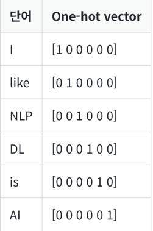
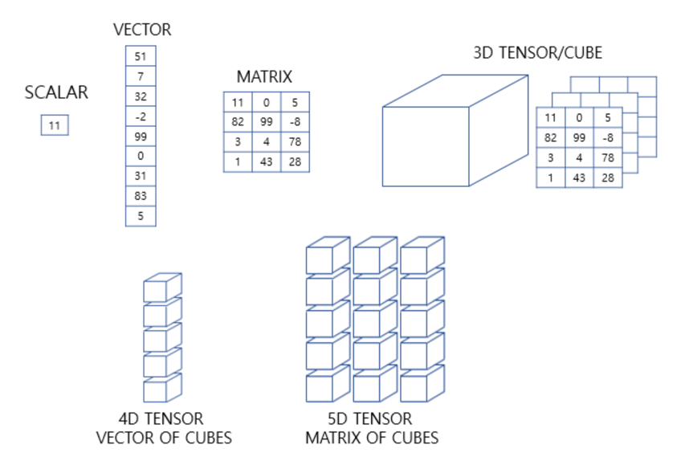
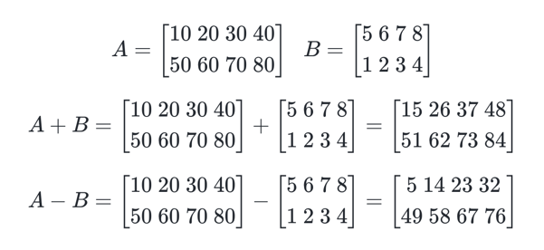
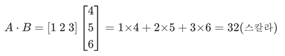
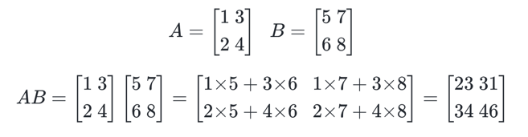
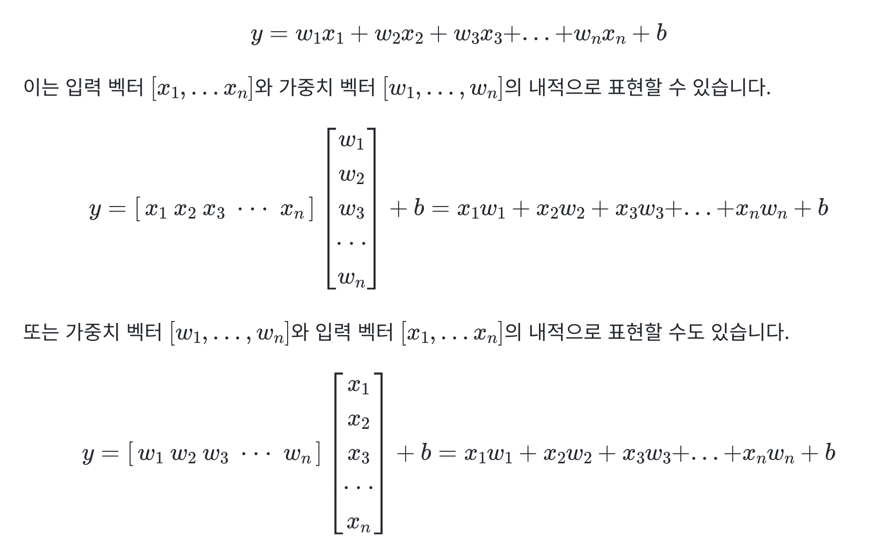
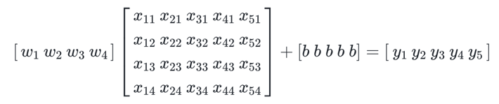

# 1. 벡터와 행렬과 텐서
- 벡터는 크기와 방향을 가진 양
- 행렬은 행과 열을 가지는 2차원 형상을 가진 구조
- 3차원부터는 주로 텐서라고 부릅니다. 텐서는 파이썬에서는 3차원 이상의 배열

# 2. 텐서(Tensor)
- 인공 신경망은 복잡한 모델 내의 연산을 주로 행렬 연산을 통해 해결
- 머신 러닝의 입, 출력이 복잡해지면 3차원 텐서에 대한 이해가 필수로 요구
```
import numpy as np
```
## 1) 0차원 텐서(스칼라)
- 스칼라는 하나의 실수값으로 이루어진 데이터. 0차원 텐서
```
d = np.array(5)
print('텐서의 차원 :',d.ndim)
print('텐서의 크기(shape) :',d.shape)

[output]
텐서의 차원 : 0
텐서의 크기(shape) : ()
```
- ndim을 출력했을 때 나오는 값을 우리는 축(axis)의 개수 또는 텐서의 차원
## 2) 1차원 텐서(벡터)
- 숫자를 배열한 것을 벡터라고합니다. 벡터는 1차원 텐서
- 벡터에서도 차원이라는 용어를 쓰는데, 벡터의 차원과 텐서의 차원은 다른 개념
```
d = np.array([1, 2, 3, 4])
print('텐서의 차원 :',d.ndim)
print('텐서의 크기(shape) :',d.shape)

[output]
텐서의 차원 : 1
텐서의 크기(shape) : (4,)
```
- 벡터에서의 차원은 하나의 축에 놓인 원소의 개수, 텐서에서의 차원은 축의 개수를 의미
## 3) 2차원 텐서(행렬)
- 행과 열이 존재하는 벡터의 배열. 즉, 행렬(matrix)을 2차원 텐서
```
# 3행 4열의 행렬
d = np.array([[1, 2, 3, 4], [5, 6, 7, 8], [9, 10, 11, 12]])
print('텐서의 차원 :',d.ndim)
print('텐서의 크기(shape) :',d.shape)

[output]
텐서의 차원 : 2
텐서의 크기(shape) : (3, 4)
```
- 텐서의 크기란, 각 축을 따라서 얼마나 많은 차원이 있는지를 나타낸 값
## 4) 3차원 텐서(다차원 배열)
```
d = np.array([
            [[1, 2, 3, 4, 5], [6, 7, 8, 9, 10], [10, 11, 12, 13, 14]],
            [[15, 16, 17, 18, 19], [19, 20, 21, 22, 23], [23, 24, 25, 26, 27]]
            ])
print('텐서의 차원 :',d.ndim)
print('텐서의 크기(shape) :',d.shape)

[output]
텐서의 차원 : 3
텐서의 크기(shape) : (2, 3, 5)
```
- 자연어 처리에서 특히 자주 보게 되는 것이 이 3D 텐서
- 3D 텐서는 시퀀스 데이터(sequence data)를 표현할 때 자주 사용되기 때문
- 시퀀스 데이터는 주로 단어의 시퀀스를 의미하며, 시퀀스는 주로 문장이나 문서, 뉴스 기사 등의 텍스트
- 3D 텐서는 (samples, timesteps, word_dim)이 된다
- 또는 일괄로 처리하기 위해 데이터를 묶는 단위인 배치의 개념에서 (batch_size, timesteps, word_dim)이 된다
- samples 또는 batch_size는 샘플의 개수, timesteps는 시퀀스의 길이, word_dim은 단어를 표현하는 벡터의 차원을 의미
```
문서1 : I like NLP
문서2 : I like DL
문서3 : DL is AI
```
- 인공 신경망의 모델의 입력으로 사용하기 위해서는 각 단어를 벡터화
- 단어를 벡터화하는 방법으로는 원-핫 인코딩이나 워드 임베딩이라는 방법이 대표적



- 훈련 데이터를 다수 묶어 입력으로 사용하는 것을 딥 러닝에서는 배치(Batch)
```
[[[1, 0, 0, 0, 0, 0], [0, 1, 0, 0, 0, 0], [0, 0, 1, 0, 0, 0]],  
[[1, 0, 0, 0, 0, 0], [0, 1, 0, 0, 0, 0], [0, 0, 0, 1, 0, 0]],  
[[0, 0, 0, 1, 0, 0], [0, 0, 0, 0, 1, 0], [0, 0, 0, 0, 0, 1]]]  
```
- (3, 3, 6)의 크기를 가지는 3D 텐서
## 5) 그 이상의 텐서



- 케라스에서는 신경망의 층에 입력의 크기(shape)를 인자로 줄 때 input_shape라는 인자를 사용
## 6) 케라스에서의 텐서
- input_shape는 배치 크기를 제외하고 차원을 지정하는데, 예를 들어 input_shape(6, 5)라는 인자값을 사용한다면 이 텐서의 크기는 (?, 6, 5)을 의미
# 3. 벡터와 행렬의 연산
## 1) 벡터와 행렬의 덧셈과 뺄셈
```
A = np.array([8, 4, 5])
B = np.array([1, 2, 3])
print('두 벡터의 합 :',A+B)
print('두 벡터의 차 :',A-B)

[output]
두 행렬의 합 : [9 6 8]
두 행렬의 차 : [7 2 2]
```



```
A = np.array([[10, 20, 30, 40], [50, 60, 70, 80]])
B = np.array([[5, 6, 7, 8],[1, 2, 3, 4]])
print('두 행렬의 합 :')
print(A + B)
print('두 행렬의 차 :')
print(A - B)

[output]
두 행렬의 합 :
[[15 26 37 48]
 [51 62 73 84]]
두 행렬의 차 :
[[ 5 14 23 32]
 [49 58 67 76]]
```
## 2) 벡터의 내적과 행렬의 곱셈
- 벡터의 내적은 연산을 점(dot)으로 표현
- 내적이 성립하기 위해서는 두 벡터의 차원이 같아야 한다
- 두 벡터 중 앞의 벡터가 행벡터(가로 방향 벡터)이고 뒤의 벡터가 열벡터(세로 방향 벡터)
- 벡터의 내적의 결과는 스칼라가 된다는 특징



```
A = np.array([1, 2, 3])
B = np.array([4, 5, 6])
print('두 벡터의 내적 :',np.dot(A, B))

[output]
두 벡터의 내적 : 32
```
- 행렬의 곱셈



```
A = np.array([[1, 3],[2, 4]])
B = np.array([[5, 7],[6, 8]])
print('두 행렬의 행렬곱 :')
print(np.matmul(A, B))

[output]
두 행렬의 행렬곱 :
[[23 31]
 [34 46]]
```
- 행렬 곱셈에서의 주요한 두 가지 조건
1. 두 행렬의 곱 A × B이 성립되기 위해서는 행렬 A의 열의 개수와 행렬 B의 행의 개수는 같아야 한다.
2. 두 행렬의 곱 A × B의 결과로 나온 행렬 AB의 크기는 A의 행의 개수와 B의 열의 개수를 가진다.
# 4. 다중 선형 회귀 행렬 연산으로 이해하기
- 독립 변수 x가 n개인 다중 선형 회귀 수식



- 가중치 벡터를 앞에 두고 입력 행렬을 뒤에 두고 행렬 연산을 한다면 이는 아래와 같다



# 5. 샘플(Sample)과 특성(Feature)
- 머신 러닝에서는 데이터를 셀 수 있는 단위로 구분할 때, 각각을 샘플이라함
- 종속 변수 y를 예측하기 위한 각각의 독립 변수 x를 특성
# 6. 가중치와 편향 행렬의 크기 결정
- 입력 행렬과 출력 행렬의 크기로부터 가중치 행렬과 편향 행렬의 크기를 추정할 수 있다면, 딥 러닝 모델을 구현하였을 때 해당 모델에 존재하는 총 매개변수의 개수를 계산하기
- 두 행렬의 곱의 결과로서 나온 행렬의 열의 크기는 행렬의 곱셈에서 뒤에 있는 행렬의 열의 크기와 동일