- 소프트맥스 희귀란 3개 이상의 선택지 중에서 1개를 고르는 다중 클래스 분류 문제
# 1. 다중 클래스 분류(Multi-class Classification)
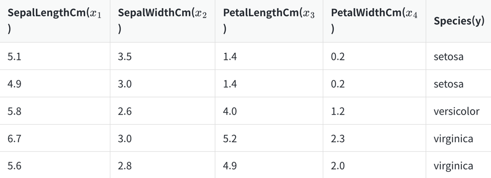
- 샘플 데이터가 입력으로 들어오면 모델이 setosa일 확률이 0.7, versicolor일 확률 0.05, virginica일 확률이 0.25과 같이 세 개의 확률의 총 합이 1인 예측값을 얻도록 하자는 것
- 이 경우 확률값이 가장 높은 setosa로 예측한 것으로 간주하고자 합니다. 이럴 때 사용할 수 있는 것이 소프트맥스 함수
# 2. 소프트맥스 함수(Softmax function)
- 소프트맥스 함수는 선택해야 하는 선택지의 총 개수를 k라고 할 때, k차원의 벡터를 입력받아 각 클래스에 대한 확률을 추정
## 1) 소프트맥스 함수의 이해
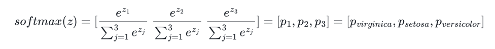
## 2) 그림을 통한 이해
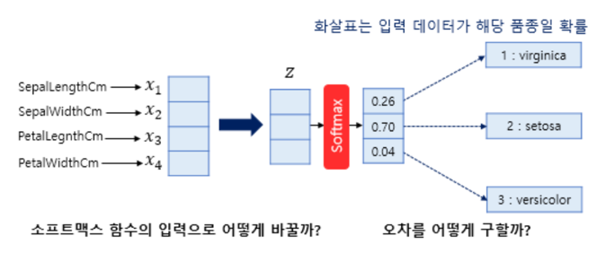
### 소프트맥스의 입력으로 어떻게 변환?
- 소프트맥스의 함수의 입력으로 사용되는 벡터는 벡터의 차원이 분류하고자 하는 클래스의 개수가 되어야 하므로 어떤 가중치 연산을 통해 3차원 벡터로 변환
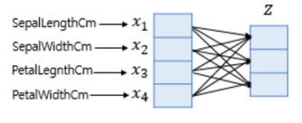
- 벡터로 차원을 축소하는 방법은 간단. 소프트맥스 함수의 입력 벡터의 차원수만큼 결과값이 나오도록 가중치 곱을 진행
### 오차 계산
- 소프트맥스 함수의 출력은 분류하고자하는 클래스의 개수만큼 차원을 가지는 벡터로 각 원소는 0과 1사이의 값
- 이 각각은 특정 클래스가 정답일 확률을 나타내고 이 예측값과 비교를 할 수 있는 실제값의 표현 방법이 있어야 한다
- 소프트맥스 회귀에서는 실제값을 원-핫 벡터로 표현
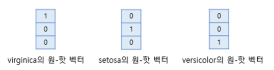
- 선형 회귀나 로지스틱 회귀와 마찬가지로 오차로부터 가중치를 업데이트
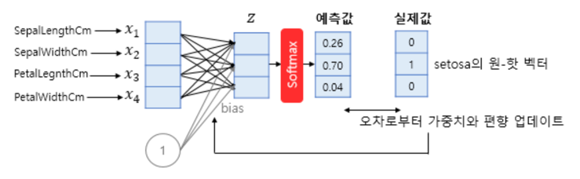
- 소프트맥스 회귀에서 예측값을 구하는 과정을 벡터와 행렬 연산으로 표현
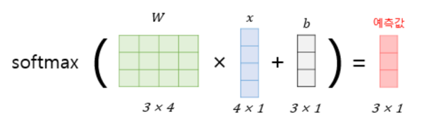
# 3. 원-핫 벡터의 무작위성
- 일반적인 분류 문제에서는 각 클래스는 순서의 의미를 갖고 있지 않으므로 각 클래스 간의 오차는 균등한 것이 옳음
- 정수 인코딩과 달리 원-핫 인코딩은 분류 문제 모든 클래스 간의 관계를 균등하게 분배
- 세 개의 카테고리에 대해서 원-핫 인코딩을 통해서 레이블을 인코딩했을 때 각 클래스 간의 제곱 오차가 균등함을 보여줌
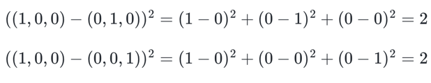
- 모든 클래스에 대해서 원-핫 인코딩을 통해 얻은 원-핫 벡터들은 모든 쌍에 대해서 유클리드 거리를 구해도 전부 유클리드 거리가 동일
- 이러한 원-핫 벡터의 관계의 무작위성은 때로는 단어의 유사성을 구할 수 없다는 단점
# 4. 비용 함수(Cost function)
## 1) 크로스 엔트로피 함수
- y는 실제값을 나타내며, k는 클래스의 개수로 정의
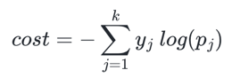
- y^가 y를 정확하게 예측한 경우의 크로스 엔트로피 함수의 값은 0
- 위의 식이 최소로 가는 쪽으로 해야한다
- n개의 전체 데이터에 대한 평균을 구한다고 하면 최종 비용 함수
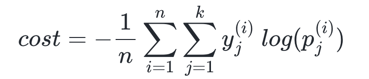
## 2) 이진 분류에서의 크로스 엔트로피 함수
- 로지스틱 회귀에서 배운 크로스 엔트로피 함수식과 달라보이지만, 본질적으로는 동일한 함수식
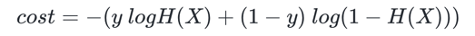
- 소프트맥스 함수의 최종 비용 함수에서 k가 2라고 가정하면 결국 로지스틱 회귀의 비용 함수와 동일
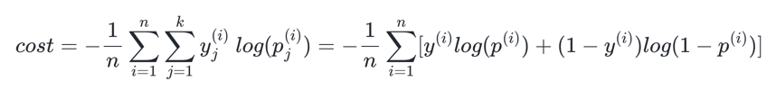
# 5. 인공 신경망 다이어그램
