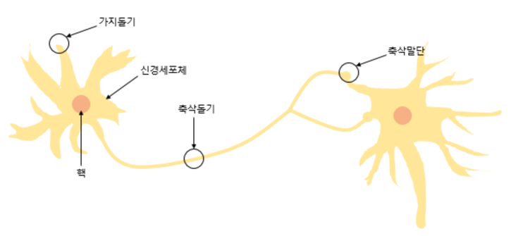
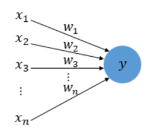
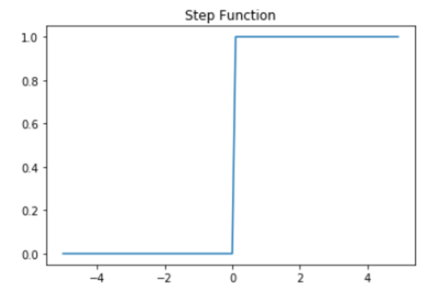
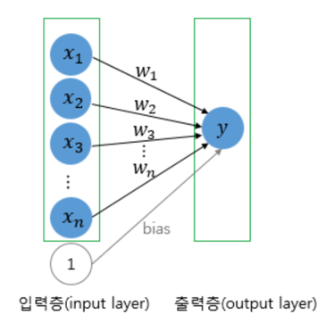
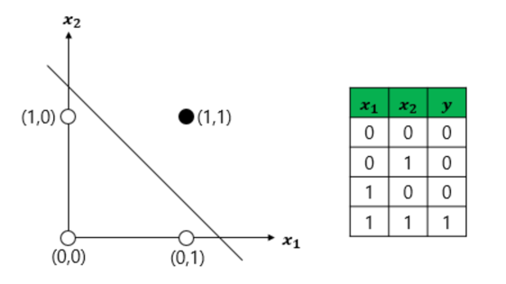
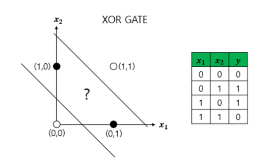
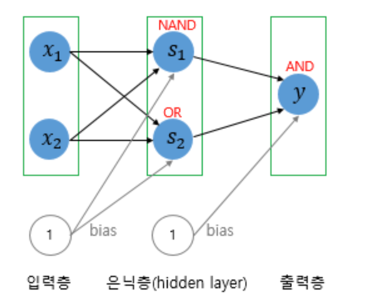
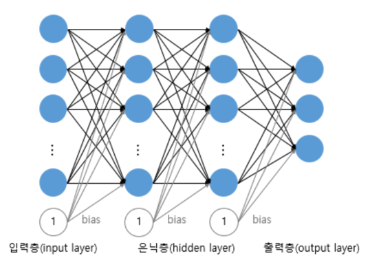

# 1. 퍼셉트론(Perceptron)
- 초기 형태의 인공 신경망으로 다수의 입력으로부터 하나의 결과를 내보내는 알고리즘
- 퍼셉트론은 실제 뇌를 구성하는 신경 세포 뉴런의 동작과 유사
- 뉴런은 가지돌기에서 신호를 받아들이고, 이 신호가 일정치 이상의 크기를 가지면 축삭돌기를 통해서 신호를 전달



- 신경 세포 뉴런의 입력 신호와 출력 신호가 퍼셉트론에서 각각 입력값과 출력값에 해당



- 실제 신경 세포 뉴런에서의 신호를 전달하는 축삭돌기의 역할을 퍼셉트론에서는 가중치가 대신
- 각각의 입력값에는 각각의 가중치가 존재하는데, 이때 가중치의 값이 크면 클수록 해당 입력 값이 중요하다는 것을 의미
- 각 입력값이 가중치와 곱해져서 인공 뉴런에 보내지고, 각 입력값과 그에 해당되는 가중치의 곱의 전체 합이 임계치(threshold)를 넘으면 종착지에 있는 인공 뉴런은 출력 신호로서 1을 출력하고, 그렇지 않을 경우에는 0을 출력      
-> 계단 함수



- 뉴런에서 출력값을 변경시키는 함수를 활성화 함수라 한다
# 2. 단층 퍼셉트론(Single-Layer Perceptron)
- 단층 퍼셉트론은 값을 보내는 단계과 값을 받아서 출력하는 두 단계로만 이루어짐



- 단층 퍼셉트론을 이용하면 AND, NAND, OR 게이트는 구현가능. XOR은 안됨
- AND 게이트를 위한 매개변수 값을 가진 단층 퍼셉트론의 식을 파이썬 코드
```
def AND_gate(x1, x2):
    w1 = 0.5
    w2 = 0.5
    b = -0.7
    result = x1*w1 + x2*w2 + b
    if result <= 0:
        return 0
    else:
        return 1
        
AND_gate(0, 0), AND_gate(0, 1), AND_gate(1, 0), AND_gate(1, 1)

[output]
(0, 0, 0, 1)
```
- NAND는 가중치와 편향만 바꿔도 값 나오는데 퍼셉트론의 구조가 같기 때문!
- 하지만 수많은 가중치와 편향을 넣어봐도 XOR 게이트를 구현하는 것은 불가능
- 단층 퍼셉트론은 직선 하나로 두 영역을 나눌 수 있는 문제에 대해서만 구현이 가능하기 때문



- AND 게이트를 충족하려면 하얀색 원과 검은색 원을 직선으로 나누게 된다



- 하얀색 원과 검은색 원을 직선 하나로 나누는 것은 불가능하므로 단층 퍼셉트론으로는 XOR 게이트를 구현 X
# 3. 다층 퍼셉트론(MultiLayer Perceptron, MLP)
- XOR 게이트는 기존의 AND, NAND, OR 게이트를 조합 생성 가능
- 다층 퍼셉트론과 단층 퍼셉트론의 차이는 단층 퍼셉트론은 입력층과 출력층만 존재하지만, 다층 퍼셉트론은 중간에 층을 더 추가하였다는 점
- 입력층과 출력층 사이에 존재하는 층을 은닉층(hidden layer)
- 다층 퍼셉트론은 줄여서 MLP라고도 부른다
- AND, NAND, OR을 조합하여 XOR게이트 구현





- 은닉층이 2개 이상인 신경망을 심층 신경망
- 만약 학습을 시키는 인공 신경망이 심층 신경망일 경우에는 이를 심층 신경망을 학습시킨다고 하여, 딥 러닝(Deep Learning)이라고 한다