# 1. 피드 포워드 신경망(Feed-Forward Neural Network, FFNN)

- 오직 입력층에서 출력층 방향으로 연산이 전개되는 신경망을 피드 포워드 신경망
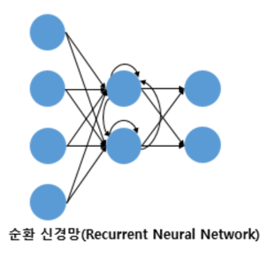
-  은닉층의 출력값을 출력층으로도 값을 보내지만, 동시에 은닉층의 출력값이 다시 은닉층의 입력으로 사용
# 2. 전결합층(Fully-connected layer, FC, Dense layer)
- 어떤 층의 모든 뉴런이 이전 층의 모든 뉴런과 연결돼 있는 층을 전결합층(Fully-connected layer) 또는 완전연결층
- 앞서 본 다층 퍼셉트론의 모든 은닉층과 출력층은 전결합층
- 동일한 의미로 밀집층(Dense layer)이라고도 부름
# 3. 활성화 함수(Activation Function)
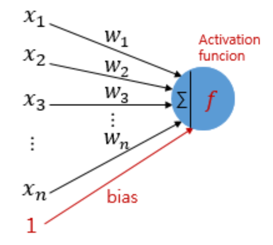
- 은닉층과 출력층의 뉴런에서 출력값을 결정하는 함수를 활성화 함수
## (1) 활성화 함수의 특징 - 비선형 함수(Nonlinear function)
- 선형 함수란 출력이 입력의 상수배만큼 변하는 함수를 선형함수
- 비선형 함수는 직선 1개로는 그릴 수 없는 함수
- 활성화 함수로 선형 함수를 사용하게 되면 은닉층을 쌓을 수가 없음
- 은닉층을 2개 추가한다고 해도 w * w * w * x = w^3 * x인데 w^3을 k라고 가정하면 1회 추가한것과 차이가 없다
- 하지만 학습 가능한 가중치가 새로 생긴다는 점에서 의미가 있어 사용은 함
- 선형 함수를 사용한 층을 활성화 함수를 사용하는 은닉층과 구분하기 위해서 이 책에서는 선형층(linear layer)이나 투사층(projection layer) 등의 다른 표현을 사용하여 표현
```python
import numpy as np
import matplotlib.pyplot as plt
```
## (2) 계단 함수(Step function)
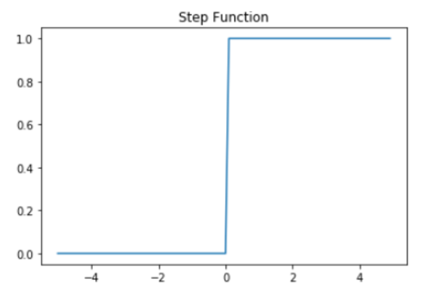
```python
def step(x):
    return np.array(x > 0, dtype=np.int)
x = np.arange(-5.0, 5.0, 0.1) # -5.0부터 5.0까지 0.1 간격 생성
y = step(x)
plt.title('Step Function')
plt.plot(x,y)
plt.show()
```
- 퍼셉트론을 통해 인공 신경망을 처음 배울 때 접하게 되는 활성화 함수
## (3) 시그모이드 함수(Sigmoid function)와 기울기 소실
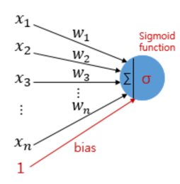
- 인공 신경망은 입력에 대해서 순전파(forward propagation) 연산
- 순전파 연산을 통해 나온 예측값과 실제값의 오차를 손실 함수(loss function)을 통해 계산
- 손실(오차라고도 부릅니다. loss)을 미분을 통해서 기울기(gradient) 추출
- 출력층에서 입력층 방향으로 가중치와 편향을 업데이트 하는 과정인 역전파(back propagation)를 수행
- 시그모이드 함수의 문제점은 미분을 해서 기울기(gradient)를 구할 때 발생
```python
# 시그모이드 함수 그래프를 그리는 코드
def sigmoid(x):
    return 1/(1+np.exp(-x))
x = np.arange(-5.0, 5.0, 0.1)
y = sigmoid(x)

plt.plot(x, y)
plt.plot([0,0],[1.0,0.0], ':') # 가운데 점선 추가
plt.title('Sigmoid Function')
plt.show()
```
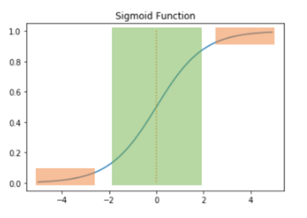
- 주황색 구간에서는 미분값이 0에 가까운 아주 작은 값
- 시그모이드 함수를 활성화 함수로하는 인공 신경망의 층을 쌓는다면, 가중치와 편향을 업데이트 하는 과정인 역전파 과정에서 0에 가까운 값이 누적   
-> 기울기 소실(Vanishing Gradient) 문제
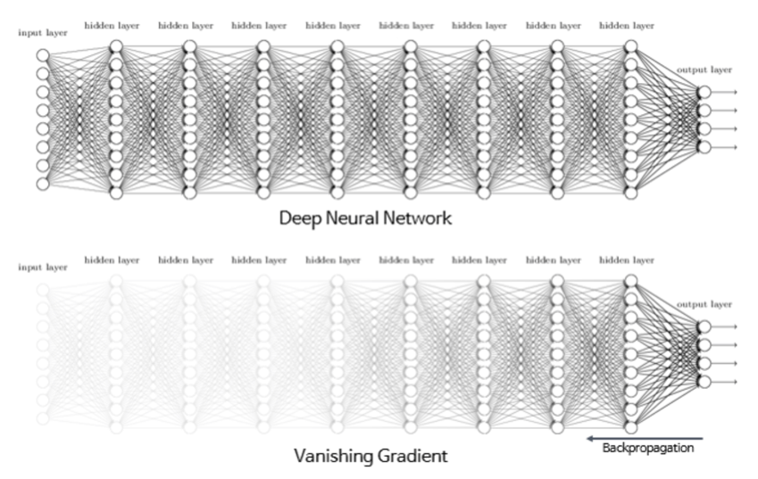
- 시그모이드 함수의 은닉층에서 사용은 지양, 주로 이진 분류를 위해 출력층에서 사용
## (4) 하이퍼볼릭탄젠트 함수(Hyperbolic tangent function)
- 입력값을 -1과 1사이의 값으로 변환
```python
x = np.arange(-5.0, 5.0, 0.1) # -5.0부터 5.0까지 0.1 간격 생성
y = np.tanh(x)

plt.plot(x, y)
plt.plot([0,0],[1.0,-1.0], ':')
plt.axhline(y=0, color='orange', linestyle='--')
plt.title('Tanh Function')
plt.show()
```
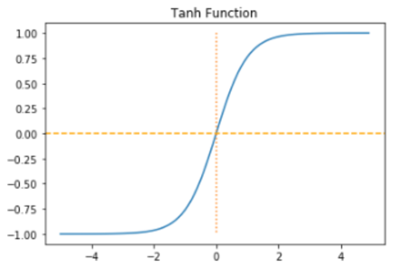
- 하이퍼볼릭탄젠트 함수도 -1과 1에 가까운 출력값을 출력할 때, 시그모이드 함수와 같은 문제가 발생
- 시그모이드 함수와는 달리 0을 중심으로 하고있으며 하이퍼볼릭탄젠트 함수를 미분했을 때의 최대값은 1
- 시그모이드 함수의 최대값인 0.25보다는 크다
- 시그모이드 함수보다는 전반적으로 큰 값이 나와서 시그모이드 함수보다는 기울기 소실 증상이 적은 편이며 은닉층에서 시그모이드 함수보다는 선호
## (5) 렐루 함수(ReLU)
- 인공 신경망의 은닉층에서 가장 인기있는 함수   
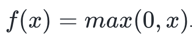
```python
def relu(x):
    return np.maximum(0, x)

x = np.arange(-5.0, 5.0, 0.1)
y = relu(x)

plt.plot(x, y)
plt.plot([0,0],[5.0,0.0], ':')
plt.title('Relu Function')
plt.show() 
```

- 음수를 입력하면 0을 출력하고, 양수를 입력하면 입력값을 그대로 반환하는 것이 특징
- 0이상의 입력값의 경우에는 미분값이 항상 1
- 어떤 연산이 필요한 것이 아니라 단순 임계값이므로 연산 속도도 빠르다
- 하지만 입력값이 음수면 기울기. 즉, 미분값도 0
- 이 문제를 죽은 렐루(dying ReLU)라고 한다
## 리키 렐루(Leaky ReLU)
- 죽은 렐루를 보완하기 위해 ReLU의 변형 함수들이 등장
- Leaky ReLU는 입력값이 음수일 경우에 0이 아니라 0.001과 같은 매우 작은 수를 반환   
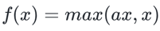
- a는 하이퍼파라미터로 Leaky('새는') 정도를 결정하며 일반적으로는 0.01의 값
- '새는 정도'라는 것은 입력값의 음수일 때의 기울기를 비유   
```
a = 0.1

def leaky_relu(x):
    return np.maximum(a*x, x)

x = np.arange(-5.0, 5.0, 0.1)
y = leaky_relu(x)

plt.plot(x, y)
plt.plot([0,0],[5.0,0.0], ':')
plt.title('Leaky ReLU Function')
plt.show()
```
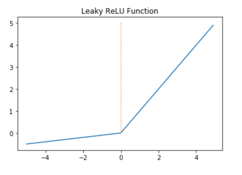
## (7) 소프트맥스 함수(Softmax function)
- 은닉층에서는 ReLU(또는 ReLU 변형) 함수들을 사용하는 것이 일반적
- 소프트맥스 함수는 시그모이드 함수처럼 출력층에서 주로 사용
- 프트맥스 함수는 세 가지 이상의 (상호 배타적인) 선택지 중 하나를 고르는 다중 클래스 분류(MultiClass Classification) 문제에 주로 사용
```python
x = np.arange(-5.0, 5.0, 0.1) # -5.0부터 5.0까지 0.1 간격 생성
y = np.exp(x) / np.sum(np.exp(x))

plt.plot(x, y)
plt.title('Softmax Function')
plt.show()
```
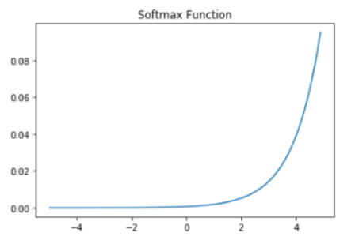