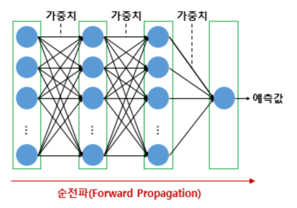
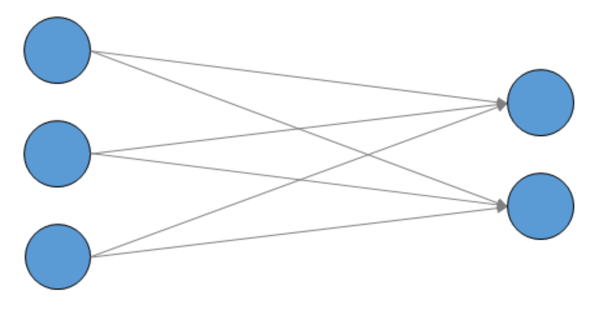
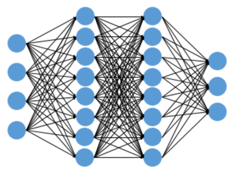

- 인공 신경망에서 입력층에서 출력층 방향으로 연산을 진행하는 과정을 순전파
- 주어진 입력이 입력층으로 들어가서 은닉층을 지나 출력층에서 예측값을 얻는 과정을 **순전파**

# 1. 순전파(Foward Propagation)


- 활성화 함수, 은닉층의 수, 각 은닉층의 뉴런 수 등 딥러닝 모델을 설계하고나면 입력값은 입력층, 은닉층을 지나면서 각 층에서의 가중치와 함께 연산되며 출력층으로 전달
-  출력층에서 모든 연산을 마친 예측값이 나오게 된다. 이와 같이 입력층에서 출력층 방향으로 예측값의 연산이 진행되는 과정을 순전파

# 2. 행렬곱으로 순전파 이해하기



```python
from tensorflow.keras.models import Sequential
from tensorflow.keras.layers import Dense

model = Sequential()

# 3개의 입력과 2개의 출력
model.add(Dense(2, input_dim=3, activation='softmax'))
```

- 소프트맥스 회귀를 한다고 가정하고 활성화 함수는 소프트맥스 함수를 임의로 기재
- 케라스에서는 .summary()를 사용하면 해당 모델에 존재하는 모든 매개변수(가중치와 편향의 개수)를 확인 가능

```shell
model.summary()

[Output]
Model: "sequential"
_________________________________________________________________
Layer (type)                 Output Shape              Param #   
=================================================================
dense (Dense)                (None, 2)                 8         
=================================================================
Total params: 8
Trainable params: 8
Non-trainable params: 0
_________________________________________________________________
```

- 위 신경망에서 학습가능한 매개변수인 w와 b의 개수가 총 합해서 8개라는 의미


# 3. 행렬곱으로 병렬 연산 이해하기
- 인공 신경망을 행렬곱으로 구현할 때의 흥미로운 점은 행렬곱을 사용하면 병렬 연산도 가능하다는 점
- 이번에는 인공 신경망이 4개의 샘플을 동시에 처리해본다고 가정


- 인공 신경망이 다수의 샘플을 동시에 처리하는 것을 우리는 '배치 연산'

# 4. 행렬곱으로 다층 퍼셉트론의 순전파 이해하기



## 1) 코드로 구현하기

```python
from tensorflow.keras.models import Sequential
from tensorflow.keras.layers import Dense

model = Sequential()

# 4개의 입력과 8개의 출력
model.add(Dense(8, input_dim=4, activation='relu'))

# 이어서 8개의 출력
model.add(Dense(8, activation='relu'))

# 이어서 3개의 출력
model.add(Dense(3, activation='softmax'))
```

## 2) 행렬의 크기 추정해보기
- 각 층을 기준으로 입력과 출력의 개수를 정리

```shell
입력층 : 4개의 입력과 8개의 출력
은닉층1 : 8개의 입력과 8개의 출력
은닉층2 : 8개의 입력과 3개의 출력
출력층 : 3개의 입력과 3개의 출력
```

### 1. 입력층 => 은닉층 1
- 벡터와 행렬 연산을 설명하며 배운 바에 따르면, 입력 행렬, 가중치 행렬, 편향 행렬, 출력 행렬은 다음과 같은 크기 관계


- 다음과 같은 과정을 통해 크기를 구할 수 있다


- 순전파를 진행하고 예측값을 구하고나서 이 다음에 인공 신경망이 해야할 일은 예측값과 실제값으로부터 오차를 계산하고, 오차로부터 가중치와 편향을 업데이트
- 이때 인공 신경망은 순전파와는 반대 방향으로 연산을 진행하며 가중치를 업데이트하는데, 이 과정을 **역전파(BackPropagation)**