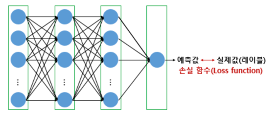
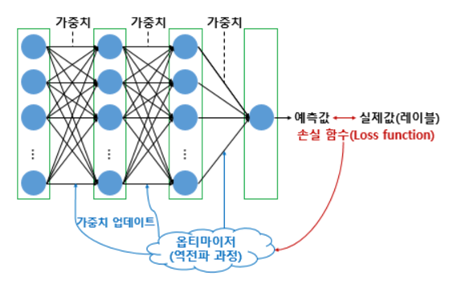
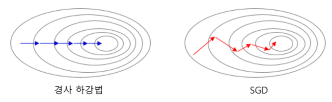
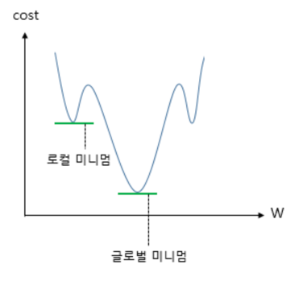
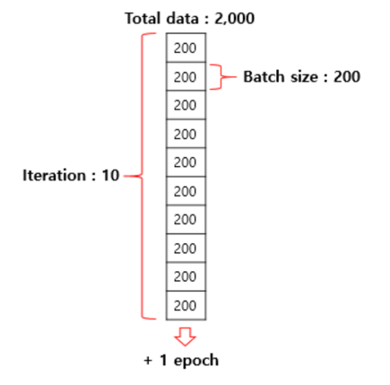

# 1. 손실 함수(Loss function)

- 손실 함수는 실제값과 예측값의 차이를 수치화해주는 함수
- 두 값의 차이. 즉, 오차가 클 수록 손실 함수의 값은 크고 오차가 작을 수록 손실 함수의 값은 작아진다
- 회귀에서는 평균 제곱 오차, 분류 문제에서는 크로스 엔트로피를 주로 손실 함수로 사용

## 1) MSE(Mean Squared Error, MSE)

- 평균 제곱 오차는 선형 회귀를 학습할 때 배웠던 손실 함수입니다. 연속형 변수를 예측할 때 사용
- compile의 loss에 문자열 'mse'라고 기재하여 사용 가능

```python
model.compile(optimizer='adam', loss='mse', metrics=['mse'])

or 

model.compile(optimizer='adam'
              , loss=tf.keras.losses.MeanSquaredError()
              , metrics=['mse'])
```

- 딥러닝 자연어 처리는 대부분 분류 문제이므로 평균 제곱 오차보다는 아래의 크로스 엔트로피 함수들을 주로 사용

## 2) 이진 크로스 엔트로피(Binary Cross-Entropy)

- 이항 교차 엔트로피라고도 부르는 손실 함수
- 출력층에서 시그모이드 함수를 사용하는 이진 분류의 경우 **binary_crossentropy**를 사용
- compile의 loss에 문자열로 'binary_crossentropy'를 기재하면 된다
- 로지스틱 회귀에서 사용했던 손실 함수

```python
model.compile(loss='binary_crossentropy'
              , optimizer='adam'
              , metrics=['acc'])

or

model.compile(loss=tf.keras.losses.BinaryCrossentropy()
              , optimizer='adam'
              , metrics=['acc'])
```

## 3) 카테고리칼 크로스 엔트로피(Categorical Cross-Entropy)

- 범주형 교차 엔트로피라고도 부르는 손실 함수
- 출력층에서 소프트맥스 함수를 사용하는 다중 클래스 분류일 경우 **categorical_crossentropy**를 사용
- compile의 loss에 문자열로 'categorical_crossentropy'를 기재해주면 된다
- 소프트맥스 회귀에서 사용했던 손실 함수

```python
model.compile(loss='categorical_crossentropy'
              , optimizer='adam'
              , metrics=['acc'])

or

model.compile(loss=tf.keras.losses.CategoricalCrossentropy()
              , optimizer='adam'
              , metrics=['acc'])
```

- 레이블에 대해서 원-핫 인코딩 과정을 생략하고, 정수값을 가진 레이블에 대해서 다중 클래스 분류를 수행하고 싶다면 다음과 같이 **sparse_categorical_crossentropy**를 사용

```python
model.compile(loss='sparse_categorical_crossentropy'
              , optimizer='adam'
              , metrics=['acc'])

or 

model.compile(loss=tf.keras.losses.SparseCategoricalCrossentropy()
              , optimizer='adam'
              , metrics=['acc'])
```

## 4) 그 외에 다양한 손실 함수들

- 텐서플로우 [공식 문서 링크](https://www.tensorflow.org/api_docs/python/tf/keras/losses)에서 방금 언급하지 않은 손실 함수 외에도 다양한 손실 함수들을 확인 가능

# 2. 배치 크기(Batch Size)에 따른 경사 하강법



- 손실 함수의 값을 줄여나가면서 학습하는 방법은 어떤 옵티마이저를 사용하느냐에 따라 달라진다
- 여기서 **배치(Batch)**라는 개념에 대한 이해가 필요

## 1) 배치 경사 하강법(Batch Gradient Descent)
- 가장 기본적인 경사 하강법
- 배치 경사 하강법은 옵티마이저 중 하나로 오차(loss)를 구할 때 전체 데이터를 고려
- 딥 러닝에서는 전체 데이터에 대한 한 번의 훈련 횟수를 1 에포크
- 배치 경사 하강법은 한번의 에포크에 모든 매개변수 업데이트를 단 한번 수행
- 전체 데이터를 고려해서 학습하므로 한번의 매개 변수 업데이트에 시간이 오래 걸리며, 메모리를 크게 요구한다는 단점

```python
model.fit(X_train, y_train, batch_size=len(X_train))
```

2) 배치 크기가 1인 확률적 경사 하강법(Stochastic Gradient Descent, SGD)
- 기존의 배치 경사 하강법은 전체 데이터에 대해서 계산을 하다보니 시간이 너무 오래걸린다는 단점
- 배치 크기가 1인 확률적 경사 하강법은 매개변수 값을 조정 시 전체 데이터가 아니다
- 랜덤으로 선택한 하나의 데이터에 대해서만 계산하는 방식



- 확률적 경사 하강법은 매개변수의 변경폭이 불안정하고, 때로는 배치 경사 하강법보다 정확도가 낮을 수 있다
- 하지만 하나의 데이터에 대해서만 메모리에 저장하면 되므로 자원이 적은 컴퓨터에서도 쉽게 사용가능 하다는 장점

```python
model.fit(X_train, y_train, batch_size=1)
```

## 3) 미니 배치 경사 하강법(Mini-Batch Gradient Descent)
- 전체 데이터도, 1개의 데이터도 아닐 때, 배치 크기를 지정
- 해당 데이터 개수만큼에 대해서 계산하여 매개 변수의 값을 조정하는 경사 하강법을 미니 배치 경사 하강법
- 전체 데이터를 계산하는 것보다 빠르며, SGD보다 안정적이라는 장점
- 배치 크기를 128로 지정했을 경우

```python
model.fit(X_train, y_train, batch_size=128)
```

- 배치 크기는 일반적으로 2의 n제곱에 해당하는 숫자로 선택하는 것이 보편적
- 배치 크기를 별도로 지정해주지 않을 경우에 기본값은 2의 5제곱에 해당하는 숫자인 32로 설정

# 3. 옵티마이저(Optimizer)
## 1) 모멘텀(Momentum)

- 모멘텀(Momentum)은 관성이라는 물리학의 법칙을 응용한 방법
- 모멘텀은 경사 하강법에서 계산된 접선의 기울기에 한 시점 전의 접선의 기울기값을 일정한 비율만큼 반영
- 마치 언덕에서 공이 내려올 때, 중간에 작은 웅덩이에 빠지더라도 관성의 힘으로 넘어서는 효과



- 전체 함수에 걸쳐 최소값을 **글로벌 미니멈(Global Minimum)** 
- 글로벌 미니멈이 아닌 특정 구역에서의 최소값인 **로컬 미니멈(Local Minimum)**
- 로컬 미니멈에 도달하였을 때 글로벌 미니멈으로 잘못 인식하여 탈출하지 못하였을 상황에서 모멘텀
- 즉, 관성의 힘을 빌리면 값이 조절되면서 현재의 로컬 미니멈에서 탈출하고 글로벌 미니멈 내지는 더 낮은 로컬 미니멈으로 갈 수 있는 효과

```python
tf.keras.optimizers.SGD(lr=0.01, momentum=0.9)
```

## 2) 아다그라드(Adagrad)
- 매개변수들은 각자 의미하는 바가 다른데, 모든 매개변수에 동일한 학습률을 적용하는 것은 비효율적
- 아다그라드는 각 매개변수에 서로 다른 학습률을 적용
- 변화가 많은 매개변수는 학습률이 작게 설정되고 변화가 적은 매개변수는 학습률을 높게 설정

```python
tf.keras.optimizers.Adagrad(lr=0.01, epsilon=1e-6)
```

## 3) 알엠에스프롭(RMSprop)
- 아다그라드는 학습을 계속 진행한 경우에는, 나중에 가서는 학습률이 지나치게 떨어진다는 단점
- 다른 수식으로 대체하여 이러한 단점을 개선

```python
tf.keras.optimizers.RMSprop(lr=0.001, rho=0.9, epsilon=1e-06)
```

## 4) 아담(Adam)
- 알엠에스프롭과 모멘텀 두 가지를 합친 듯한 방법으로, 방향과 학습률 두 가지를 모두 잡기 위한 방법

```python
tf.keras.optimizers.Adam(lr=0.001, beta_1=0.9, beta_2=0.999
                         , epsilon=None, decay=0.0, amsgrad=False)
```

## 5) 사용 방법
- 각 옵티마이저 인스턴스는 compile의 optimizer에서 호출
- 예를 들어 아담(adam)은 다음과 같이 코드를 작성

```python
adam = tf.keras.optimizers.Adam(lr=0.001, beta_1=0.9
                                , beta_2=0.999, epsilon=None
                                , decay=0.0, amsgrad=False)
model.compile(loss='categorical_crossentropy', optimizer=adam, metrics=['acc'])
```

- 다음과 같이 단순히 문자열로 'adam'으로 작성하더라도 동작

```python
model.compile(loss='categorical_crossentropy', optimizer='adam', metrics=['acc'])
```

- 다른 옵티마이저들도 마찬가지   
ex) optimizer='sgd', optimizer='rmsprop'

# 4. 역전파(BackPropagation)
- 다음 챕터에 자세히

# 5. 에포크와 배치 크기와 이터레이션(Epochs and Batch size and Iteration)
- 기계는 실제값과 예측값의 오차로부터 옵티마이저를 통해서 가중치를 업데이트
- 머신 러닝에서는 이 과정을 **학습**
- 사람마다 동일한 문제지와 정답지를 주더라도 공부 방법은 사실 천차만별
- 같은 문제지와 정답지를 주더라도 공부 방법을 다르게 설정가능


## 1) 에포크(Epoch)
- 인공 신경망에서 전체 데이터에 대해서 순전파와 역전파가 끝난 상태
- 문제지의 모든 문제를 끝까지 다 풀고, 정답지로 채점을 하여 문제지에 대한 공부를 한 번 끝낸 상태
- 에포크가 50이라고 하면, 전체 데이터 단위로는 총 50번 학습. 문제지를 50번 푼 셈
- 에포크 횟수가 지나치거나 너무 적으면 앞서 배운 과적합과 과소적합이 발생

## 2) 배치 크기(Batch size)
- 몇 개의 데이터 단위로 매개변수를 업데이트 하는지
- 문제지에서 몇 개씩 문제를 풀고나서 정답지를 확인하느냐의 문제
- 기계 입장에서는 실제값과 예측값으로부터 오차를 계산하고 옵티마이저가 매개변수를 업데이트
- 중요한 포인트는 업데이트가 시작되는 시점이 정답지/실제값을 확인하는 시점
- 사람이 2000 문제가 수록되어있는 문제지의 문제를 200개 단위로 풀고 채점한다고 하면 이때 배치 크기는 200
- 기계는 배치 크기가 200이면 200개의 샘플 단위로 가중치를 업데이트
- 주의할 점은 배치 크기와 배치의 수는 다른 개념이라는 점
- 전체 데이터가 2,000일때 배치 크기를 200으로 준다면 배치의 수는 10. 이때 배치의 수를 **이터레이이션**

## 3) 이터레이션(Iteration) 또는 스텝(Step)
- 한번의 에포크를 끝내기 위해서 필요한 배치의 수
- 한번의 에포크 내에서 이루어지는 매개변수의 업데이트 횟수
- 전체 데이터가 2,000일 때 배치 크기를 200으로 한다면 이터레이션의 수는 총 10
- 한번의 에포크 당 매개변수 업데이트가 10번 이루어진다는 것을 의미
- 배치 크기가 1인 확률적 경사 하강법을 이 개념을 가지고 다시 설명하면 배치 크기가 1이므로 모든 이터레이션마다 하나의 데이터를 선택하여 경사하강법을 수행
- 스텝(Step)이라고 부르기도 한다
