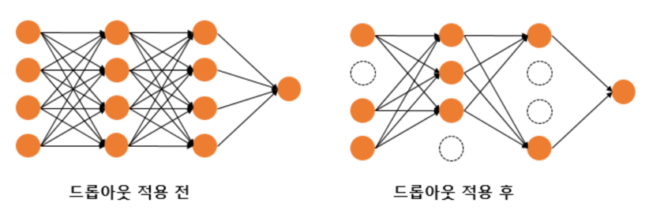

- 학습 데이터에 모델이 과적합되는 현상은 모델의 성능을 떨어트리는 주요 이슈
- 과적합은 모델이 학습 데이터를 불필요할정도로 과하게 암기하여 훈련 데이터에 포함된 노이즈까지 학습한 상태

# 1. 데이터의 양을 늘리기
- 데이터의 양을 늘릴 수록 모델은 데이터의 일반적인 패턴을 학습하여 과적합을 방지 가능
- 데이터의 양이 적을 경우에는 의도적으로 기존의 데이터를 조금씩 변형하고 추가하여 데이터의 양을 늘리기도 하는데 이를 **데이터 증식** 또는 **증강**
- 텍스트 데이터의 경우에는 데이터를 증강하는 방법으로 번역 후 재번역을 통해 새로운 데이터를 만들어내는 **역번역(Back Translation)** 등의 방법

# 2. 모델의 복잡도 줄이기
- 인공 신경망의 복잡도는 은닉층(hidden layer)의 수나 매개변수의 수 등으로 결정
- 적합 현상이 포착되었을 때 한 가지 조치는 인공 신경망의 복잡도를 줄이는 것

```shell
인공 신경망에서는 모델에 있는 매개변수들의 수를 모델의 수용력(capacity)
```

# 3. 가중치 규제(Regularization) 적용하기
- 복잡한 모델이 간단한 모델보다 과적합될 가능성 높다
- 간단한 모델은 적은 수의 매개변수를 가진 모델
- 복잡한 모델을 좀 더 간단하게 하는 방법으로 가중치 규제(Regularization)
  - L1 규제 : 가중치 w들의 절대값 합계를 비용 함수에 추가
  - L2 규제 : 모든 가중치 w들의 제곱합을 비용 함수에 추가
- 이 두 식 모두 비용 함수를 최소화하기 위해서는 가중치 w들의 값이 작아져야 한다는 특징
- L2 규제는 L1 규제와는 달리 가중치들의 제곱을 최소화하므로 w의 값이 완전히 0이 되기보다는 0에 가까워지기는 경향
- L1 규제는 어떤 특성들이 모델에 영향을 주고 있는지를 정확히 판단하고자 할 때 유용
- 이런 판단이 필요없다면 경험적으로는 L2 규제가 더 잘 동작
- 인공 신경망에서 L2 규제는 가중치 감쇠(weight decay)라고도 부른다

# 4. 드롭아웃(Dropout)



- 드롭아웃은 신경망 학습 시에만 사용하고, 예측 시에는 사용하지 않는 것이 일반적
- 매번 랜덤 선택으로 뉴런들을 사용하지 않으므로 서로 다른 신경망들을 앙상블하여 사용하는 것 같은 효과를 내어 과적합을 방지

```python
from tensorflow.keras.models import Sequential
from tensorflow.keras.layers import Dropout, Dense

max_words = 10000
num_classes = 46

model = Sequential()
model.add(Dense(256, input_shape=(max_words,), activation='relu'))
model.add(Dropout(0.5)) # 드롭아웃 추가. 비율은 50%
model.add(Dense(128, activation='relu'))
model.add(Dropout(0.5)) # 드롭아웃 추가. 비율은 50%
model.add(Dense(num_classes, activation='softmax')
```