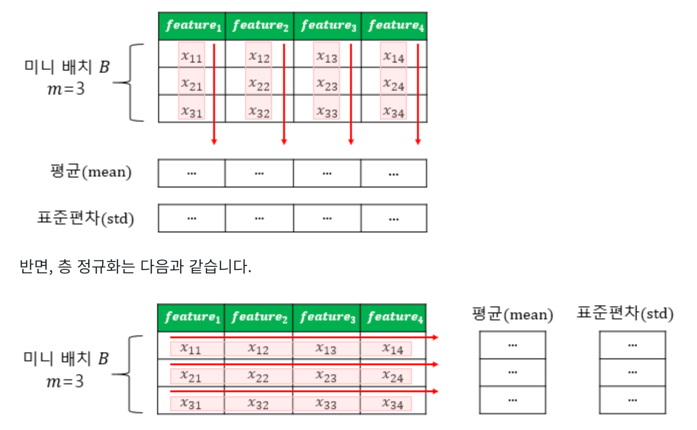

- 역전파 과정에서 입력층으로 갈 수록 기울기(Gradient)가 점차적으로 작아지는 현상이 발생
- 입력층에 가까운 층들에서 가중치들이 업데이트가 제대로 되지 않으면 결국 최적의 모델 발견 X. 이를 **기울기 소실(Gradient Vanishing)**
- 기울기가 점차 커지더니 가중치들이 비정상적으로 큰 값이 되면서 결국 발산. 이를 **폭주(Gradient Exploding)**
# 1. ReLU와 ReLU의 변형들
- 기울기 소실을 완화하는 가장 간단한 방법은 은닉층의 활성화 함수로 ReLU나 ReLU의 변형 함수와 같은 Leaky ReLU를 사용
1. 은닉층에서는 시그모이드 함수를 사용 X
2. Leaky ReLU를 사용하면 모든 입력값에 대해서 기울기가 0에 수렴하지 않아 죽은 ReLU 문제를 해결
3. 은닉층에서는 ReLU나 Leaky ReLU와 같은 ReLU 함수의 변형들을 사용

# 2. 그래디언트 클리핑(Gradient Clipping)
- 말 그대로 기울기 값을 자르는 것을 의미
- 기울기 폭주를 막기 위해 임계값을 넘지 않도록 값을 자른다. 다시 말해서 임계치만큼 크기를 감소

```python
from tensorflow.keras import optimizers

Adam = optimizers.Adam(lr=0.0001, clipnorm=1.)
```

# 3. 가중치 초기화(Weight initialization)
- 가중치가 초기에 어떤 값을 가졌느냐에 따라서 모델의 훈련 결과가 달라지기도 한다

## 1) 세이비어 초기화(Xavier Initialization)
- 이 초기화 방법은 제안한 사람의 이름을 따서 세이비어(Xavier Initialization) 초기화 또는 글로럿 초기화(Glorot Initialization)
- 이 방법은 균등 분포(Uniform Distribution) 또는 정규 분포(Normal distribution)로 초기화 할 때 두 가지 경우로 나뉜다
- 여러 층의 기울기 분산 사이에 균형을 맞춰서 특정 층이 너무 주목을 받거나 다른 층이 뒤쳐지는 것을 막는다
- 시그모이드 함수나 하이퍼볼릭 탄젠트 함수와 같은 S자 형태인 활성화 함수와 함께 사용할 경우에는 좋은 성능
- ReLU 함수 또는 ReLU의 변형 함수들을 활성화 함수로 사용할 경우에는 다른 초기화 방법을 사용하는 것이 더 낫다
- 이를 **He 초기화(He initialization)**

## 2) He 초기화(He initialization)
- 세이비어 초기화와 다르게 다음 층의 뉴런의 수를 반영 X
- 시그모이드 함수나 하이퍼볼릭탄젠트 함수를 사용할 경우에는 세이비어 초기화 방법이 효율적
- ReLU 계열 함수를 사용할 경우에는 He 초기화 방법이 효율적

# 4. 배치 정규화(Batch Normalization)
- 배치 정규화는 인공 신경망의 각 층에 들어가는 입력을 평균과 분산으로 정규화하여 학습을 효율적으로

## 1) 내부 공변량 변화(Internal Covariate Shift)
- 내부 공변량 변화란 학습 과정에서 층 별로 입력 데이터 분포가 달라지는 현상
1. 공변량 변화는 훈련 데이터의 분포와 테스트 데이터의 분포가 다른 경우를 의미
2. 내부 공변량 변화는 신경망 층 사이에서 발생하는 입력 데이터의 분포 변화를 의미

## 2) 배치 정규화(Batch Normalization)
- 표현 그대로 한 번에 들어오는 배치 단위로 정규화
- 배치 정규화는 각 층에서 활성화 함수를 통과하기 전에 수행
- 입력에 대해 평균을 0으로 만들고, 정규화
- 정규화 된 데이터에 대해서 스케일과 시프트를 수행
- 배치 정규화를 사용하면 시그모이드 함수나 하이퍼볼릭탄젠트 함수를 사용하더라도 기울기 소실 문제가 크게 개선
- 가중치 초기화에 훨씬 덜 민감
- 훨씬 큰 학습률을 사용할 수 있어 학습 속도를 개선
- 미니 배치마다 평균과 표준편차를 계산하여 사용하므로 훈련 데이터에 일종의 잡음 주입의 부수 효과로 과적합을 방지하는 효과
- 마치 드롭아웃과 비슷한 효과를 냅니다. 물론, 드롭 아웃과 함께 사용하는 것이 좋다
- 테스트 데이터에 대한 예측 시에 실행 시간이 느려진다. 그래서 서비스 속도를 고려하는 관점에서는 배치 정규화가 꼭 필요한지 고민이 필요

## 3) 배치 정규화의 한계
1. 미니 배치 크기에 의존적이다.
2. RNN에 적용하기 어렵다.

# 5. 층 정규화(Layer Normalization)
- 층 정규화를 이해하기에 앞서 배치 정규화를 시각화
- 미니 배치란 동일한 특성(feature) 개수들을 가진 다수의 샘플들을 의미함을 상기

