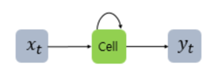
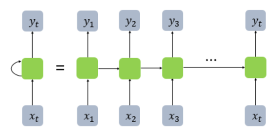
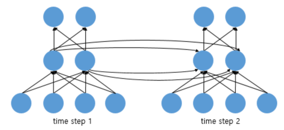
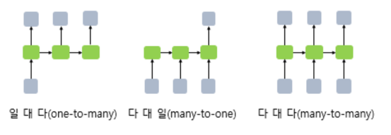
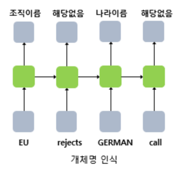
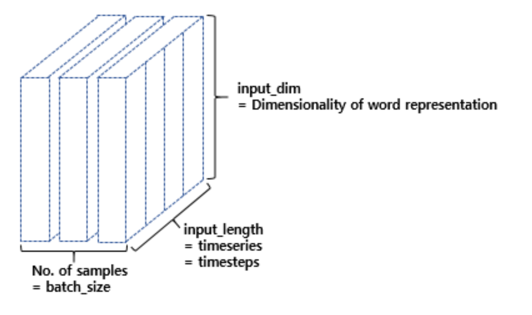
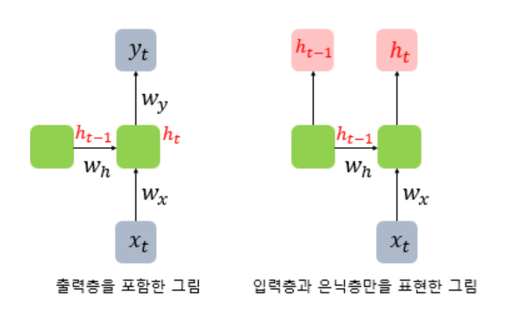
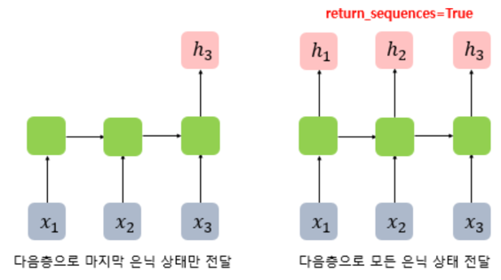
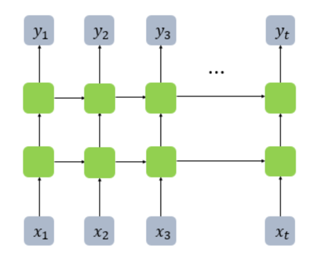
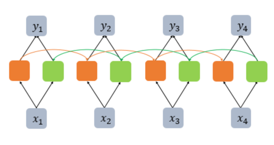

- RNN(Recurrent Neural Network)은 입력과 출력을 시퀀스 단위로 처리하는 시퀀스(Sequence) 모델
- 시퀀스들을 처리하기 위해 고안된 모델들을 시퀀스 모델
- RNN은 가장 기본적인 인공 신경망 시퀀스 모델
- 용어는 비슷하지만 순환 신경망과 재귀 신경망(Recursive Neural Network)은 전혀 다른 개념

# 1. 순환 신경망(Recurrent Neural Network, RNN)
- 신경망들은 전부 은닉층에서 활성화 함수를 지난 값은 오직 출력층 방향으로만
- 이와 같은 신경망들을 피드 포워드 신경망(Feed Forward Neural Network)
- RNN은 은닉층의 노드에서 활성화 함수를 통해 나온 결과값을 출력층 방향으로 보낸다
- 이때 그 값을 다시 은닉층 노드의 다음 계산의 입력으로도 보내는 특징



- RNN에서 은닉층에서 활성화 함수를 통해 결과를 내보내는 역할을 하는 노드를 셀(cell)
- 이전의 값을 기억하려고 하는 일종의 메모리 역할을 수행하므로 이를 **메모리 셀** 또는 **RNN 셀**이라고 표현
- 은닉층의 메모리 셀은 각각의 시점(time step)에서 바로 이전 시점에서의 은닉층의 메모리 셀에서 나온 값을 자신의 입력으로 사용하는 재귀적 활동
- 현재 시점을 변수 t로 표현
- 현재 시점 t에서의 메모리 셀이 갖고있는 값은 과거의 메모리 셀들의 값에 영향을 받은 것임을 의미
- 메모리 셀이 출력층 방향 또는 다음 시점인 t+1의 자신에게 보내는 값을 **은닉 상태(hidden state)**
- t 시점의 메모리 셀은 t-1 시점의 메모리 셀이 보낸 은닉 상태값을 t 시점의 은닉 상태 계산을 위한 입력값으로 사용



- RNN을 표현할 때는 일반적으로 위의 그림에서 좌측과 같이 화살표로 사이클을 그려서 재귀 형태로 표현
- 우측과 같이 사이클을 그리는 화살표 대신 여러 시점으로 펼쳐서 표현하기도
- 시점의 흐름에 따라서 표현하였느냐의 차이일 뿐 둘 다 동일한 RNN을 표현
- RNN에서는 뉴런이라는 단위보다는 입력층과 출력층에서는 각각 입력 벡터와 출력 벡터, 은닉층에서는 은닉 상태라는 표현을 주로 사용



- 입력 벡터의 차원이 4, 은닉 상태의 크기가 2, 출력층의 출력 벡터의 차원이 2
- 뉴런 단위로 해석하면 입력층의 뉴런 수는 4, 은닉층의 뉴런 수는 2, 출력층의 뉴런 수는 2



- RNN은 입력과 출력의 길이를 다르게 설계 할 수 있으므로 다양한 용도로 사용 가능
- RNN 셀의 각 시점의 입, 출력의 단위는 사용자가 정의하기 나름이지만 가장 보편적인 단위는 '단어 벡터'
- 하나의 입력에 대해서 여러개의 출력을 의미하는 일 대 다(one-to-many) 구조의 모델
1. 하나의 이미지 입력에 대해서 사진의 제목을 출력하는 이미지 캡셔닝(Image Captioning) 작업에 사용


- 단어 시퀀스에 대해서 하나의 출력을 하는 다 대 일(many-to-one) 구조의 모델
1. 입력 문서가 긍정적인지 부정적인지를 판별하는 감성 분류
2. 메일이 정상 메일인지 스팸 메일인지 판별하는 스팸 메일 분류 등에 사용



- 다 대 다(many-to-many) 구조의 모델의 경우
1. 사용자가 문장을 입력하면 대답 문장을 출력하는 챗봇
2. 입력 문장으로부터 번역된 문장을 출력하는 번역기
3. '태깅 작업' 챕터에서 배우는 개체명 인식이나 품사 태깅과 같은 작업

# 2. 케라스(Keras)로 RNN 구현하기
```python
from tensorflow.keras.layers import SimpleRNN

model.add(SimpleRNN(hidden_units))

# 추가 인자를 사용할 때
model.add(SimpleRNN(hidden_units, input_shape=(timesteps, input_dim)))

# 다른 표기
model.add(SimpleRNN(hidden_units, input_length=M, input_dim=N))
```

- hidden_units: 은닉 상태의 크기를 정의. 메모리 셀이 다음 시점의 메모리 셀과 출력층으로 보내는 값의 크기(output_dim)와도 동일
- timesteps: 입력 시퀀스의 길이(input_length)라고 표현하기도 함. 시점의 수
- input_dim: 입력의 크기





- 메모리 셀의 최종 시점의 은닉 상태만을 리턴하고자 한다면 (batch_size, output_dim) 크기의 2D 텐서를 리턴
- 메모리 셀의 각 시점(time step)의 은닉 상태값들을 모아서 전체 시퀀스를 리턴하고자 한다면 (batch_size, timesteps, output_dim) 크기의 3D 텐서를 리턴



- time step=3일 때, return_sequences = True를 설정했을 때와 그렇지 않았을 때 차이
- 마지막 은닉 상태만 전달하도록 하면 다 대 일(many-to-one) 문제
- 모든 시점의 은닉 상태를 전달하도록 하면, 다음층에 RNN 은닉층이 하나 더 있는 경우이거나 다 대 다(many-to-many) 문제

```python
from tensorflow.keras.models import Sequential
from tensorflow.keras.layers import SimpleRNN

model = Sequential()
model.add(SimpleRNN(3, input_shape=(2,10)))
# model.add(SimpleRNN(3, input_length=2, input_dim=10))와 동일함.
model.summary()

[Output]
_________________________________________________________________
Layer (type)                 Output Shape              Param #   
=================================================================
simple_rnn_1 (SimpleRNN)     (None, 3)                 42        
=================================================================
Total params: 42
Trainable params: 42
Non-trainable params: 0
_________________________________________________________________
```

- 출력값이 (batch_size, output_dim) 크기의 2D 텐서일 때, output_dim은 hidden_units의 값인 3

```python
model = Sequential()
model.add(SimpleRNN(3, batch_input_shape=(8,2,10)))
model.summary()

[Output]
_________________________________________________________________
Layer (type)                 Output Shape              Param #   
=================================================================
simple_rnn_2 (SimpleRNN)     (8, 3)                    42        
=================================================================
Total params: 42
Trainable params: 42
Non-trainable params: 0
_________________________________________________________________
```

- batch_size를 8로 기재하면 출력의 크기가 (8, 3)

```python
model = Sequential()
model.add(SimpleRNN(3, batch_input_shape=(8,2,10), return_sequences=True))
model.summary()

[Output]
_________________________________________________________________
Layer (type)                 Output Shape              Param #   
=================================================================
simple_rnn_3 (SimpleRNN)    (8, 2, 3)                 42        
=================================================================
Total params: 42
Trainable params: 42
Non-trainable params: 0
_________________________________________________________________
```

# 4. 깊은 순환 신경망(Deep Recurrent Neural Network)



- RNN도 다수의 은닉층을 가질 수 있다
- 은닉층 2개 추가

```python
model = Sequential()
model.add(SimpleRNN(hidden_units, input_length=10, input_dim=5, return_sequences=True))
model.add(SimpleRNN(hidden_units, return_sequences=True))
```

# 5. 양방향 순환 신경망(Bidirectional Recurrent Neural Network)
- 시점 t에서의 출력값을 예측할 때 이전 시점의 입력뿐만 아니라, 이후 시점의 입력 또한 예측에 기여할 수 있다는 아이디어에 기반

```python
운동을 열심히 하는 것은 [        ]을 늘리는데 효과적이다.

1) 근육
2) 지방
3) 스트레스
```

- 이전과 이후의 시점 모두를 고려해서 현재 시점의 예측을 더욱 정확하게 할 수 있도록 고안된 것이 양방향 RNN



- 하나의 출력값을 예측하기 위해 기본적으로 두 개의 메모리 셀을 사용

```python
from tensorflow.keras.layers import Bidirectional

timesteps = 10
input_dim = 5

model = Sequential()
model.add(Bidirectional(SimpleRNN(hidden_units, return_sequences=True), input_shape=(timesteps, input_dim)))
```

- 은닉층을 추가하면 학습할 수 있는 양이 많아지지만 반대로 훈련 데이터 또한 많은 양이 필요

```python
model = Sequential()
model.add(Bidirectional(SimpleRNN(hidden_units, return_sequences=True), input_shape=(timesteps, input_dim)))
model.add(Bidirectional(SimpleRNN(hidden_units, return_sequences=True)))
model.add(Bidirectional(SimpleRNN(hidden_units, return_sequences=True)))
model.add(Bidirectional(SimpleRNN(hidden_units, return_sequences=True)))
```