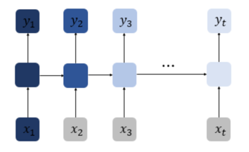
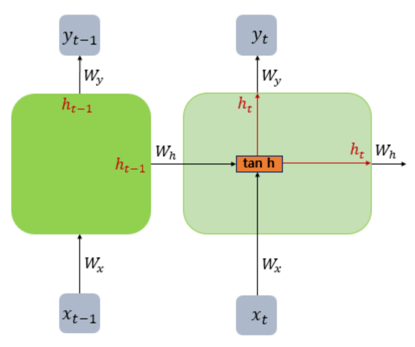
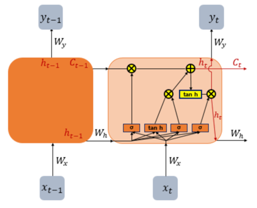
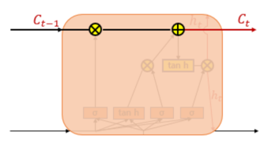
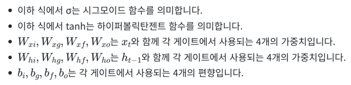
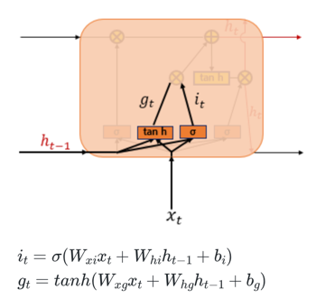
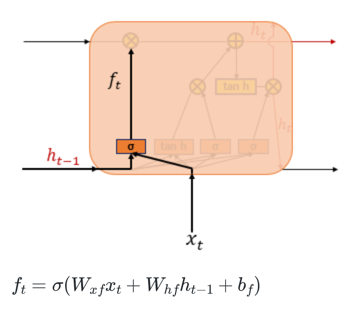
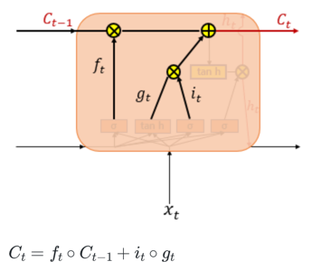
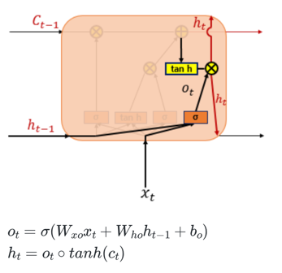

# 1. 바닐라 RNN의 한계

- 바닐라 RNN은 비교적 짧은 시퀀스(sequence)에 대해서만 효과를 보이는 단점
- 첫번째 입력값인 x1의 정보량을 짙은 남색으로 표현했을 때, 색이 점차 얕아지는 것으로 시점이 지날수록 x1의 정보량이 손실되어가는 과정을 표현
- 가장 중요한 정보가 시점의 앞 쪽에 위치할 수도 있는데 없어지면 큰일   
-> **장기 의존성 문제(the problem of Long-Term Dependencies)**

# 2. 바닐라 RNN 내부 열어보기

- 바닐라 RNN은 x(t)와 h(t-1)이라는 두 개의 입력이 각각의 가중치와 곱해져서 메모리 셀의 입력
- 이를 하이퍼볼릭탄젠트 함수의 입력으로 사용하고 이 값은 은닉층의 출력인 은닉 상태

# 3. LSTM(Long Short-Term Memory)

- 전통적인 RNN의 이러한 단점을 보완한 RNN의 일종을 장단기 메모리(Long Short-Term Memory)라고 하며, 줄여서 LSTM
- 은닉층의 메모리 셀에 입력 게이트, 망각 게이트, 출력 게이트를 추가하여 불필요한 기억을 지우고, 기억해야할 것들을 정한다
- 은닉 상태(hidden state)를 계산하는 식이 전통적인 RNN보다 조금 더 복잡해졌으며 셀 상태(cell state)라는 값을 추가
- LSTM은 RNN과 비교하여 긴 시퀀스의 입력을 처리하는데 탁월한 성능

- 은닉 상태의 값과 셀 상태의 값을 구하기 위해서 새로 추가 된 3개의 게이트를 사용
- 각 게이트는 삭제 게이트, 입력 게이트, 출력 게이트라고 부르며 이 3개의 게이트에는 공통적으로 시그모이드 함수가 존재

## (1) 입력 게이트

- 현재 정보를 기억하기 위한 게이트

## (2) 삭제 게이트

- 기억을 삭제하기 위한 게이트

## (3) 셀 상태

- 삭제 게이트의 값이 닫히면 현재의 입력값만, 현재 게이트의 값이 닫히면 이전의 입력값에만 의존
- 결과적으로 삭제 게이트는 이전 시점의 입력을 얼마나 반영할지를 의미하고, 입력 게이트는 현재 시점의 입력을 얼마나 반영할지를 결정

## (4) 출력 게이트와 은닉 상태

