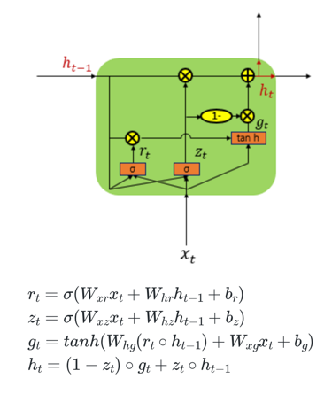

- GRU는 성능은 LSTM과 유사하면서 복잡했던 LSTM의 구조를 간단화

# 1. GRU(Gated Recurrent Unit)

- LSTM에서는 출력, 입력, 삭제 게이트라는 3개의 게이트가 존재
- GRU에서는 업데이트 게이트와 리셋 게이트 두 가지 게이트만이 존재



- 경험적으로 데이터 양이 적을 때는 매개 변수의 양이 적은 GRU가 조금 더 낫고, 데이터 양이 더 많으면 LSTM이 더 낫다고도 한다

# 2. 케라스에서의 GRU(Gated Recurrent Unit)

```python
model.add(GRU(hidden_size, input_shape=(timesteps, input_dim)))
```