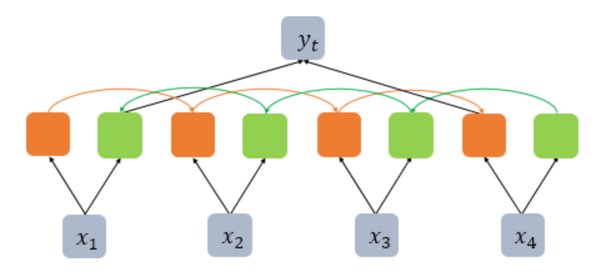

# 1. 임의의 입력 생성하기

```python
import numpy as np
import tensorflow as tf
from tensorflow.keras.layers import SimpleRNN, LSTM, Bidirectional

train_X = [[0.1, 4.2, 1.5, 1.1, 2.8], [1.0, 3.1, 2.5, 0.7, 1.1], [0.3, 2.1, 1.5, 2.1, 0.1], [2.2, 1.4, 0.5, 0.9, 1.1]]
print(np.shape(train_X))

[output]
(4, 5)
```

- 단어 벡터의 차원은 5이고, 문장의 길이가 4인 경우를 가정한 입력
- 4번의 시점(timesteps)이 존재하고, 각 시점마다 5차원의 단어 벡터가 입력으로 사용
- RNN은 2D 텐서가 아니라 3D 텐서를 입력을 받는다
- 위에서 만든 2D 텐서를 3D 텐서로 변경. 이는 배치 크기 1을 추가해주므로서 해결

```python
train_X = [[[0.1, 4.2, 1.5, 1.1, 2.8], [1.0, 3.1, 2.5, 0.7, 1.1], [0.3, 2.1, 1.5, 2.1, 0.1], [2.2, 1.4, 0.5, 0.9, 1.1]]]
train_X = np.array(train_X, dtype=np.float32)
print(train_X.shape)

[output]
(1, 4, 5)
```

- batch_size는 한 번에 RNN이 학습하는 데이터의 양을 의미
- 여기서는 샘플이 1개 밖에 없으므로 batch_size는 1

## 2. SimpleRNN 이해하기
- SimpleRNN에는 여러 인자가 있으며 대표적인 인자로 return_sequences와 return_state
- 은닉 상태의 크기를 3으로 지정하고, 두 인자 값이 모두 False일 때의 출력값

```python
rnn = SimpleRNN(3)
# rnn = SimpleRNN(3, return_sequences=False, return_state=False)와 동일.
hidden_state = rnn(train_X)

print('hidden state : {}, shape: {}'.format(hidden_state, hidden_state.shape))

[output]
hidden state : [[-0.866719    0.95010996 -0.99262357]], shape: (1, 3)
```

- return_sequences를 True로 지정하여 모든 시점의 은닉 상태를 출력

```python
rnn = SimpleRNN(3, return_sequences=True)
hidden_states = rnn(train_X)

print('hidden states : {}, shape: {}'.format(hidden_states, hidden_states.shape))

[output]
hidden states : [[[ 0.92948604 -0.9985648   0.98355013]
  [ 0.89172053 -0.9984244   0.191779  ]
  [ 0.6681082  -0.96070355  0.6493537 ]
  [ 0.95280755 -0.98054564  0.7224146 ]]], shape: (1, 4, 3)
```

- return_state가 True일 경우에는 return_sequences의 True/False 여부와 상관없이 마지막 시점의 은닉 상태를 출력
- return_sequences가 True이면서, return_state를 True로 할 경우 SimpleRNN은 두 개의 출력을 리턴

```python
rnn = SimpleRNN(3, return_sequences=True, return_state=True)
hidden_states, last_state = rnn(train_X)

print('hidden states : {}, shape: {}'.format(hidden_states, hidden_states.shape))
print('last hidden state : {}, shape: {}'.format(last_state, last_state.shape))

[output]
hidden states : [[[ 0.29839835 -0.99608386  0.2994854 ]
  [ 0.9160876   0.01154806  0.86181474]
  [-0.20252597 -0.9270214   0.9696659 ]
  [-0.5144398  -0.5037417   0.96605766]]], shape: (1, 4, 3)
last hidden state : [[-0.5144398  -0.5037417   0.96605766]], shape: (1, 3)
```

- return_sequences는 False인데, retun_state가 True인 경우

```python
rnn = SimpleRNN(3, return_sequences=False, return_state=True)
hidden_state, last_state = rnn(train_X)

print('hidden state : {}, shape: {}'.format(hidden_state, hidden_state.shape))
print('last hidden state : {}, shape: {}'.format(last_state, last_state.shape))

[output]
hidden state : [[0.07532981 0.97772664 0.97351676]], shape: (1, 3)
last hidden state : [[0.07532981 0.97772664 0.97351676]], shape: (1, 3)
```

- 두 개의 출력 모두 마지막 시점의 은닉 상태를 출력

# 3. LSTM 이해하기
-  SimpleRNN이 사용되는 경우는 거의 없다
-  return_sequences를 False로 두고, return_state가 True인 경우

```python
lstm = LSTM(3, return_sequences=False, return_state=True)
hidden_state, last_state, last_cell_state = lstm(train_X)

print('hidden state : {}, shape: {}'.format(hidden_state, hidden_state.shape))
print('last hidden state : {}, shape: {}'.format(last_state, last_state.shape))
print('last cell state : {}, shape: {}'.format(last_cell_state, last_cell_state.shape))

[output]
hidden state : [[-0.00263056  0.20051427 -0.22501363]], shape: (1, 3)
last hidden state : [[-0.00263056  0.20051427 -0.22501363]], shape: (1, 3)
last cell state : [[-0.04346419  0.44769213 -0.2644241 ]], shape: (1, 3)
```

 - SimpleRNN 때와는 달리, 세 개의 결과를 반환
 - return_sequences가 False이므로 우선 첫번째 결과는 마지막 시점의 은닉 상태
 - SimpleRNN과 다른 점은 return_state를 True로 둔 경우에는 마지막 시점의 은닉 상태뿐만 아니라 셀 상태까지 반환
 - return_sequences를 True로 바꿔보자

```python
lstm = LSTM(3, return_sequences=True, return_state=True)
hidden_states, last_hidden_state, last_cell_state = lstm(train_X)

print('hidden states : {}, shape: {}'.format(hidden_states, hidden_states.shape))
print('last hidden state : {}, shape: {}'.format(last_hidden_state, last_hidden_state.shape))
print('last cell state : {}, shape: {}'.format(last_cell_state, last_cell_state.shape))

[output]
hidden states : [[[ 0.1383949   0.01107763 -0.00315794]
  [ 0.0859854   0.03685492 -0.01836833]
  [-0.02512104  0.12305924 -0.0891041 ]
  [-0.27381724  0.05733536 -0.04240693]]], shape: (1, 4, 3)
last hidden state : [[-0.27381724  0.05733536 -0.04240693]], shape: (1, 3)
last cell state : [[-0.39230722  1.5474017  -0.6344505 ]], shape: (1, 3)
```

- 첫번째 출력값은 모든 시점의 은닉 상태가 출력

# 4. Bidirectional(LSTM) 이해하기
-  은닉 상태의 값이 어떻게 바뀌는지 직접 비교하기 위해서 이번에는 출력되는 은닉 상태의 값을 고정

```python
k_init = tf.keras.initializers.Constant(value=0.1)
b_init = tf.keras.initializers.Constant(value=0)
r_init = tf.keras.initializers.Constant(value=0.1)
```

- return_sequences가 False이고, return_state가 True인 경우

```python
bilstm = Bidirectional(LSTM(3, return_sequences=False, return_state=True, \
                            kernel_initializer=k_init, bias_initializer=b_init, recurrent_initializer=r_init))
hidden_states, forward_h, forward_c, backward_h, backward_c = bilstm(train_X)

print('hidden states : {}, shape: {}'.format(hidden_states, hidden_states.shape))
print('forward state : {}, shape: {}'.format(forward_h, forward_h.shape))
print('backward state : {}, shape: {}'.format(backward_h, backward_h.shape))

[output]
hidden states : [[0.6303139  0.6303139  0.6303139  0.70387346 0.70387346 0.70387346]], shape: (1, 6)
forward state : [[0.6303139 0.6303139 0.6303139]], shape: (1, 3)
backward state : [[0.70387346 0.70387346 0.70387346]], shape: (1, 3)
```

- return_state가 True인 경우에는 정방향 LSTM의 은닉 상태와 셀 상태, 역방향 LSTM의 은닉 상태와 셀 상태 4가지를 반환
- 셀 상태는 각각 forward_c와 backward_c에 저장만 하고 출력 X
- 이는 return_sequences가 False인 경우 정방향 LSTM의 마지막 시점의 은닉 상태와 역방향 LSTM의 첫번째 시점의 은닉 상태가 연결된 채 반환
- 그림으로 표현하면 아래와 같이 연결되어 다음층에서 사용



- return_state가 True인 경우에 반환한 은닉 상태의 값인 forward_h와 backward_h는 각각 정방향 LSTM의 마지막 시점의 은닉 상태와 역방향 LSTM의 첫번째 시점의 은닉 상태값
- 이 두 값을 연결한 값이 hidden_states에 출력되는 값
- 정방향 LSTM의 마지막 시점의 은닉 상태값과 역방향 LSTM의 첫번째 은닉 상태값을 기억해두자