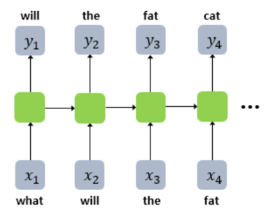
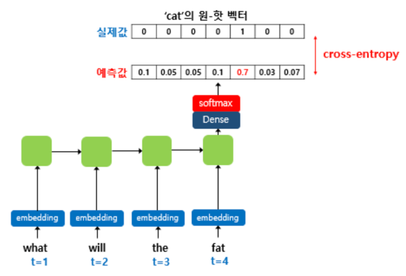
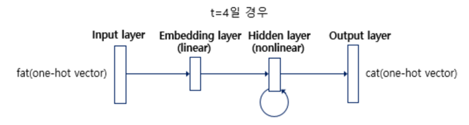
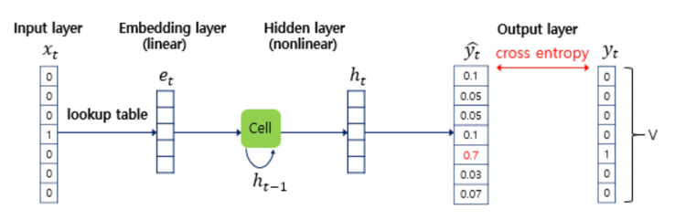
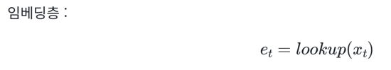
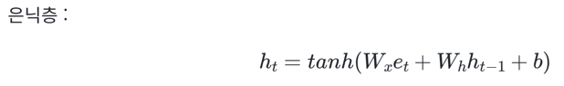
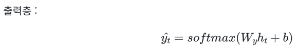

# 1. RNN 언어 모델(Recurrent Neural Network Language Model, RNNLM)
- n-gram 언어 모델과 NNLM은 고정된 개수의 단어만을 입력으로 받아야한다는 단점
- 시점(time step)이라는 개념이 도입된 RNN으로 언어 모델을 만들면 입력의 길이를 고정 X
- RNN으로 만든 언어 모델을 RNNLM(Recurrent Neural Network Language Model)

```python
예문 : 'what will the fat cat sit on'
```



- RNNLM은 기본적으로 예측 과정에서 이전 시점의 출력을 현재 시점의 입력
- 훈련 과정에서는 이전 시점의 예측 결과를 다음 시점의 입력으로 넣으면서 예측하는 것이 X  

```python
what will the fat cat sit on라는 훈련 샘플이 있다면, what will the fat cat sit 시퀀스를 모델의 입력으로 넣으면,
will the fat cat sit on를 예측하도록 훈련. will, the, fat, cat, sit, on는 각 시점의 레이블
```

- 이러한 RNN 훈련 기법을 **교사 강요(teacher forcing)**
- 테스트 과정에서 t 시점의 출력이 t+1 시점의 입력으로 사용되는 RNN 모델을 훈련시킬 때 사용하는 훈련 기법
- 훈련할 때 교사 강요를 사용할 경우, 모델이 t 시점에서 예측한 값을 t+1 시점에 입력으로 사용 X
- 실제 알고있는 정답을 t+1 시점의 입력으로 사용
- 한 번 잘못 예측하면 뒤에서의 예측까지 영향을 미쳐 훈련 시간이 느려지게 되므로 교사 강요를 사용하여 RNN을 좀 더 빠르고 효과적으로 훈련



- 훈련 과정 동안 출력층에서 사용하는 활성화 함수는 소프트맥스 함수
- 모델이 예측한 값과 실제 레이블과의 오차를 계산하기 위해서 손실 함수로 크로스 엔트로피 함수를 사용



- RNNLM은 위의 그림과 같이 총 4개의 층(layer)으로 이루어진 인공 신경망
- 출력층(output layer)을 보면 모델이 예측해야하는 정답에 해당되는 단어 cat의 원-핫 벡터
- 해당 값은 출력층에서 모델이 예측한 값의 오차를 구하기 위해 사용될 예정. 이 오차로부터 손실 함수를 사용해 인공 신경망이 학습



- x(t)가 거치는 임베딩층은 기본적으로 NNLM에서 배운 투사층(projection layer)
- NNLM에서는 룩업 테이블을 수행하는 층을 투사층라고 표현했지만, 이미 투사층의 결과로 얻는 벡터를 임베딩 벡터라 부른다
- 단어 집합의 크기가 V일 때, 임베딩 벡터의 크기를 M으로 설정하면, 각 입력 단어들은 임베딩층에서 V × M 크기의 임베딩 행렬과 곱해진다   
-> 원-핫 벡터의 차원이 7이고, M이 5라면 임베딩 행렬은 7 × 5 행렬



- 이 임베딩 벡터는 은닉층에서 이전 시점의 은닉 상태인 h(t-1)과 함께 다음의 연산을 하여 현재 시점의 은닉 상태 h(t)를 계산



- 출력층에서는 활성화 함수로 소프트맥스(softmax) 함수를 사용하는데, V차원의 벡터는 소프트맥스 함수를 지나면서 각 원소는 0과 1사이의 실수값을 가지며 총 합은 1이 되는 상태로 변경
- 이렇게 나온 벡터를 RNNLM의 t시점의 예측값이라는 의미에서 ^y(t)



- ^y(t)의 j번째 인덱스가 가진 0과 1사이의 값은 j번째 단어가 다음 단어일 확률. ^y(t)는 실제값
- 즉, 실제 정답에 해당되는 단어인 원-핫 벡터의 값에 가까워져야 한다
-  실제값에 해당되는 다음 단어를 y라고 했을 때, 이 두 벡터가 가까워지게 하기위해서 RNNLM는 손실 함수로 cross-entropy 함수를 사용
- 역전파가 이루어지면서 가중치 행렬들이 학습되는데, 이 과정에서 임베딩 벡터값들도 학습
- 룩업 테이블의 대상이 되는 테이블인 임베딩 행렬 E, 과적으로 RNNLM에서 학습 과정에서 학습되는 가중치 행렬은 E, W(x), W(h), W(h), W(y)
