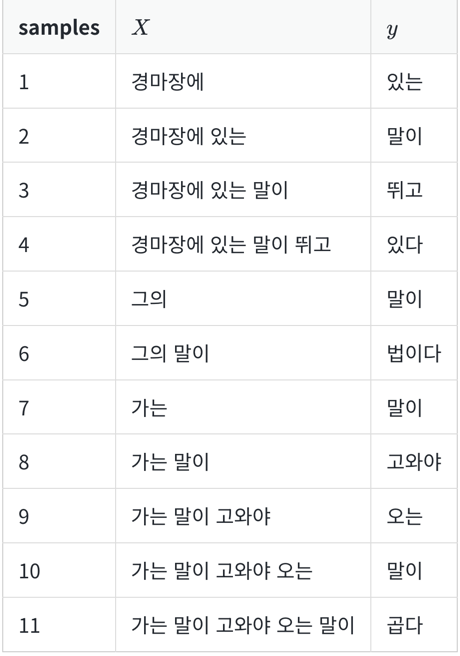
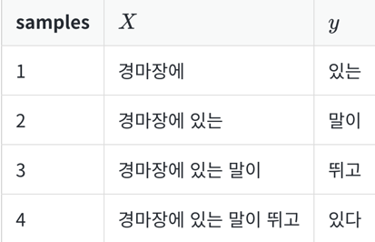

# 1. RNN을 이용하여 텍스트 생성하기
- 모델이 문맥을 학습할 수 있도록 전체 문장의 앞의 단어들을 전부 고려하여 학습하도록 데이터를 재구성한다면 아래와 같이 총 11개의 샘플이 구성



## 1) 데이터에 대한 이해와 전처리

```python
import numpy as np
from tensorflow.keras.preprocessing.text import Tokenizer
from tensorflow.keras.preprocessing.sequence import pad_sequences
from tensorflow.keras.utils import to_categorical
```

- 3개의 한국어 문장을 저장

```python
text = """경마장에 있는 말이 뛰고 있다\n
그의 말이 법이다\n
가는 말이 고와야 오는 말이 곱다\n"""
```

- 단어 집합의 크기를 저장할 때는 케라스 토크나이저의 정수 인코딩은 인덱스가 1부터 시작하지만, 패딩을 위한 0을 고려하여 +1

```python
tokenizer = Tokenizer()
tokenizer.fit_on_texts([text])
vocab_size = len(tokenizer.word_index) + 1
print('단어 집합의 크기 : %d' % vocab_size)

[output]
단어 집합의 크기 : 12
```

- 각 단어와 단어에 부여된 정수 인덱스를 출력

```python
print(tokenizer.word_index)

[output]
{'말이': 1, '경마장에': 2, '있는': 3, '뛰고': 4, '있다': 5, '그의': 6, '법이다': 7, '가는': 8, '고와야': 9, '오는': 10, '곱다': 11}
```

- 훈련 데이터 생성

```python
sequences = list()
for line in text.split('\n'): # 줄바꿈 문자를 기준으로 문장 토큰화
    encoded = tokenizer.texts_to_sequences([line])[0]
    for i in range(1, len(encoded)):
        sequence = encoded[:i+1]
        sequences.append(sequence)

print('학습에 사용할 샘플의 개수: %d' % len(sequences))

[output]
학습에 사용할 샘플의 개수: 11
```

- 샘플의 개수는 총 11개가 나옵니다. 전체 샘플을 출력

```python
print(sequences)

[output]
[[2, 3], [2, 3, 1], [2, 3, 1, 4], [2, 3, 1, 4, 5], [6, 1], [6, 1, 7], [8, 1], [8, 1, 9], [8, 1, 9, 10], [8, 1, 9, 10, 1], [8, 1, 9, 10, 1, 11]]
```

- 우선 가장 긴 샘플의 길이를 기준으로 전체 샘플에 대해서 길이를 일치

```python
max_len = max(len(l) for l in sequences) # 모든 샘플에서 길이가 가장 긴 샘플의 길이 출력
print('샘플의 최대 길이 : {}'.format(max_len))

[output]
샘플의 최대 길이 : 6
```

- 전체 샘플의 길이를 6으로 패딩

```python
sequences = pad_sequences(sequences, maxlen=max_len, padding='pre')
```

- padding의 인자로 'pre'를 주면 길이가 6보다 짧은 샘플의 앞에 0으로 채운다

```python
print(sequences)

[output]
[[ 0  0  0  0  2  3]
 [ 0  0  0  2  3  1]
 [ 0  0  2  3  1  4]
 [ 0  2  3  1  4  5]
 [ 0  0  0  0  6  1]
 [ 0  0  0  6  1  7]
 [ 0  0  0  0  8  1]
 [ 0  0  0  8  1  9]
 [ 0  0  8  1  9 10]
 [ 0  8  1  9 10  1]
 [ 8  1  9 10  1 11]]
```

-  리스트의 마지막 값을 제외하고 저장한 것은 X, 리스트의 마지막 값만 저장한 것은 y. 이는 레이블에 해당

```python
sequences = np.array(sequences)
X = sequences[:,:-1]
y = sequences[:,-1]
print(X)
print(y)

[output]
[[ 0  0  0  0  2]
 [ 0  0  0  2  3]
 [ 0  0  2  3  1]
 [ 0  2  3  1  4]
 [ 0  0  0  0  6]
 [ 0  0  0  6  1]
 [ 0  0  0  0  8]
 [ 0  0  0  8  1]
 [ 0  0  8  1  9]
 [ 0  8  1  9 10]
 [ 8  1  9 10  1]]

[ 3  1  4  5  1  7  1  9 10  1 11]
```

- RNN 모델에 훈련 데이터를 훈련 시키기 전에 레이블에 대해서 원-핫 인코딩

```python
y = to_categorical(y, num_classes=vocab_size)
print(y)

[output]
[[0. 0. 0. 1. 0. 0. 0. 0. 0. 0. 0. 0.] # 3에 대한 원-핫 벡터
 [0. 1. 0. 0. 0. 0. 0. 0. 0. 0. 0. 0.] # 1에 대한 원-핫 벡터
 [0. 0. 0. 0. 1. 0. 0. 0. 0. 0. 0. 0.] # 4에 대한 원-핫 벡터
 [0. 0. 0. 0. 0. 1. 0. 0. 0. 0. 0. 0.] # 5에 대한 원-핫 벡터
 [0. 1. 0. 0. 0. 0. 0. 0. 0. 0. 0. 0.] # 1에 대한 원-핫 벡터
 [0. 0. 0. 0. 0. 0. 0. 1. 0. 0. 0. 0.] # 7에 대한 원-핫 벡터
 [0. 1. 0. 0. 0. 0. 0. 0. 0. 0. 0. 0.] # 1에 대한 원-핫 벡터
 [0. 0. 0. 0. 0. 0. 0. 0. 0. 1. 0. 0.] # 9에 대한 원-핫 벡터
 [0. 0. 0. 0. 0. 0. 0. 0. 0. 0. 1. 0.] # 10에 대한 원-핫 벡터
 [0. 1. 0. 0. 0. 0. 0. 0. 0. 0. 0. 0.] # 1에 대한 원-핫 벡터
 [0. 0. 0. 0. 0. 0. 0. 0. 0. 0. 0. 1.]] # 11에 대한 원-핫 벡터
```

# 2) 모델 설계하기

- RNN 모델에 데이터를 훈련

```python

'''
하이퍼파라미터인 임베딩 벡터의 차원은 10, 은닉 상태의 크기는 32입니다.
다 대 일 구조의 RNN을 사용합니다. 전결합층(Fully Connected Layer)을 출력층으로 단어 집합 크기만큼의 뉴런을 배치하여 모델을 설계합니다. 
해당 모델은 마지막 시점에서 모든 가능한 단어 중 하나의 단어를 예측하는 다중 클래스 분류 문제를 수행하는 모델입니다.
다중 클래스 분류 문제의 경우, 출력층에 소프트맥스 회귀를 사용해야 하므로 활성화 함수로는 소프트맥스 함수를 사용하고, 손실 함수로 크로스 엔트로피 함수를 사용하여 200 에포크를 수행
'''

from tensorflow.keras.models import Sequential
from tensorflow.keras.layers import Embedding, Dense, SimpleRNN

embedding_dim = 10
hidden_units = 32

model = Sequential()
model.add(Embedding(vocab_size, embedding_dim))
model.add(SimpleRNN(hidden_units))
model.add(Dense(vocab_size, activation='softmax'))
model.compile(loss='categorical_crossentropy', optimizer='adam', metrics=['accuracy'])
model.fit(X, y, epochs=200, verbose=2)
```

- 모델이 정확하게 예측하고 있는지 문장을 생성하는 함수를 만들어서 출력

```python
def sentence_generation(model, tokenizer, current_word, n): # 모델, 토크나이저, 현재 단어, 반복할 횟수
    init_word = current_word
    sentence = ''

    # n번 반복
    for _ in range(n):
        # 현재 단어에 대한 정수 인코딩과 패딩
        encoded = tokenizer.texts_to_sequences([current_word])[0]
        encoded = pad_sequences([encoded], maxlen=5, padding='pre')
        # 입력한 X(현재 단어)에 대해서 Y를 예측하고 Y(예측한 단어)를 result에 저장.
        result = model.predict(encoded, verbose=0)
        result = np.argmax(result, axis=1)

        for word, index in tokenizer.word_index.items(): 
            # 만약 예측한 단어와 인덱스와 동일한 단어가 있다면 break
            if index == result:
                break

        # 현재 단어 + ' ' + 예측 단어를 현재 단어로 변경
        current_word = current_word + ' '  + word

        # 예측 단어를 문장에 저장
        sentence = sentence + ' ' + word

    sentence = init_word + sentence
    return sentence
```

- '경마장에' 라는 단어 뒤에는 총 4개의 단어가 있으므로 4번 예측

```python
print(sentence_generation(model, tokenizer, '경마장에', 4))
print(sentence_generation(model, tokenizer, '그의', 2))
print(sentence_generation(model, tokenizer, '가는', 5))

[output]
경마장에 있는 말이 뛰고 있다
그의 말이 법이다
가는 말이 고와야 오는 말이 곱다
```

# 2. LSTM을 이용하여 텍스트 생성하기

## 1) 데이터에 대한 이해와 전처리

- 사용할 데이터는 뉴욕 타임즈 기사의 제목

```python
import pandas as pd
import numpy as np
from string import punctuation

from tensorflow.keras.preprocessing.text import Tokenizer
from tensorflow.keras.preprocessing.sequence import pad_sequences
from tensorflow.keras.utils import to_categorical

df = pd.read_csv('ArticlesApril2018.csv')
df.head()

[output]
책의 지면의 한계로 이번 출력 화면은 생략
```

- 어떤 열이 있고, 열이 총 몇 개가 있는지 출력

```python
print('열의 개수: ',len(df.columns))
print(df.columns)

[output]
열의 개수:  15
Index(['articleID', 'articleWordCount', 'byline', 'documentType', 'headline',
       'keywords', 'multimedia', 'newDesk', 'printPage', 'pubDate',
       'sectionName', 'snippet', 'source', 'typeOfMaterial', 'webURL'], dtype='object')
```

- 여기서 사용할 열은 제목에 해당되는 headline 열입니다. Null 값이 있는지 확인

```python
print(df['headline'].isnull().values.any())

[output]
False
```

- headline 열에서 모든 신문 기사의 제목을 뽑아서 하나의 리스트로 저장

```python
headline = []
# 헤드라인의 값들을 리스트로 저장
headline.extend(list(df.headline.values)) 
headline[:5]
```

- headline이라는 리스트에 모든 신문 기사의 제목을 저장. 저장한 리스트에서 상위 5개만 출력

```python
['Former N.F.L. Cheerleaders’ Settlement Offer: $1 and a Meeting With Goodell',
 'E.P.A. to Unveil a New Rule. Its Effect: Less Science in Policymaking.',
 'The New Noma, Explained',
 'Unknown',
 'Unknown']
```

- 노이즈 데이터 Unknown 값을 가진 샘플을 제거

```python
headline = [word for word in headline if word != "Unknown"]
print('노이즈값 제거 후 샘플의 개수 : {}'.format(len(headline)))

[output]
노이즈값 제거 후 샘플의 개수 : 1214
```

- 다시 출력

```python
headline[:5]

[output]
['Former N.F.L. Cheerleaders’ Settlement Offer: $1 and a Meeting With Goodell',
 'E.P.A. to Unveil a New Rule. Its Effect: Less Science in Policymaking.',
 'The New Noma, Explained',
 'How a Bag of Texas Dirt  Became a Times Tradition',
 'Is School a Place for Self-Expression?']]
```

- 데이터 전처리를 수행. 여기서 선택한 전처리는 구두점 제거와 단어의 소문자화

```python
def repreprocessing(raw_sentence):
    preproceseed_sentence = raw_sentence.encode("utf8").decode("ascii",'ignore')
    # 구두점 제거와 동시에 소문자화
    return ''.join(word for word in preproceseed_sentence if word not in punctuation).lower()

preprocessed_headline = [repreprocessing(x) for x in headline]
preprocessed_headline[:5]

[output]
['former nfl cheerleaders settlement offer 1 and a meeting with goodell',
 'epa to unveil a new rule its effect less science in policymaking',
 'the new noma explained',
 'how a bag of texas dirt  became a times tradition',
 'is school a place for selfexpression']
```

- 기존에 구두점이 붙어있던 단어들에서 구두점이 제거
- 단어 집합(vocabulary)을 만들고 크기를 확인

```python
tokenizer = Tokenizer()
tokenizer.fit_on_texts(preprocessed_headline)
vocab_size = len(tokenizer.word_index) + 1
print('단어 집합의 크기 : %d' % vocab_size)

[output]
단어 집합의 크기 : 3494
```

- 정수 인코딩을 진행하는 동시에 하나의 문장을 여러 줄로 분해하여 훈련 데이터를 구성

```python
sequences = list()

for sentence in preprocessed_headline:

    # 각 샘플에 대한 정수 인코딩
    encoded = tokenizer.texts_to_sequences([sentence])[0] 
    for i in range(1, len(encoded)):
        sequence = encoded[:i+1]
        sequences.append(sequence)

sequences[:11]

[output]
[[99, 269], # former nfl
 [99, 269, 371], # former nfl cheerleaders
 [99, 269, 371, 1115], # former nfl cheerleaders settlement
 [99, 269, 371, 1115, 582], # former nfl cheerleaders settlement offer
 [99, 269, 371, 1115, 582, 52], # 'former nfl cheerleaders settlement offer 1
 [99, 269, 371, 1115, 582, 52, 7], # former nfl cheerleaders settlement offer 1 and
 [99, 269, 371, 1115, 582, 52, 7, 2], # ... 이하 생략 ...
 [99, 269, 371, 1115, 582, 52, 7, 2, 372],
 [99, 269, 371, 1115, 582, 52, 7, 2, 372, 10],
 [99, 269, 371, 1115, 582, 52, 7, 2, 372, 10, 1116], # 모든 단어가 사용된 완전한 첫번째 문장
 # 바로 위의 줄은 : former nfl cheerleaders settlement offer 1 and a meeting with goodell
 [100, 3]] # epa to에 해당되며 두번째 문장이 시작됨.
```

- 왜 하나의 문장을 저렇게 나눌까?   
-> 하나의 단어를 예측하기 위해 이전에 등장한 단어들을 모두 참고하는 것



- 모든 문장을 각 단어가 각 시점(time step)마다 하나씩 추가적으로 등장하는 형태로 만들었다
- 하지만, 아직 예측할 단어에 해당되는 레이블을 분리하는 작업까지는 수행하지 않은 상태
- 어떤 정수가 어떤 단어를 의미하는지 알아보기 위해 인덱스로부터 단어를 찾는 index_to_word

```python
index_to_word = {}
for key, value in tokenizer.word_index.items(): # 인덱스를 단어로 바꾸기 위해 index_to_word를 생성
    index_to_word[value] = key

print('빈도수 상위 582번 단어 : {}'.format(index_to_word[582]))

[output]
빈도수 상위 582번 단어 : offer
```

- 데이터를 분리하기 전에 전체 샘플의 길이를 동일하게 만드는 패딩 작업을 수행

```python
max_len = max(len(l) for l in sequences)
print('샘플의 최대 길이 : {}'.format(max_len))
sequences = pad_sequences(sequences, maxlen=max_len, padding='pre')
print(sequences[:3])

[output]
샘플의 최대 길이 : 24
[[ 0  0  0  0  0  0  0  0  0  0  0  0  0  0  0  0  0  0  0  0    0    0   99  269]
 [ 0  0  0  0  0  0  0  0  0  0  0  0  0  0  0  0  0  0  0  0    0   99  269  371]
 [ 0  0  0  0  0  0  0  0  0  0  0  0  0  0  0  0  0  0  0  0   99  269  371 1115]
```

- padding='pre'를 설정하여 샘플의 길이가 24보다 짧은 경우에 앞에 0으로 패딩

```python
sequences = np.array(sequences)
X = sequences[:,:-1]
y = sequences[:,-1]
print(X[:3])

[output]
[[ 0  0  0  0  0  0  0  0  0  0  0  0  0  0  0  0  0  0  0  0    0    0   99]
 [ 0  0  0  0  0  0  0  0  0  0  0  0  0  0  0  0  0  0  0  0    0   99  269]
 [ 0  0  0  0  0  0  0  0  0  0  0  0  0  0  0  0  0  0  0  0   99  269  371]
```

```python
print(y[:3])

[output]
[ 269  371 1115]
```

- 훈련 데이터 y 중 3개의 샘플만 출력해보았는데, 기존 훈련 데이터에서 맨 우측에 있던 정수들이 별도로 저장

```python
y = to_categorical(y, num_classes=vocab_size)
```

## 2) 모델 설계하기

```python
'''
하이퍼파라미터인 임베딩 벡터의 차원은 10, 은닉 상태의 크기는 128입니다. 
다 대 일 구조의 LSTM을 사용합니다. 전결합층(Fully Connected Layer)을 출력층으로 단어 집합 크기만큼의 뉴런을 배치하여 모델을 설계합니다. 
해당 모델은 마지막 시점에서 모든 가능한 단어 중 하나의 단어를 예측하는 다중 클래스 분류 문제를 수행하는 모델입니다. 
다중 클래스 분류 문제의 경우, 출력층에 소프트맥스 회귀를 사용해야 하므로 활성화 함수로는 소프트맥스 함수를 사용하고, 손실 함수로 크로스 엔트로피 함수를 사용하여 200 에포크를 수행합니다.
'''
from tensorflow.keras.models import Sequential
from tensorflow.keras.layers import Embedding, Dense, LSTM

embedding_dim = 10
hidden_units = 128

model = Sequential()
model.add(Embedding(vocab_size, embedding_dim))
model.add(LSTM(hidden_units))
model.add(Dense(vocab_size, activation='softmax'))
model.compile(loss='categorical_crossentropy', optimizer='adam', metrics=['accuracy'])
model.fit(X, y, epochs=200, verbose=2)
```

- 문장을 생성하는 함수 sentence_generation을 만들어서 문장을 생성

```python
def sentence_generation(model, tokenizer, current_word, n): # 모델, 토크나이저, 현재 단어, 반복할 횟수
    init_word = current_word
    sentence = ''

    # n번 반복
    for _ in range(n):
        encoded = tokenizer.texts_to_sequences([current_word])[0]
        encoded = pad_sequences([encoded], maxlen=max_len-1, padding='pre')

        # 입력한 X(현재 단어)에 대해서 y를 예측하고 y(예측한 단어)를 result에 저장.
        result = model.predict(encoded, verbose=0)
        result = np.argmax(result, axis=1)

        for word, index in tokenizer.word_index.items(): 
            # 만약 예측한 단어와 인덱스와 동일한 단어가 있다면
            if index == result:
                break

        # 현재 단어 + ' ' + 예측 단어를 현재 단어로 변경
        current_word = current_word + ' '  + word

        # 예측 단어를 문장에 저장
        sentence = sentence + ' ' + word

    sentence = init_word + sentence
    return sentence
```

- 임의의 단어 'i'에 대해서 10개의 단어를 추가 생성

```python
print(sentence_generation(model, tokenizer, 'i', 10))
print(sentence_generation(model, tokenizer, 'how', 10))

[output]
i disapprove of school vouchers can i still apply for them
how to make facebook more accountable will so your neighbor chasing
```