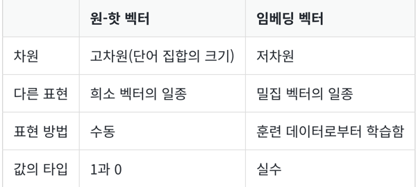

- 워드 임베딩(Word Embedding)은 단어를 벡터로 표현하는 방법으로, 단어를 밀집 표현으로 변환

# 1. 희소 표현(Sparse Representation)

- 벡터 또는 행렬(matrix)의 값이 대부분이 0으로 표현되는 방법
- 원-핫 벡터는 희소 벡터(sparse vector)
- 희소 벡터의 문제점은 단어의 개수가 늘어나면 벡터의 차원이 한없이 커진다는 점
- 이러한 벡터 표현은 공간적 낭비
- 원-핫 벡터와 같은 희소 벡터의 문제점은 단어의 의미를 표현하지 못한다는 점

# 2. 밀집 표현(Dense Representation)

- 희소 표현과 반대되는 표현으로 밀집 표현
- 밀집 표현은 벡터의 차원을 단어 집합의 크기로 상정 X
- 사용자가 설정한 값으로 모든 단어의 벡터 표현의 차원을 맞춘다
- 과정에서 더 이상 0과 1만 가진 값이 아니라 실수값
- 밀집 표현을 사용하고, 사용자가 밀집 표현의 차원을 128로 설정한다면, 모든 단어의 벡터 표현의 차원은 128로 바뀌면서 모든 값이 실수

```python
Ex) 강아지 = [0.2 1.8 1.1 -2.1 1.1 2.8 ... 중략 ...] # 이 벡터의 차원은 128
```

- 벡터의 차원이 조밀해졌다고 하여 밀집 벡터(dense vector)

# 3. 워드 임베딩(Word Embedding)

- 단어를 밀집 벡터(dense vector)의 형태로 표현하는 방법을 워드 임베딩(word embedding)
- 이 밀집 벡터를 워드 임베딩 과정을 통해 나온 결과라고 하여 임베딩 벡터(embedding vector)
- 워드 임베딩 방법론으로는 LSA, Word2Vec, FastText, Glove
- 케라스에서 제공하는 도구인 Embedding()   
-> 단어를 랜덤한 값을 가지는 밀집 벡터로 변환한 뒤에, 인공 신경망의 가중치를 학습하는 것과 같은 방식으로 단어 벡터를 학습하는 방법을 사용

