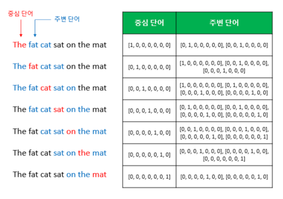
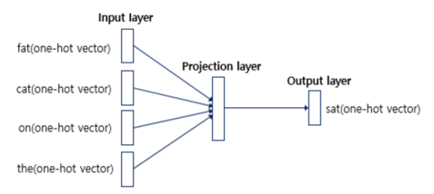
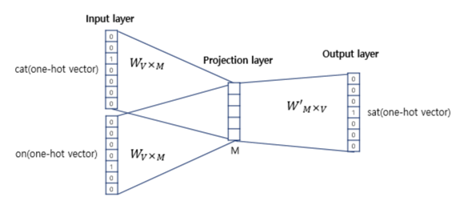
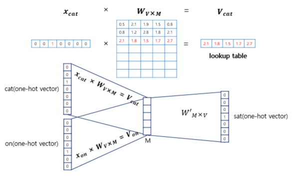
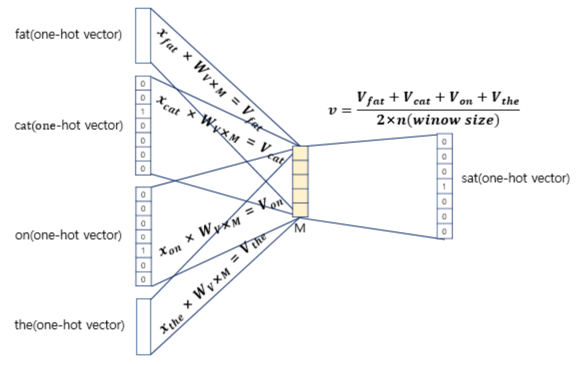
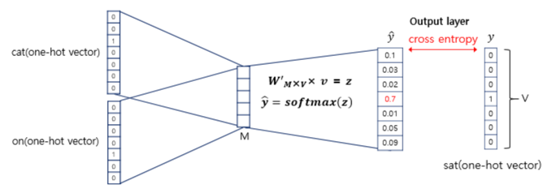
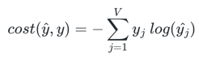
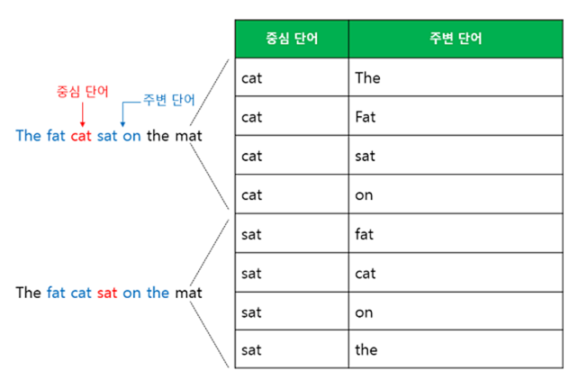
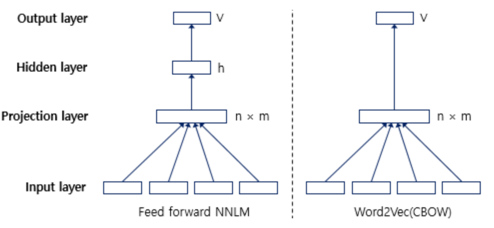

- 원-핫 벡터는 단어 벡터 간 유의미한 유사도를 계산할 수 없다는 단점
- 단어 벡터 간 유의미한 유사도를 반영할 수 있도록 단어의 의미를 수치화 할 수 있는 방법이 필요

# 1. 희소 표현(Sparse Representation)
- 벡터 또는 행렬의 값이 대부분이 0으로 표현되는 방법을 희소 표현
- 이러한 표현 방법은 각 단어 벡터간 유의미한 유사성을 표현할 수 없다는 단점이 있었고, 대안으로 단어의 의미를 다차원 공간에 벡터화하는 방법을 사용하는데 이러한 표현을 **분산 표현**
- 분산 표현을 이용하여 단어 간 의미적 유사성을 벡터화하는 작업을 워드 임베딩이라 부르며 이렇게 표현된 벡터를 임베딩 벡터

# 2. 분산 표현(Distributed Representation)

- 기본적으로 분포 가설(distributional hypothesis)이라는 가정 하에 만들어진 표현 방법   
**'비슷한 문맥에서 등장하는 단어들은 비슷한 의미를 가진다'**
- 강아지란 단어는 귀엽다, 예쁘다, 애교 등의 단어가 주로 함께 등장
- 분포 가설에 따라서 해당 내용을 가진 텍스트의 단어들을 벡터화한다면 해당 단어 벡터들은 유사한 벡터값
- 분산 표현은 저차원에 단어의 의미를 여러 차원에다가 분산하여 표현
- 이런 표현 방법을 사용하면 단어 벡터 간 유의미한 유사도를 계산 가능

# 3. CBOW(Continuous Bag of Words)
- Word2Vec의 학습 방식에는 CBOW(Continuous Bag of Words)와 Skip-Gram 두 가지 방식
- CBOW는 주변에 있는 단어들을 입력으로 중간에 있는 단어들을 예측하는 방법
- Skip-Gram은 중간에 있는 단어들을 입력으로 주변 단어들을 예측하는 방법

- **슬라이딩 윈도우**: 윈도우 크기가 정해지면 윈도우를 옆으로 움직여서 주변 단어와 중심 단어의 선택을 변경해가며 학습을 위한 데이터 셋 생성
- Word2Vec에서 입력은 모두 원-핫 벡터가 되어야 하는데, 아래는 중심 단어와 주변 단어를 어떻게 선택했을 때에 따라서 각각 어떤 원-핫 벡터가 되는지 보여준다

- Word2Vec은 은닉층이 다수인 딥 러닝(deep learning) 모델이 아니라 은닉층이 1개인 얕은 신경망(shallow neural network)이라는 점
- 일반적인 은닉층과는 달리 활성화 함수가 존재하지 않으며 룩업 테이블이라는 연산을 담당하는 층으로 투사층(projection layer)

- 주목해야할 것은 두 가지
1. 투사층의 크기가 M
2. 입력층과 투사층 사이의 가중치 W는 V × M 행렬이며, 투사층에서 출력층사이의 가중치 W'는 M × V 행렬

- **룩업 테이블(lookup table)**: i번째 인덱스에 1이라는 값을 가지고 그 외의 0의 값을 가지는 입력 벡터와 가중치 W 행렬의 곱은 사실 W행렬의 i번째 행을 그대로 읽어오는 것과(lookup) 동일

- 주변 단어의 원-핫 벡터에 대해서 가중치 W가 곱해서 생겨진 결과 벡터들은 투사층에서 만나 이 벡터들의 평균인 벡터를 구한다
- 윈도우 크기 n=2라면, 입력 벡터의 총 개수는 2n이므로 중간 단어를 예측하기 위해서는 총 4개가 입력 벡터로 사용

- 구해진 평균 벡터는 두번째 가중치 행렬 W'와 곱해진다
- 곱셈의 결과로는 원-핫 벡터들과 차원이 V로 동일한 벡터
- 소프트맥스(softmax) 함수를 지나면서 벡터의 각 원소들의 값은 0과 1사이의 실수로, 총 합은 1
- 크로스 엔트로피 함수에 중심 단어인 원-핫 벡터와 스코어 벡터를 입력값으로 넣고, 이를 식으로 표현하면 다음과 같습니다. 아래의 식에서 V는 단어 집합의 크기

- 학습이 다 되었다면 M차원의 크기를 갖는 W의 행렬의 행을 각 단어의 임베딩 벡터로 사용하거나 W와 W' 행렬 두 가지 모두를 가지고 임베딩 벡터를 사용

# 4. Skip-gram

- 중심 단어에 대해서 주변 단어를 예측하므로 투사층에서 벡터들의 평균을 구하는 과정 X
- 전반적으로 Skip-gram이 CBOW보다 성능이 좋다라고 알려져있다

# 5. NNLM Vs. Word2Vec

- NNLM과 Word2Vec의 차이
1. NNLM은 다음 단어를 예측하는 언어 모델이 목적이므로 다음 단어를 예측하지만, Word2Vec(CBOW)은 워드 임베딩 자체가 목적이므로 다음 단어가 아닌 중심 단어를 예측
2. 구조도 달라졌다. Word2Vec은 우선 NNLM에 존재하던 활성화 함수가 있는 은닉층을 제거
3. Word2Vec이 NNLM보다 학습 속도에서 강점을 가지는 이유는 은닉층을 제거한 것뿐만 아니라 추가적으로 사용되는 기법들   
-> 계층적 소프트맥스, 네거티브 샘플링
