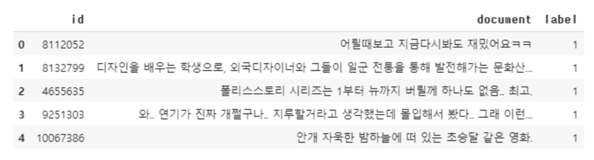
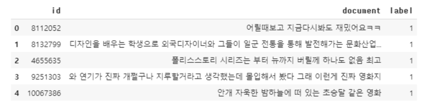
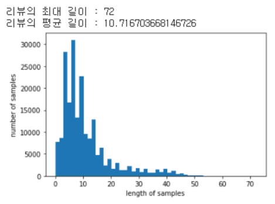

- gensim 패키지에서 제공하는 이미 구현된 Word2Vec을 사용하여 영어와 한국어 데이터를 학습

# 1. 영어 Word2Vec 만들기

- 파이썬의 gensim 패키지에는 Word2Vec을 지원하고 있어, gensim 패키지를 이용하면 손쉽게 단어를 임베딩 벡터로 변환 가능

```python
import re
import urllib.request
import zipfile
from lxml import etree
from nltk.tokenize import word_tokenize, sent_tokenize
```

## 1) 훈련 데이터 이해하기

```python
# 데이터 다운로드
urllib.request.urlretrieve("https://raw.githubusercontent.com/ukairia777/tensorflow-nlp-tutorial/main/09.%20Word%20Embedding/dataset/ted_en-20160408.xml", filename="ted_en-20160408.xml")
```

- 훈련 데이터 파일이 xml 형식이라 전처리 필요
- 실질적 데이터는 영어문장으로만 구성된 내용을 담고 있는 \<content\>와 \</content\> 사이의 내용
- (Laughter)나 (Applause)와 같은 배경음을 나타내는 단어도 등장하는데 이 또한 제거

## 2) 훈련 데이터 전처리하기

- 전처리 코드

```python
targetXML = open('ted_en-20160408.xml', 'r', encoding='UTF8')
target_text = etree.parse(targetXML)

# xml 파일로부터 <content>와 </content> 사이의 내용만 가져온다.
parse_text = '\n'.join(target_text.xpath('//content/text()'))

# 정규 표현식의 sub 모듈을 통해 content 중간에 등장하는 (Audio), (Laughter) 등의 배경음 부분을 제거.
# 해당 코드는 괄호로 구성된 내용을 제거.
content_text = re.sub(r'\([^)]*\)', '', parse_text)

# 입력 코퍼스에 대해서 NLTK를 이용하여 문장 토큰화를 수행.
sent_text = sent_tokenize(content_text)

# 각 문장에 대해서 구두점을 제거하고, 대문자를 소문자로 변환.
normalized_text = []
for string in sent_text:
     tokens = re.sub(r"[^a-z0-9]+", " ", string.lower())
     normalized_text.append(tokens)

# 각 문장에 대해서 NLTK를 이용하여 단어 토큰화를 수행.
result = [word_tokenize(sentence) for sentence in normalized_text]

print('총 샘플의 개수 : {}'.format(len(result)))

[output]
총 샘플의 개수 : 273424

# 샘플 3개만 출력
for line in result[:3]:
    print(line)

[output]
['here', 'are', 'two', 'reasons', 'companies', 'fail', 'they', 'only', 'do', 'more', 'of', 'the', 'same', 'or', 'they', 'only', 'do', 'what', 's', 'new']
['to', 'me', 'the', 'real', 'real', 'solution', 'to', 'quality', 'growth', 'is', 'figuring', 'out', 'the', 'balance', 'between', 'two', 'activities', 'exploration', 'and', 'exploitation']
['both', 'are', 'necessary', 'but', 'it', 'can', 'be', 'too', 'much', 'of', 'a', 'good', 'thing']
```

## 3) Word2Vec 훈련시키기

```python
from gensim.models import Word2Vec
from gensim.models import KeyedVectors

model = Word2Vec(sentences=result, vector_size=100, window=5, min_count=5, workers=4, sg=0)
```

- Word2Vec의 하이퍼파라미터값
1. vector_size = 워드 벡터의 특징 값. 즉, 임베딩 된 벡터의 차원.
2. window = 컨텍스트 윈도우 크기
3. min_count = 단어 최소 빈도 수 제한 (빈도가 적은 단어들은 학습하지 않는다.)
4. workers = 학습을 위한 프로세스 수
5. sg = 0은 CBOW, 1은 Skip-gram.

- Word2Vec는 입력한 단어에 대해서 가장 유사한 단어들을 출력하는 model.wv.most_similar 지원
- 'man'과 유사한 단어

```python
model_result = model.wv.most_similar("man")
print(model_result)

[output]
[('woman', 0.842622697353363), ('guy', 0.8178728818893433), ('boy', 0.7774451375007629), ('lady', 0.7767927646636963), ('girl', 0.7583760023117065), ('gentleman', 0.7437191009521484), ('soldier', 0.7413754463195801), ('poet', 0.7060446739196777), ('kid', 0.6925194263458252), ('friend', 0.6572611331939697)]
```

## 4) Word2Vec 모델 저장하고 로드하기

- 학습한 모델을 언제든 나중에 다시 사용할 수 있도록 컴퓨터 파일로 저장하고 다시 로드

```python
model.wv.save_word2vec_format('eng_w2v') # 모델 저장
loaded_model = KeyedVectors.load_word2vec_format("eng_w2v") # 모델 로드
model_result = loaded_model.most_similar("man")
print(model_result)

[output]
[('woman', 0.842622697353363), ('guy', 0.8178728818893433), ('boy', 0.7774451375007629), ('lady', 0.7767927646636963), ('girl', 0.7583760023117065), ('gentleman', 0.7437191009521484), ('soldier', 0.7413754463195801), ('poet', 0.7060446739196777), ('kid', 0.6925194263458252), ('friend', 0.6572611331939697)]
```

# 2. 한국어 Word2Vec 만들기(네이버 영화 리뷰)

```python
import pandas as pd
import matplotlib.pyplot as plt
import urllib.request
from gensim.models.word2vec import Word2Vec
from konlpy.tag import Okt

urllib.request.urlretrieve("https://raw.githubusercontent.com/e9t/nsmc/master/ratings.txt", filename="ratings.txt")
train_data = pd.read_table('ratings.txt')
train_data[:5] # 상위 5개 출력
```



- 총 리뷰 개수

```python
print(len(train_data)) # 리뷰 개수 출력

[output]
200000
```

- 결측값 유무를 확인

```python
# NULL 값 존재 유무
print(train_data.isnull().values.any())

[output]
True
```

- 결측값이 존재하므로 결측값이 존재하는 행을 제거

```python
train_data = train_data.dropna(how = 'any') # Null 값이 존재하는 행 제거
print(train_data.isnull().values.any()) # Null 값이 존재하는지 확인

[output]
False
```

- 결측값이 삭제된 후의 리뷰 개수를 확인

```python
print(len(train_data)) # 리뷰 개수 출력

[output]
199992
```

- 정규 표현식을 통해 한글이 아닌 경우 제거하는 전처리를 진행

```python
# 정규 표현식을 통한 한글 외 문자 제거
train_data['document'] = train_data['document'].str.replace("[^ㄱ-ㅎㅏ-ㅣ가-힣 ]","", regex=True)

[output]
train_data[:5] # 상위 5개 출력
```



- 학습 시에 사용하고 싶지 않은 단어들인 불용어를 제거

```python
# 불용어 정의
stopwords = ['의','가','이','은','들','는','좀','잘','걍','과','도','를','으로','자','에','와','한','하다']

# 형태소 분석기 OKT를 사용한 토큰화 작업 (다소 시간 소요)
okt = Okt()

tokenized_data = []
for sentence in tqdm(train_data['document']):
    tokenized_sentence = okt.morphs(sentence, stem=True) # 토큰화
    stopwords_removed_sentence = [word for word in tokenized_sentence if not word in stopwords] # 불용어 제거
    tokenized_data.append(stopwords_removed_sentence)

# 리뷰 길이 분포 확인
print('리뷰의 최대 길이 :',max(len(review) for review in tokenized_data))
print('리뷰의 평균 길이 :',sum(map(len, tokenized_data))/len(tokenized_data))
plt.hist([len(review) for review in tokenized_data], bins=50)
plt.xlabel('length of samples')
plt.ylabel('number of samples')
plt.show()

[output]
리뷰의 최대 길이 : 72
리뷰의 평균 길이 : 10.716703668146726
```



- Word2Vec으로 토큰화 된 네이버 영화 리뷰 데이터를 학습

```python
from gensim.models import Word2Vec

model = Word2Vec(sentences = tokenized_data, vector_size = 100, window = 5, min_count = 5, workers = 4, sg = 0)

# 완성된 임베딩 매트릭스의 크기 확인
model.wv.vectors.shape

[output]
(16477, 100)
```

- '최민식'과 유사한 단어들

```python
print(model.wv.most_similar("최민식"))

[output]
[('한석규', 0.8789200782775879), ('안성기', 0.8757420778274536), ('김수현', 0.855679452419281), ('이민호', 0.854516863822937), ('김명민', 0.8525030612945557), ('최민수', 0.8492398262023926), ('이성재', 0.8478372097015381), ('윤제문', 0.8470626473426819), ('김창완', 0.8456774950027466), ('이주승', 0.8442063927650452)]
```

# 3. 사전 훈련된 Word2Vec 임베딩(Pre-trained Word2Vec embedding) 소개

- 위키피디아 등의 방대한 데이터로 사전에 훈련된 워드 임베딩(pre-trained word embedding vector)를 가지고 와서 해당 벡터들의 값을 원하는 작업에 사용 가능
- 구글이 제공하는 사전 훈련된(미리 학습되어져 있는) Word2Vec 모델을 사용하는 방법
- 구글은 사전 훈련된 3백만 개의 Word2Vec 단어 벡터들을 제공

```python
import gensim
import urllib.request

# 구글의 사전 훈련된 Word2Vec 모델을 로드.
urllib.request.urlretrieve("https://s3.amazonaws.com/dl4j-distribution/GoogleNews-vectors-negative300.bin.gz", \
                           filename="GoogleNews-vectors-negative300.bin.gz")
word2vec_model = gensim.models.KeyedVectors.load_word2vec_format('GoogleNews-vectors-negative300.bin.gz', binary=True)

print(word2vec_model.vectors.shape)

[output]
(3000000, 300)
```

- 사전 훈련된 임베딩을 사용하여 두 단어의 유사도를 계산

```python
print(word2vec_model.similarity('this', 'is'))
print(word2vec_model.similarity('post', 'book'))

[output]
0.407970363878
0.0572043891977
```

- Word2vec 모델은 최근에 들어서는 자연어 처리를 넘어서 추천 시스템에도 사용되고 있는 모델
- 적당하게 데이터를 나열해주면 Word2vec은 위치가 근접한 데이터를 유사도가 높은 벡터를 만들어준다는 점에서 착안된 아이디어
