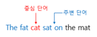
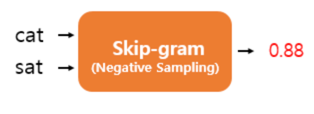
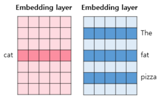
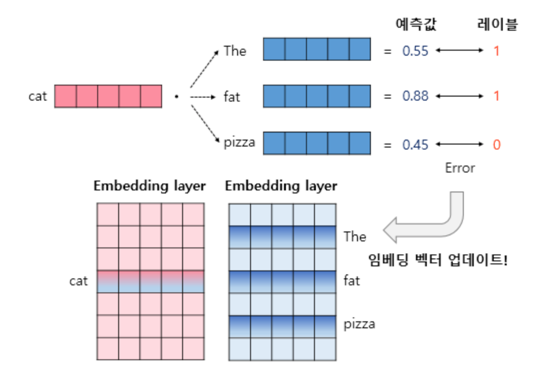

# 1. 네거티브 샘플링(Negative Sampling)

- 만약 단어 집합의 크기가 수만 이상에 달한다면 이 작업은 굉장히 무거운 작업이므로, Word2Vec은 꽤나 학습하기에 무거운 모델
- 현재 집중하고 있는 중심 단어와 주변 단어가 '강아지'와 '고양이', '귀여운'과 같은 단어라면, 사실 이 단어들과 별 연관 관계가 없는 '돈가스'나 '컴퓨터'와 같은 수많은 단어의 임베딩 벡터값까지 업데이트하는 것은 비효율적
- 네거티브 샘플링은 Word2Vec이 학습 과정에서 전체 단어 집합이 아니라 일부 단어 집합에만 집중할 수 있도록 하는 방법
- 주변 단어들을 긍정(positive), 랜덤으로 샘플링 된 단어들을 부정(negative)으로 레이블링한다면 이진 분류 문제를 위한 데이터셋
- 기존의 단어 집합의 크기만큼의 선택지를 두고 다중 클래스 분류 문제를 풀던 Word2Vec보다 훨씬 연산량에서 효율적

# 2. 네거티브 샘플링 Skip-Gram(Skip-Gram with Negative Sampling, SGNS)

- Skip-gram은 중심 단어로부터 주변 단어를 예측하는 모델
- SGNS는 다음과 같이 중심 단어와 주변 단어가 모두 입력이 되고, 이 두 단어가 실제로 윈도우 크기 내에 존재하는 이웃 관계인지 그 확률을 예측

- 기존의 Skip-gram 데이터셋을 SGNS의 데이터셋으로 바꾸는 과정

- 이 둘은 실제로 윈도우 크기 내에서 이웃 관계였므로 레이블은 1

- 이제 이 데이터셋은 입력1과 입력2가 실제로 윈도우 크기 내에서 이웃 관계인 경우에는 레이블이 1, 아닌 경우에는 레이블이 0인 데이터셋
- 이제 두 개의 임베딩 테이블을 준비합니다. 두 임베딩 테이블은 훈련 데이터의 단어 집합의 크기를 가지므로 크기가 동일

- 두 테이블 중 하나는 입력 1인 중심 단어의 테이블 룩업을 위한 임베딩 테이블이고, 하나는 입력 2인 주변 단어의 테이블 룩업을 위한 임베딩 테이블
-  각 단어는 각 임베딩 테이블을 테이블 룩업하여 임베딩 벡터로 변환

- 중심 단어와 주변 단어의 내적값을 이 모델의 예측값으로 하고, 레이블과의 오차로부터 역전파하여 중심 단어와 주변 단어의 임베딩 벡터값을 업데이트
- 학습 후에는 좌측의 임베딩 행렬을 임베딩 벡터로 사용할 수도 있고, 두 행렬을 더한 후 사용하거나 두 행렬을 연결(concatenate)해서 사용 가능

