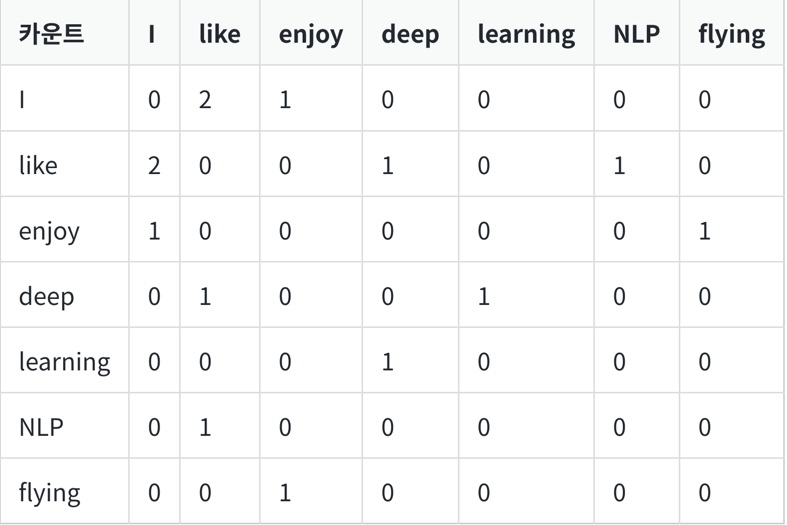
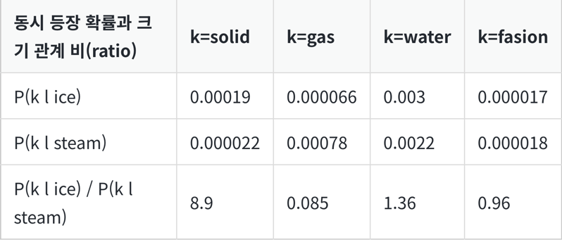
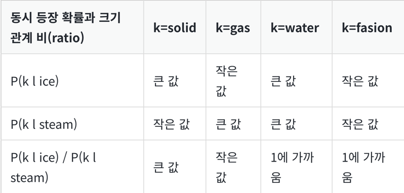
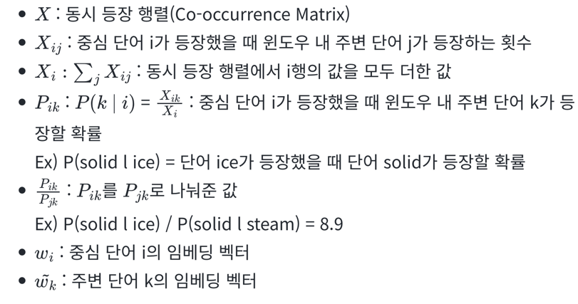

# 1. 기존 방법론에 대한 비판

- LSA는 DTM이나 TF-IDF 행렬과 같이 각 문서에서의 각 단어의 빈도수를 카운트 한 행렬이라는 전체적인 통계 정보를 입력으로 받아 차원을 축소(Truncated SVD)하여 잠재된 의미를 끌어내는 방법론
- Word2Vec는 실제값과 예측값에 대한 오차를 손실 함수를 통해 줄여나가며 학습하는 예측 기반의 방법론
- 서로 다른 방법을 사용하는 이 두 방법론은 각각 장단점이 존재

## LSA

- 카운트 기반으로 코퍼스의 전체적인 통계 정보를 고려하기는 하지만, 왕:남자 = 여왕:? (정답은 여자)와 같은 단어 의미의 유추 작업(Analogy task)에는 성능이 떨어진다

## Word2Vec

- 예측 기반으로 단어 간 유추 작업에는 LSA보다 뛰어나지만, 임베딩 벡터가 윈도우 크기 내에서만 주변 단어를 고려하기 때문에 코퍼스의 전체적인 통계 정보를 반영 X

## Glove

- 이러한 기존 방법론들의 각각의 한계를 지적
- LSA의 메커니즘이었던 카운트 기반의 방법과 Word2Vec의 메커니즘이었던 예측 기반의 방법론 두 가지를 모두 사용

# 2. 윈도우 기반 동시 등장 행렬(Window based Co-occurrence Matrix)

- 단어의 동시 등장 행렬은 행과 열을 전체 단어 집합의 단어들로 구성하고, i 단어의 윈도우 크기(Window Size) 내에서 k 단어가 등장한 횟수를 i행 k열에 기재한 행렬
- 3개 문서로 구성된 텍스트 데이터   

1. I like deep learning   
2. I like NLP   
3. I enjoy flying

- 윈도우 크기가 1일 때, 위의 텍스트를 가지고 구성한 동시 등장 행렬

- 행렬을 전치(Transpose)해도 동일한 행렬이 된다는 특징

# 3. 동시 등장 확률(Co-occurrence Probability)

- 동시 등장 확률 P(k|i)는 동시 등장 행렬로부터 특정 단어 i의 전체 등장 횟수를 카운트하고, 특정 단어 i가 등장했을 때 어떤 단어 k가 등장한 횟수를 카운트하여 계산한 조건부 확률
- P(k|i)에서 i를 중심 단어(Center Word), k를 주변 단어(Context Word)
- 위에서 배운 동시 등장 행렬에서 중심 단어 i의 행의 모든 값을 더한 값을 분모, i행 k열의 값을 분자로 한 값

- P(k | ice) / P(k | steam) 수식에서 k가 뭐냐에 따라 값이 달라진다
- 보기 쉽게 단순화한 표

# 4. 손실 함수(Loss function)

- 손실 함수를 설명하기 전에 각 용어 정리

- GloVe의 아이디어 한 줄 요약: **'임베딩 된 중심 단어와 주변 단어 벡터의 내적이 전체 코퍼스에서의 동시 등장 확률이 되도록 만드는 것'**
