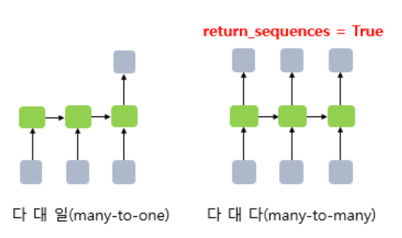

# 1. 훈련 데이터에 대한 이해
- 진행하는 텍스트 분류 실습은 지도 학습(Supervised Learning)에 해당
- 만약 데이터에 문제가 없고, 모델 또한 잘 설계되어져 있다면 학습이 다 된 이 모델은 훈련 데이터에 존재하지 않았던 어떤 메일 텍스트가 주어지더라도 정확한 레이블을 예측


# 2. 훈련 데이터와 테스트 데이터
- 전체 데이터를 전부 훈련에 사용하는 것 보다는 테스트용은 일부 남겨놓는 것으로 바람직

# 3. 단어에 대한 정수 부여
- 케라스의 Embedding()은 단어 각각에 대해 정수로 변환된 입력에 대해서 임베딩 작업을 수행
- 단어 각각에 숫자 맵핑, 정수를 부여하는 방법으로는 정수 인코딩 챕터에서와 같이 단어를 빈도수 순대로 정렬하고 순차적으로 정수를 부여하는 방법
- 등장 빈도 순으로 단어를 정렬하여 정수를 부여하였을 때의 장점은 등장 빈도수가 적은 단어의 제거

# 4. RNN으로 분류하기

```python
model.add(SimpleRNN(hidden_units, input_shape=(timesteps, input_dim)))

'''
hidden_units = RNN의 출력의 크기 = 은닉 상태의 크기.
timesteps = 시점의 수 = 각 문서에서의 단어 수.
input_dim = 입력의 크기 = 임베딩 벡터의 차원.
'''
```

# 5. RNN의 다-대-일(Many-to-One) 문제



- 텍스트 분류는 RNN의 다 대 일(many-to-one) 문제에 속한다
- 텍스트 분류는 모든 시점(time step)에 대해서 입력을 받지만 최종 시점의 RNN 셀만이 은닉 상태를 출력하고, 이것이 출력층으로 가서 활성화 함수를 통해 정답을 고르는 문제
- 2개의 선택지 중에서 정답를 고르는 이진 분류(Binary Classification) 문제라고 하며, 3개 이상의 선택지 중에서 정답을 고르는 다중 클래스 분류(Multi-Class Classification) 문제
- 이진 분류의 문제의 경우 출력층의 활성화 함수로 시그모이드 함수를, 손실 함수로 binary_crossentropy를 사용
- 다중 클래스 문제라면 출력층의 활성화 함수로 소프트맥스 함수를, 손실 함수로 categorical_crossentropy를 사용
- 다중 클래스 분류 문제의 경우에는 클래스가 N개라면 출력층에 해당되는 밀집층(dense layer)의 크기는 N