- 합성곱 신경망(Convolutional Neural Network)은 이미지 처리에 탁월한 성능을 보이는 신경망
- 합성곱 신경망은 크게 **합성곱층과(Convolution layer)** 와 **풀링층(Pooling layer)** 으로 구성

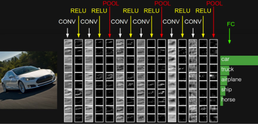

- CONV는 합성곱 연산을 의미하고, 합성곱 연산의 결과가 활성화 함수 ReLU를 지난다. 이 두 과정을 **합성곱층**
- POOL이라는 구간을 지나는데 이는 풀링 연산을 의미하며 **풀링층**

# 1. 합성곱 신경망의 대두

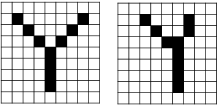

- 사람이 보기에는 두 그림 모두 알파벳 Y로 손쉽게 판단이 가능하지만, 기계가 보기에는 각 픽셀마다 가진 값이 대부분 상이하므로 사실상 다른 값을 가진 입력
- 이미지라는 것은 위와 같이 같은 대상이라도 휘어지거나, 이동되었거나, 방향이 뒤틀렸거나 등 다양한 변형이 존재
- 다층 퍼셉트론은 몇 가지 픽셀만 값이 달라져도 민감하게 예측에 영향을 받는다는 단점

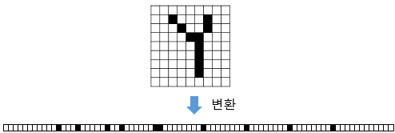

- 1차원으로 변환된 결과는 사람, 기계 둘다 보기에 원래 어떤 이미지였는지 알아보기가 어렵다
- 위와 같이 결과는 변환 전에 가지고 있던 공간적인 구조(spatial structure) 정보가 유실된 상태
- 공간적인 구조 정보라는 것은 거리가 가까운 어떤 픽셀들끼리는 어떤 연관이 있고, 어떤 픽셀들끼리는 값이 비슷하거나 등을 포함

# 2. 채널(Channel)

- 기계는 글자나 이미지보다 숫자. 다시 말해, 텐서를 더 잘 처리 가능
- 이미지는 **(높이, 너비, 채널)** 이라는 3차원 텐서
- 높이는 이미지의 세로 방향 픽셀 수, 너비는 이미지의 가로 방향 픽셀 수, 채널은 색 성분을 의미

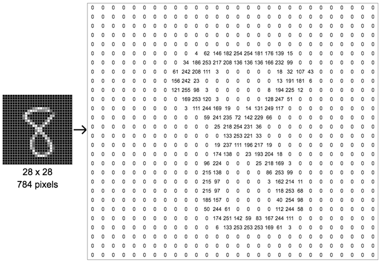

- 흑백 이미지므로 채널 수가 1임을 고려하면 (28 × 28 × 1)의 크기를 가지는 3차원 텐서

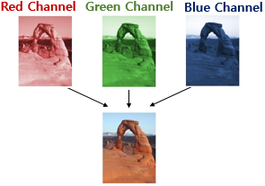

- 하나의 픽셀은 세 가지 색깔, 삼원색의 조합
- 이 이미지의 텐서는 (28 × 28 × 3)의 크기를 가지는 3차원 텐서
- 채널은 때로는 깊이(depth)

# 3. 합성곱 연산(Convolution operation)

- 합성곱층은 합성곱 연산을 통해서 **이미지의 특징** 을 추출하는 역할
- 합성곱은 **커널(kernel)** 또는 **필터(filter)** 라는 n * m 크기의 행렬로 높이(height) * 너비(width) 크기의 이미지를 처음부터 끝까지 겹치며 훑으면서 n * m 크기의 겹쳐지는 부분의 각 이미지와 커널의 원소의 값을 곱해서 모두 더한 값을 출력으로 하는 것

```bash
커널(kernel)은 일반적으로 3 × 3 또는 5 × 5를 사용
```

- 한 번의 연산을 1 스텝(step)이라고 하였을 때, 합성곱 연산의 네번째 스텝

### 1. 첫번째 스텝

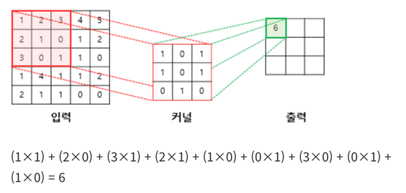

### 2. 두번째 스텝

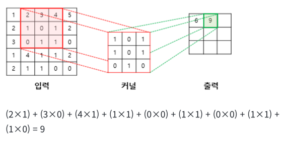

### 3. 세번째 스텝

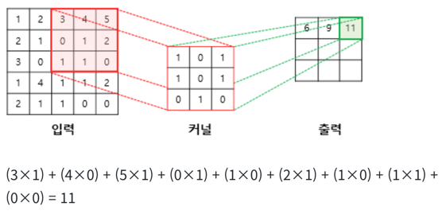

### 4. 네번째 스텝

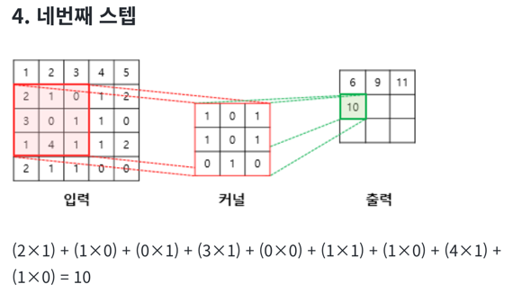

### 결과

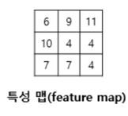

- 위와 같이 입력으로부터 커널을 사용하여 합성곱 연산을 통해 나온 결과를 **특성 맵(feature map)**
- 커널의 이동 범위가 위의 예제에서는 한 칸이었지만, 이 또한 사용자가 정할 수 있다, **스트라이드(stride)**
- 스트라이드가 2일 경우에 5 × 5 이미지에 합성곱 연산을 수행하는 3 × 3 커널의 움직임

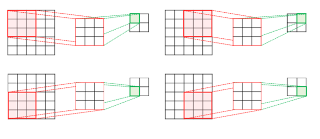

# 4. 패딩(Padding)

- 합성곱 연산의 결과로 얻은 특성 맵은 입력보다 크기가 작아진다는 특징
- 합성곱 연산 이후에도 특성 맵의 크기가 입력의 크기와 동일하게 유지되도록 하고 싶다면 패딩(padding)을 사용

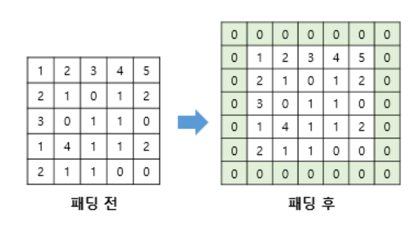

- 패딩은 (합성곱 연산을 하기 전에) 입력의 가장자리에 지정된 개수의 폭만큼 행과 열을 추가해주는 것   
-> 지정된 개수의 폭만큼 테두리를 추가
- 스트라이드가 1이라고 하였을 때, 3 * 3 크기의 커널을 사용, 1폭짜리 제로 패딩. 5 * 5 크기의 커널을 사용, 2폭 짜리 제로 패딩을 사용하면 입력과 특성 맵의 크기를 보존

# 5. 가중치와 편향

## 1. 합성곱 신경망의 가중치

- 우선 이미지를 1차원 텐서인 벡터로 만들면, 3 × 3 = 9가 되므로 입력층은 9개의 뉴런

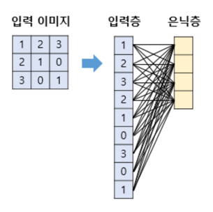

- 연결선은 가중치를 의미하므로, 위의 그림에서는 9 * 4 = 36개의 가중
- 합성곱 신경망으로 3 * 3 이미지를 처리. 2 * 2 커널을 사용, 스트라이드는 1

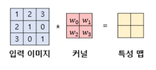

- 인공 신경망의 형태로 표현한다면 다음과 같이 표현

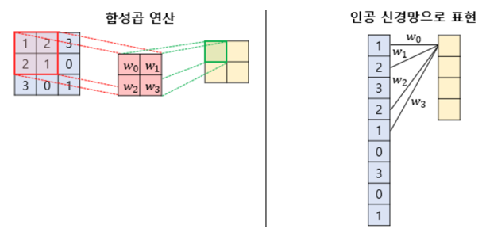

- 최종적으로 특성 맵을 얻기 위해서는 동일한 커널로 이미지 전체를 훑으며 합성곱 연산을 진행
- 이미지 전체를 훑으면서 사용되는 가중치는 w1, w2, w3, w4 4개 뿐
- 합성곱 신경망은 다층 퍼셉트론을 사용할 때보다 훨씬 적은 수의 가중치를 사용하며 공간적 구조 정보를 보존한다는 특징
- 합성곱 연산을 통해서 특성 맵을 얻고, 활성화 함수를 지나는 연산을 하는 합성곱 신경망의 층, **합성곱 층**

## 2. 합성곱 신경망의 편향

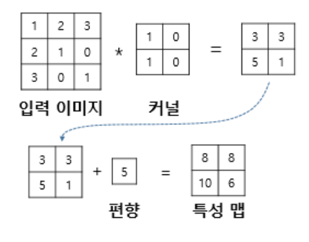

- 편향을 사용한다면 커널을 적용한 뒤에 더해진다
- 편향은 하나의 값만 존재하며, 커널이 적용된 결과의 모든 원소에 더해진다

# 6. 특성 맵의 크기 계산 방법

- 입력의 크기와 커널의 크기, 그리고 스트라이드의 값만 알면 합성곱 연산의 결과인 특성 맵의 크기를 계산 가능

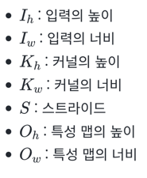


- 특성 맵의 크기는 (5 - 3 + 1 ) x (5 - 3 x 1) = 3 × 3
- 패딩까지 고려한 식

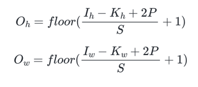

# 7. 다수의 채널을 가질 경우의 합성곱 연산(3차원 텐서의 합성곱 연산)

- 실제로 합성곱 연산의 입력은 '다수의 채널을 가진' 이미지 또는 이전 연산의 결과로 나온 특성 맵일 가능성 존재
- 다수의 채널을 가진 입력 데이터를 가지고 합성곱 연산을 한다고 하면 커널의 채널 수도 입력의 채널 수만큼 존재
- 채널 수가 같으므로 합성곱 연산을 채널마다 수행하고 그 결과를 모두 더하여 최종 특성 맵

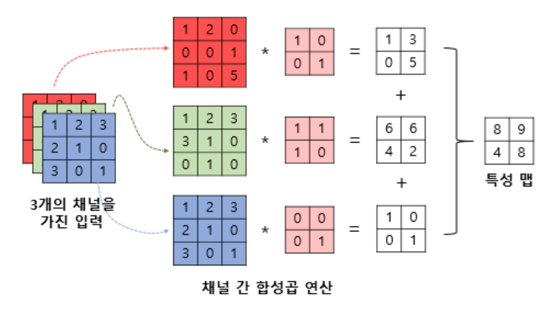

- 주의할 점은 위의 연산에서 사용되는 커널은 3개의 커널이 아니라 3개의 채널을 가진 1개의 커널이라는 점

# 8. 3차원 텐서의 합성곱 연산

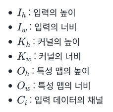

- 하나의 입력에 여러 개의 커널을 사용하는 합성곱 연산 가능
- 가중치 매개변수의 총 수

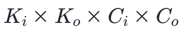