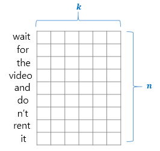
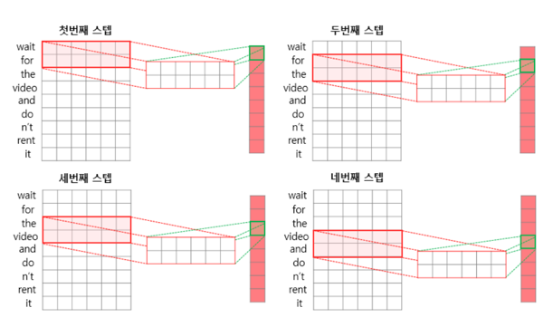
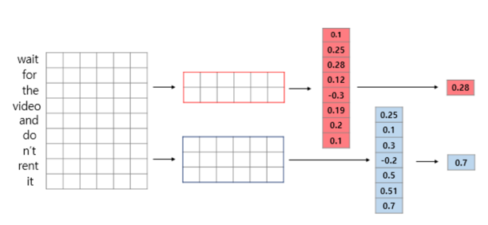
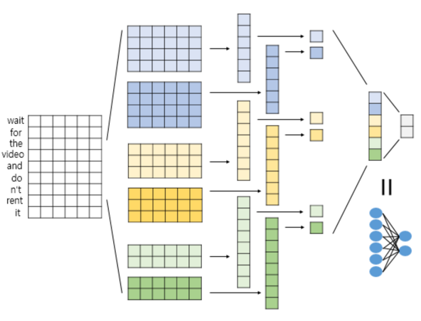

# 1. 2D 합성곱(2D Convolutions)

- 합성곱 신경망을 설명하며 합성곱 연산을 다음과 같이 정의

```shell
합성곱 연산이란 커널(kernel) 또는 필터(filter) 라는 n × m 크기의 행렬로 높이(height) × 너비(width) 크기의 이미지를 처음부터 끝까지 겹치며 훑습니다
그리고 n × m 크기의 겹쳐지는 부분의 각 이미지와 커널의 원소의 값을 곱해서 모두 더한 값을 출력으로 하는 것을 말합니다. 이때, 이미지의 가장 왼쪽 위부터 가장 오른쪽 아래까지 순차적으로 훑습니다.
```

# 2. 1D 합성곱(1D Convolutions)

- 1D 합성곱 연산에서도 입력이 되는 것은 각 단어가 벡터로 변환된 문장 행렬로 LSTM과 입력을 받는 형태는 동일
- 이 문장 'wait for the video and don't rent it'이 토큰화, 패딩, 임베딩 층(Embedding layer)을 거친다면 다음과 같은 문장 형태의 행렬로 변환
- n은 문장의 길이, k는 임베딩 벡터의 차원



- 1D 합성곱 연산에서 커널의 너비는 문장 행렬에서의 임베딩 벡터의 차원과 동일하게 설정
- 1D 합성곱 연산에서는 커널의 높이만으로 해당 커널의 크기라고 간주
- 커널의 너비가 임베딩 벡터의 차원이라는 의미는 커널이 2D 합성곱 연산때와는 달리 너비 방향으로는 더 이상 움직일 곳이 없다는 것을 의미
- 커널이 문장 행렬의 높이 방향으로만 움직인다
- 차례대로 스탭 별 연산



- CNN에서의 커널은 신경망 관점에서는 가중치 행렬이므로 커널의 크기에 따라 학습하게 되는 파라미터의 수가 달라진다
- 1D 합성곱 연산과 자연어 처리 관점에서는 커널의 크기에 따라서 참고하는 단어의 묶음의 크기가 달라진다
- 참고하는 n-gram이 달라진다고 볼 수도 있다

# 3. 맥스 풀링(Max-pooling)

- 일반적으로 1D 합성곱 연산을 사용하는 1D CNN에서도 풀링층 추가. 그 중 대표적으로 사용하는 것이 **맥스 풀링**
- 맥스 풀링은 각 합성곱 연산으로부터 얻은 결과 벡터에서 가장 큰 값을 가진 스칼라 값을 빼내는 연산



# 4. 신경망 설계하기

- 설계하고자 하는 신경망은 이진 분류를 위한 신경망
- 소프트맥스 함수를 사용할 것이므로 출력층에서 뉴런의 개수가 2인 신경망을 설계



# 5. 케라스(Keras)로 CNN 구현하기

- 케라스로 1D 합성곱 층을 추가하는 코드

```python
from tensorflow.keras.layers import Conv1D, GlobalMaxPooling1D

model = Sequential()
model.add(Conv1D(num_filters, kernel_size, padding='valid', activation='relu'))

'''
num_filters = 커널의 개수.
kernel_size = 커널의 크기.
padding = 패딩 방법.
- valid : 패딩 없음. 제로 패딩없이 유효한(valid) 값만을 사용한다는 의미에서 valid.
- same : 합성곱 연산 후에 출력이 입력과 동일한 차원을 가지도록 왼쪽과 오른쪽(또는 위, 아래)에 제로 패딩을 추가.
activation = 활성화 함수.
'''
```

- 맥스 풀링을 추가하고자 한다면 다음과 같이 코드를 작성

```python
model = Sequential()
model.add(Conv1D(num_filters, kernel_size, padding='valid', activation='relu'))
model.add(GlobalMaxPooling1D())
```


