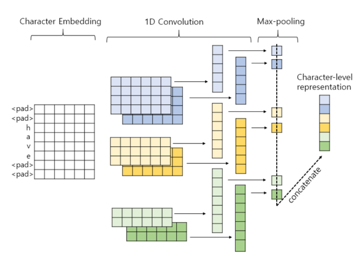
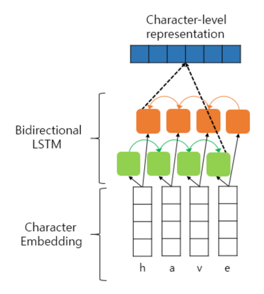

- 워드 임베딩과는 다른 방법으로 단어의 벡터 표현 방법을 얻는 문자 임베딩에 대해서 알아보자
- mis-라는 접두사는 기존에 존재하는 단어들을 통해서 추측이 가능하다
- 문자 임베딩은 사람의 이러한 이해 능력을 흉내내는 알고리즘

# 1. 1D CNN을 이용한 문자 임베딩

- 1D CNN은 전체 시퀀스 입력 안의 더 작은 시퀀스에 집중하여 정보를 얻어내는 동작을 하는 알고리즘
- FastText가 문자의 N-gram의 조합을 이용하여 OOV 문제를 해결하였듯이, 1D CNN을 문자 임베딩에 사용할 경우에는 문자의 N-gram으로부터 정보를 얻는다
- 기존 1D CNN을 이용한 텍스트 분류와는 단어를 문자 단위로 쪼개고나서 입력으로 사용하는 것 외에 달라진 것이 없다

- 임베딩 층(Embedding layer)을 이용한 임베딩을 단어에 대해서 하는 것이 아니라 문자에 대해서 하게된다
- 이렇게 얻은 벡터를 단어 'have'의 벡터로 사용
- 단어 벡터를 얻을 경우, 어떤 단어이든 기본적으로 문자 레벨로 쪼개므로 기존 워드 임베딩의 접근에서 OOV라고 하더라도 벡터를 얻을 수 있다

# 2. BiLSTM을 이용한 문자 임베딩

- 순방향 LSTM은 단어 순방향으로 순차적으로 문자 임베딩 벡터를 읽는다
- 역방향 LSTM은 단어의 역방향으로 순차적으로 문자 임베딩 벡터를 읽는다
- 순방향 LSTM의 마지막 시점의 은닉 상태와 역방향 LSTM의 첫번째 시점의 은닉 상태를 연결
- 최종적으로 이렇게 얻은 벡터를 단어 'have'의 벡터로 사용