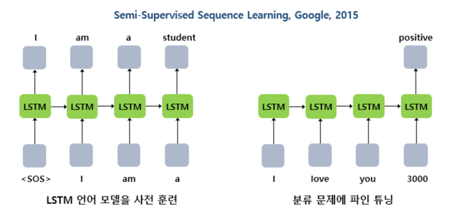
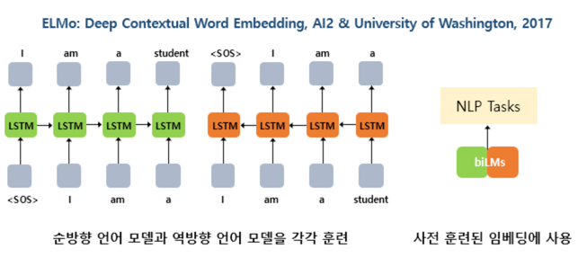
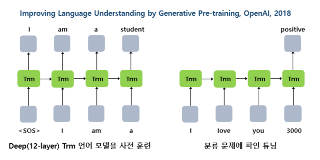
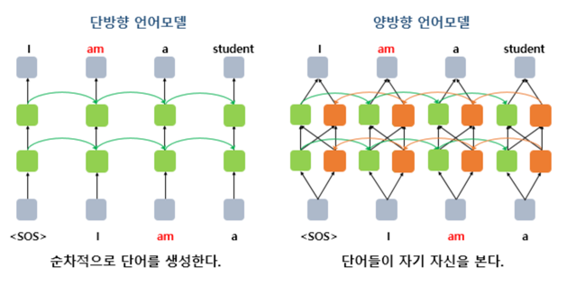

# 1. 사전 훈련된 워드 임베딩

- 임배딩을 사용하는 방법은 크게 2가지
  1. 임베딩 층(Embedding layer)을 랜덤 초기화하여 처음부터 학습하는 방법
  2. 방대한 데이터로 Word2Vec 등과 같은 임베딩 알고리즘으로 사전에 학습된 임베딩 벡터들을 가져와 사용하는 방법
- 모두 하나의 단어가 하나의 벡터값으로 맵핑되므로, 문맥을 고려하지 못 하여 다의어나 동음이의어를 구분하지 못하는 문제점

# 2. 사전 훈련된 언어 모델

## LSTM

- 언어 모델은 주어진 텍스트로부터 이전 단어들로부터 다음 단어를 예측하도록 학습하므로 기본적으로 별도의 레이블이 부착되지 않은 텍스트 데이터로도 학습 가능
- 사전 훈련된 워드 임베딩과 마찬가지로 사전 훈련된 언어 모델의 강점은 학습 전 사람이 별도 레이블을 지정해줄 필요가 없다는 점

## ELMO

- 순방향 언어 모델과 역방향 언어 모델을 각각 따로 학습시킨 후에, 이렇게 사전 학습된 언어 모델로부터 임베딩 값을 얻는다는 아이디어

## 트랜스포머 

- 트랜스포머의 디코더는 LSTM 언어 모델처럼 순차적으로 이전 단어들로부터 다음 단어를 예측
- NLP의 주요 트렌드는 사전 훈련된 언어 모델을 만들고 이를 특정 태스크에 추가 학습시켜 해당 태스크에서 높은 성능을 얻는 것으로 접어들었고, 언어 모델의 학습 방법에 변화를 주는 모델들이 등장

## 양방향 언어모델

- 언어의 문맥이라는 것은 실제로는 양방향. 텍스트 분류나 개체명 인식 등에서 양방향 LSTM을 사용하여 모델을 구현해서 좋은 성능을 얻을 수 있었던 것
- 기존 언어 모델로는 양방향 구조를 도입할 수 없으므로, 양방향 구조를 도입하기 위해서 2018년에는 새로운 구조의 언어 모델이 탄생했는데 바로 마스크드 언어 모델

# 3. 마스크드 언어 모델(Masked Language Model)

- 마스크드 언어 모델은 입력 텍스트의 단어 집합의 15%의 단어를 랜덤으로 마스킹(Masking)
- 인공 신경망에게 이렇게 마스킹 된 단어들을(Masked words) 예측하도록 주문
- 문장 중간에 구멍을 뚫어놓고, 구멍에 들어갈 단어들을 예측하게 하는 식