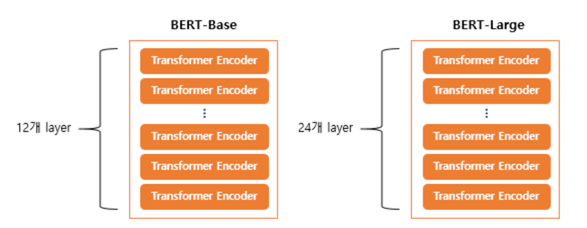
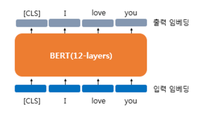
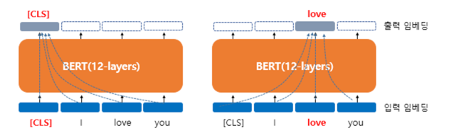
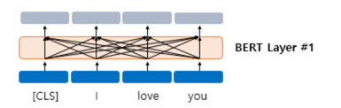
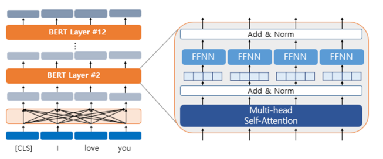
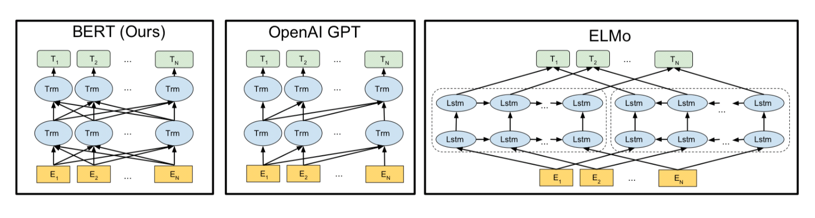

# 1. BERT의 개요

- 트랜스포머를 이용하여 구현되었으며, 위키피디아(25억 단어)와 BooksCorpus(8억 단어)와 같은 레이블이 없는 텍스트 데이터로 사전 훈련된 언어 모델
- 레이블이 없는 방대한 데이터로 사전 훈련된 모델을 가지고, 레이블이 있는 다른 작업(Task)에서 추가 훈련과 함께 하이퍼파라미터를 재조정하여 이 모델을 사용하면 성능이 높게 나오는 기존의 사례들을 참고

# 2. Bert의 크기

- BERT-Base: L=12, D=768, A=12 : 110M개의 파라미터
- BERT-Large: L=24, D=1024, A=16 : 340M개의 파라미터

# 3. BERT의 문맥을 반영한 임베딩(Contextual Embedding)

- BERT가 각 768차원의 [CLS], I, love, you라는 4개의 벡터를 입력받아서(입력 임베딩) 동일하게 768차원의 4개의 벡터를 출력하는 모습(출력 임베딩)

- 좌측 그림에서 [CLS]라는 벡터는 BERT의 초기 입력으로 사용되었을 입력 임베딩 당시에는 단순히 임베딩 층(embedding layer)를 지난 임베딩 벡터였다
- BERT를 지나고 나서는 [CLS], I, love, you라는 모든 단어 벡터들을 모두 참고한 후에 문맥 정보를 가진 벡터
- 좌측 그림에서는 모든 단어를 참고하고 있다는 것을 점선의 화살표로 표현ㄴㄴ
- 우측의 그림에서 출력 임베딩 단계의 love를 보면 BERT의 입력이었던 모든 단어들인 [CLS], I, love, you를 참고

- BERT의 첫번째 층에 입력된 각 단어가 모든 단어를 참고한 후에 출력되는 과정을 화살표로 표현

- 기본적으로 트랜스포머 인코더를 12번 쌓은 것이므로 내부적으로 각 층마다 멀티 헤드 셀프 어텐션과 포지션 와이즈 피드 포워드 신경망을 수행

# 4. BERT의 서브워드 토크나이저 : WordPiece

- 단어보다 더 작은 단위로 쪼개는 서브워드 토크나이저를 사용
- 사용한 토크나이저는 WordPiece 토크나이저로 서브워드 토크나이저 챕터에서 공부한 바이트 페어 인코딩(Byte Pair Encoding, BPE)의 유사 알고리즘
- 동작 방식은 BPE와 조금 다르지만, 글자로부터 서브워드들을 병합해가는 방식으로 최종 단어 집합(Vocabulary)을 만드는 것은 BPE와 유사

# 5. 포지션 임베딩(Position Embedding)

- 포지셔널 인코딩은 사인 함수와 코사인 함수를 사용하여 위치에 따라 다른 값을 가지는 행렬을 만들어 이를 단어 벡터들과 더하는 방법
- BERT에서는 이와 유사하지만, 위치 정보를 사인 함수와 코사인 함수로 만드는 것이 아닌 학습을 통해서 얻는 포지션 임베딩(Position Embedding)이라는 방법을 사용

# 6. BERT의 사전 훈련(Pre-training)

## 1) 마스크드 언어 모델(Masked Language Model, MLM)

- 사전 훈련을 위해서 인공 신경망의 입력으로 들어가는 입력 텍스트의 15%의 단어를 랜덤으로 마스킹(Masking)
- 인공 신경망에게 이 가려진 단어들을(Masked words) 예측

## 2) 다음 문장 예측(Next Sentence Prediction, NSP)

- 두 개의 문장을 준 후에 이 문장이 이어지는 문장인지 아닌지를 맞추는 방식으로 훈련
- 50:50 비율로 실제 이어지는 두 개의 문장과 랜덤으로 이어붙인 두 개의 문장을 주고 훈련